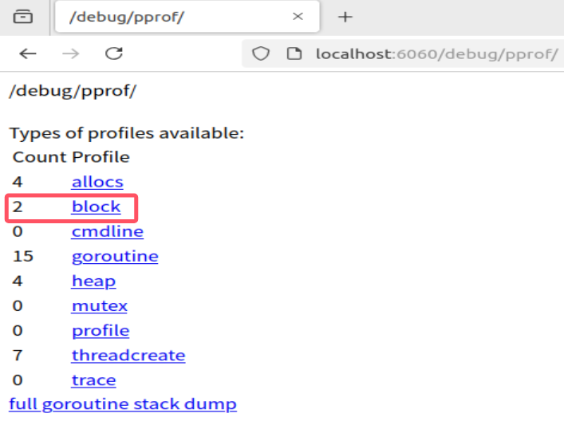

# 高质量编程 & 性能优化学习笔记

[PPT](https://bytedance.larkoffice.com/file/boxcn7AkvSWnRkHEttsuYHqW24g)

## 目录

[高质量编程](#1)
+ [编程原则](#3)
+ [编码规范](#4)

[性能优化](#2)
+ [性能优化建议](#5)
+ [实战pprof](#6)
+ [性能调优案例](#7)

[自动内存管理](#8)
+ [常见内存管理方式](#12)

[Go内存管理及优化](#9)
+ [Go内存分配](#13)
+ [Go内存管理优化](#14)

[编译器和静态分析](#10)
+ [编译器](#15)
+ [静态分析](#16)

[Go编译器优化](#11)
+ [函数内联](#17)
+ [逃逸分析](#18)

## <span id="1">高质量编程</span>
编写的代码能够达到正确可靠、简洁清晰的目标可称之为高质量代码
+ 各种边界条件是否完备
+ 异常情况处理，稳定性保证
+ 易读易维护

### <span id="3">编程原则</span>
+ 简单性
  + 消除“多余的复杂性”，以简单清晰的逻辑编写代码
  + 不理解的代码无法修复改进
+ 可读性
  + 代码是写给人看的，而不是机器
  + 编写可维护代码的第一步是确保代码可读
+ 生产力
  + 团队整体工作效率非常重要

### <span id="4">编码规范</span>

#### 代码格式
推荐使用gofmt自动格式化代码
goimports实际等于gofmt加上依赖包管理，自动增删依赖的包引用、将依赖包按字母序排序并分类

#### 注释
公共符号始终要注释
+ 包中声明的每个公共的符号：变量、常量、函数以及结构都需要添加注释
+ 任何既不明显也不简短的公共功能必须予以注释
+ 无论长度或复杂程度如何，对库中的任何函数都必须进行注释
+ 有一个例外，不需要注释实现接口的方法
+ 注释应该做的
  + 解释代码作用
  + 解释代码如何做的
  + 解释代码实现的原因
  + 解释代码什么情况会出错

#### 命名规范
+ 简洁胜于冗长
+ 缩略词全大写，但当其位于变量开头且不需要导出时，使用全小写
  + 例如使用ServeHTTP而不是ServeHttp
  + 使用XMLHTTPRequest而不是xmlHTTPRequest
+ 变量距离其被使用的地方越远，则需要携带越多的上下文信息
  + 全局变量在其名字中需要更多的上下文信息，使得在不同地方可以轻易辨别出其含义

function：
+ 函数名不携带包名的上下文信息，因为包名和函数名总是成对出现的
+ 函数名尽量简短
+ 当名为foo的包某个函数返回类型Foo时，可以省略类型信息而不导致歧义
+ 当名为foo的包某个函数返回类型T时(T并不是Foo)，可以在函数名中加入类型信息

package：
+ 只由小写字母组成，不包含大写字母和下划线等字符
+ 简短并包含一定的上下文信息，例如schema、task等
+ 不要与标准库同名，例如不要使用sync或strings
以下规则尽量满足，以标准库包名为例
+ 不使用常用变量名作为包名，例如使用bufio而不是buf
+ 使用单数而不是复数，例如使用encoding而不是encodings
+ 谨慎地使用缩写，例如使用fmt在不破坏上下文的情况下比format更加简短

#### 控制流程
+ 避免嵌套，保持正常流程清晰
+ 尽量保持正常代码路径为最小缩进
  + 优先处理错误情况、特殊情况，尽早返回或继续循环来减少嵌套
+ 线性原理，处理逻辑尽量走直线，避免复杂的嵌套分支
+ 正常流程代码沿着屏幕向下移动
+ 提升代码的可维护性和可读性
+ 故障问题大多出现在复杂的条件语句和循环语句中

#### 错误和异常处理
简单错误
+ 简单的错误指的是仅出现一次的错误，且在其他地方不需要捕获该错误
+ 优先使用errors.New()来创建匿名变量来直接表示简单错误
+ 如果有格式化的要求，使用fmt.Errorf()

错误的Wrap和Unwrap
+ 错误的Wrap实际上是提供一个error嵌套另一个error的能力，从而生成一个error的跟踪链
+ 在fmt.Errorf中使用%w关键字来讲一个错误关联至错误链中
Go1.13在errors中新增了三个新API和一个新的format关键字，分别是errors.Is，errors.As，errors.Unwrap以及fmt.Errorf的%w，如果项目运行在小于Go1.13的版本中，导入golang.org/x/xerrors来使用

错误判定
+ 判定一个错误是否为特定错误，使用errors.Is，不同于使用==，使用该方法可以判定错误链上的所有错误是否含有特定错误
+ 在错误链上获取特定类型的错误，使用errors.As

panic
+ 不建议在业务代码中使用panic
+ 调用函数不包含recover会导致程序崩溃
+ 若问题可以被屏蔽或解决，建议使用error代替panic
+ 当程序启动阶段发生不可逆转的错误时，可以在init或main函数中使用panic

recover
+ recover只能在被defer的函数中使用
+ 嵌套无法生效
+ 只能在当前goroutine生效
+ defer语句是后进先出
+ 如果需要更多的上下文信息，可以recover后在log中记录当前的调用栈

error尽可能提供简明的上下文信息链，方便定位问题
panic用于真正异常的情况
recover生效范围：在当前goroutine的被defer的函数中生效

## <span id="2">性能优化</span>

性能优化：提升软件系统处理能力，减少不必要的消耗，充分发掘计算机算力
原因：
+ 用户体验：带来用户体验的提升
+ 资源高效利用：降低成本，提升效率

性能优化的层面：业务代码、SDK、基础库、语言运行时、OS
+ 业务层优化
  + 针对特定场景，具体问题具体分析
  + 容易获得较大性能效益
+ 语言运行时优化
  + 解决更通用的性能问题
  + 考虑更多场景
  + Tradeoffs
+ 数据驱动
  + 自动化性能分析工具--pprof
  + 依靠数据而非猜测
  + 首先优化最大瓶颈

性能优化与软件质量
+ 软件质量至关重要
+ 在保证接口稳定的前提下改进具体实现
+ 测试用例：覆盖尽可能多的场景，方便回归。用测试驱动开发
+ 文档：做了什么，没做什么，能达到怎样的效果
+ 隔离：通过选项控制是否开启优化
+ 可观测：必要的日志输出

### <span id="5">性能优化建议</span>

#### Benchmark
+ 性能表现需要实际数据衡量
+ Go语言提供了支持基准性能测试的benchmark工具

#### Slice
+ 尽可能在使用make()初始化切片时提供容量信息
+ 切片本质是一个数组片段的描述
  + 包括数组指针
  + 片段长度
  + 片段容量(不改变内存分配情况下的最大长度)
+ 切片操作并不复制切片指向的元素
+ 创建一个新的切片会复用原来切片的底层数组，在已有切片基础上创建切片，不会创建新的底层数组
+ 陷阱：大内存未释放
  + 原切片较大，代码在原切片基础上新建小切片
  + 原底层数组在内存中有引用，得不到释放
+ 可使用copy代替re-slice

#### Map
+ 尽可能在使用make()初始化切片时提供容量信息
+ 提前分配好空间可以减少内存拷贝和Rehash的消耗

#### 字符串处理
+ 使用+拼接性能最差，string.Builder和bytes.Buffer相近，strings.Buffer更快
+ bytes.Buffer转化为字符串时重新申请了一块空间，strings.Builder直接将底层的[]byte转换为字符串类型返回

#### 空结构体
使用空结构体节省内存
+ 空结构体struct{}实例不占据任何内存空间
+ 可作为各种场景下的占位符使用
  + 节省资源
  + 空结构体本身具备很强的语义，即这里不需要任何值，仅作为占位符
+ 实现Set，可以考虑用Map来代替，[开源实现set](https://github.com/deckarep/golang-set/blob/main/threadunsafe.go)
+ 对于这个场景，只需要用到map的键，而不需要值

#### atomic包
使用atomic包
+ 锁的实现是通过操作系统来实现，属于系统调用
+ atomic操作是通过硬件实现，效率比锁高
+ sync.Mutex应该用来保护一段逻辑，不仅仅用于保护一个变量
+ 对于非数值操作，可以使用atomic.Value，能承载一个interface{}

#### 建议
+ 避免常见的性能陷阱可以保证大部分程序的性能
+ 普通应用代码不要一味地追求程序的性能
+ 越高级的性能优化手段越容易出现问题
+ 在满足正确可靠、简洁清晰的质量要求的前提下提高程序性能

### <span id="6">实战pprof</span>

[实战案例](https://github.com/wolfogre/go-pprof-practice)
[golang pprof实战](https://blog.wolfogre.com/posts/go-ppof-practice/)
[Go性能分析工具](https://farmerchillax.github.io/2023/07/04/Go%E6%80%A7%E8%83%BD%E5%88%86%E6%9E%90%E5%B7%A5%E5%85%B7/)

#### 性能调优原则
+ 要依靠数据不是猜测
+ 要定位最大瓶颈而不是细枝末节
+ 不要过早优化
+ 不要过度优化

#### 性能分析工具pprof
+ 希望知道应用在什么地方耗费了多少CPU、Memory
+ pprof是用于可视化和分析性能分析数据的工具

本实战是根据golang pprof实战一步步实现的，前提是下载项目代码，能够编译运行，会占用2CPU核心和超过2GB的内存，不要爆内存了

本实验使用的是vmware虚拟机下的Ubuntu系统，不同系统命令会有所不同

##### CPU占用过高
当我们开始运行main.go时
```
go run main.go
```
在浏览器打开 `http://localhost:6060/debug/pprof/` 就可以看到以下页面

|类型|描述|备注|
|-|-|-|
|allocs|内存分配情况的采样信息|可以用浏览器打开，但可读性不高|
|block|阻塞操作情况的采样信息|可以用浏览器打开，但可读性不高|
|cmdline|显示程序启动命令及参数|可以用浏览器打开，这里会显示 `./go-pprof-practice`|
|goroutine|当前所有协程的堆栈信息|可以用浏览器打开，但可读性不高|
|heap|堆上内存使用情况的采样信息|可以用浏览器打开，但可读性不高|
|mutex|锁争用情况的采样信息|可以用浏览器打开，但可读性不高|
|profile|CPU占用情况的采样信息|浏览器打开会下载文件|
|threadcreate|系统线程创建情况的采样信息|可以用浏览器打开，但可读性不高|
|trace|程序运行跟踪信息|浏览器打开会下载文件|

另开一个终端输入`top`命令查看CPU占用，main.go要一直运行着
```
top
```


命令行输入以下命令会出现一个Fetching....，需要等待一会然后返回信息，就成功打开pprof了
```
go tool pprof http://localhost:6060/debug/pprof/profile
```


在终端输入以下命令查看CPU占用较高的调用
```
top
```


pprof名词解释：
+ flat：当前函数本身的执行耗时
+ flat%：flat占CPU总时间的比例
+ sum%：上面每一行的flat%总和
+ cum：指当前函数本身加上其调用函数的总耗时
+ cum%：cum占CPU总时间的比例

flat == cum：说明当前函数没有调用其他函数
flat == 0：说明函数中只有其他函数的调用

显然发现CPU占用较高都是由`github.com/wolfogre/go-pprof-practice/animal/felidae/tiger.(*Tiger).Eat`造成的

输入以下命令查看问题具体在代码的什么位置
```
list Eat
```
通过返回信息，发现问题所在，即可去对应的代码里修改


使用`web`命令可以生成图片，越大越红的说明占用资源越多，不过本菜鸡在实操过程中一直不能使用在pprof里的graphviz，但确实已经install了graphviz，非常奇怪，但也并不太妨碍后续的分析，graphviz只是一个图片生成器，生成一个.svg的文件

##### 内存占用过高
通过任务管理器我们发现，main.go仍然占用着巨大的内存空间，下面来排查内存空间问题


在终端输入
```
go tool pprof http://localhost:6060/debug/pprof/heap
```

再次在pprof内使用`top`指令找到问题代码


在pprof内使用`list Steal`查看代码出现问题的代码段


可以看到下面代码一直在追加1MB数组，直到达到1GB为止
```
m.buffer = append(m.buffer, [constant.Mi]byte{})
```
找到相应文件，修改问题代码段

##### 排查内存频繁回收
接下来是排查频繁内存回收
先暂停炸弹文件执行，输入以下指令获取运行过程中的GC日志，然后运行main.go，发现程序在不断地申请16MB然后回收到0MB
```
GODEBUG=gctrace=1 ./go-pprof-practice | grep gc
```


继续使用pprof排查问题
```
go tool pprof http://localhost:6060/debug/pprof/allocs
```
在pprof内输入`top`指令和`list Run`指令，找到问题代码段


这里有个小插曲，你可尝试一下将`16 * constant.Mi`修改成一个较小的值，重新编译运行，会发现并不会引起频繁GC，原因是在golang里，对象是使用堆内存还是栈内存，由编译器进行逃逸分析并决定，如果对象不会逃逸，便可在使用栈内存，但总有意外，就是对象的尺寸过大时，便不得不使用堆内存。所以这里设置申请16MB的内存就是为了避免编译器直接在栈上分配，如果那样得话就不会涉及到GC了。

##### 排查协程泄露
由于golang自带内存回收，所以一般不会发生内存泄露。但凡事都有例外，在golang中，协程本身是可能泄露的，或者叫协程失控，进而导致内存泄露。

运行一段时间炸弹程序后，发现协程数量达到了115


继续使用pprof排查问题
```
go tool pprof http://localhost:6060/debug/pprof/goroutine
```
依然是`top`、`list Drink`和`web`三板斧，由于我的问题就不展示`web`了~~QAQ~~


根据前两板斧发现，`github.com/wolfogre/go-pprof-practice/animal/canidae/wolf.(*Wolf).Drink.func1`一直在创建没有用的协程
可以看到，Drink函数每次会调用10个协程出去，每个协程会睡眠30秒再退出，而Drink函数又会被反复调用，这才导致大量协程泄露。
试想一下，如果释放出的协程会永久阻塞，那么泄露的协程数便会持续增加，内存的占用也会持续增加，那迟早是会被操作系统杀死。
当我们修改好问题代码段后，协程数量变少且稳定


##### 排查锁的争用

到目前为止，我们已经解决这个炸弹程序的所有资源占用问题，但是事情还没有完，我们需要进一步排查那些会导致程序运行慢的性能问题，这些问题可能并不会导致资源占用，但会让程序效率低下，这同样是高性能程序所忌讳的。

由上图我们发现协程数量是变少了，但还存在一个mutex的问题，下面我们来解决这个问题
继续执行程序，然后进入pprof排查问题
```
go tool pprof http://localhost:6060/debug/pprof/mutex
```
然后再掏出我的两板斧`top`和`list`，定位问题代码段


简单分析一下问题代码段，首先创建一个sync锁，运行时锁住，然后执行了一个协程，协程先睡眠一秒，然后再解锁，此时程序会卡在第60行的位置，即程序需要再次锁住，但它必须等待子协程睡眠一秒后解锁，因此白白浪费了时间

##### 排查阻塞操作
修改完成以上所有问题后再运行代码，发现还存在两个阻塞，虽然可能不是问题，但为了保证性能还是要排查一下


接下来我们来排查一下阻塞操作，继续使用我们的pprof
```
go tool pprof http://localhost:6060/debug/pprof/block
```


这里的问题不是睡眠一秒，而是从一个channel里读取数据时，发生了阻塞，直到这个channel在一秒后才有数据读出，导致程序阻塞了一秒而非睡眠了一秒

**至此，炸弹实验到此结束，完结撒花！~~美中不足的是我没配置好`web`命令~~**

名词解释
+ alloc_objects：程序累计申请的对象数
+ alloc_space：程序累计申请的内存大小
+ inuse_objects：程序当前持有的对象数
+ inuse_space：程序当前占用的内存大小


#### CPU采样过程和原理
+ 采样对象：函数调用和它们占用的时间
+ 采样率：100次/秒，固定值
+ 采样时间：从手动启动到手动结束
+ 操作系统每10ms向进程发送一次SIGPROF信号，进程每次接收到SIGPROF会记录调用堆栈，写缓存每100ms读取已经记录的调用栈并写入输出流

#### Heap采样过程和原理
+ 采样程序通过内存分配器在堆上分配和释放的内存，记录分配/释放的大小和数量
+ 采样率：每分配512KB记录一次，可在运行开头修改，1为每次分配均记录
+ 采样时间：从程序运行开始到采样时
+ 采样指标：alloc_space、alloc_objects、inuse_space、inuse_objects
+ 计算方式：inuse=alloc-free

#### Goroutine协程 & ThreadCreate线程创建
+ Goroutine
  + 记录所有用户发起且在运行中的goroutine(即入口非runtime开头的)runtime.main的调用栈信息
+ ThreadCreate
  + 记录程序创建的所有系统线程的信息

#### Block阻塞 & Mutex锁
+ 阻塞操作
  + 采样阻塞操作的次数和耗时
  + 采样率：阻塞耗时超过阈值的才会被记录，1为每次阻塞均记录
+ 锁竞争
  + 采样争抢锁的次数和耗时
  + 采样率：只记录固定比例的锁操作，1为每次加锁均记录

### <span id="7">性能调优案例</span>
+ 业务服务优化
+ 基础库优化
+ Go语言优化

#### 业务服务优化
基本概念
+ 服务：能单独部署，承载一定功能的程序
+ 依赖：Service A的功能实现依赖Service B的响应结果，称为Service A依赖Service B
+ 调用链路：能支持一个接口请求的相关服务集合及其互相之间的依赖关系
+ 基础库：公共的工具包、中间件


流程
+ 建立服务性能评估手段
+ 分析性能数据，定位性能瓶颈
+ 重点优化项改造
+ 优化效果验证

建立服务性能评估手段
+ 服务性能评估方式
  + 单独benchmark无法满足复杂逻辑分析
  + 不同负载情况下性能表现差异
+ 请求流量构造
  + 不同请求参数覆盖逻辑不同
  + 线上真实流量情况
+ 压测范围
  + 单机器压测
  + 集群压测
+ 性能数据采集
  + 单机性能数据
  + 集群性能数据

分析性能数据，定位性能瓶颈
+ 使用库不规范
+ 高并发场景优化不足

重点优化项改造
+ 正确性是基础
+ 响应数据diff
  + 线上请求数据录制回放，把线上的请求录制下来，等优化好了以后在新服务上重新回放请求数据检验效果，差异不大的话说明对服务的功能是没有影响的
  + 新旧逻辑接口数据diff

优化效果验证
+ 重复压测验证
+ 上线评估优化效果
  + 关注服务监控
  + 逐步放量
  + 收集性能数据

进一步优化，服务整体链路分析
+ 规范上游服务调用接口，明确场景需求
+ 分析链路，通过业务流程优化提升服务性能(请求合并，增加写缓存，减小数据集等)

#### 基础库优化
适用范围更广

AB实验SDK的优化
+ 分析基础库核心逻辑和性能瓶颈
  + 设计完善改造方案
  + 数据按需获取
  + 数据序列化协议优化
+ 内部压测验证
+ 推广业务服务落地验证

#### Go语言优化
编译器&运行时优化
+ 优化内存分配策略
+ 优化代码编译流程，生成更高效的程序
+ 内部压测验证
+ 推广业务服务落地验证
+ 优点：
  + 接入简单，只需要调整编译配置
  + 通用性强

## <span id="8">自动内存管理</span>
[PPT](https://bytedance.larkoffice.com/file/boxcngF8NWGNFuXUkdyQViZq6vd)
术语前瞻：
+ Auto memory management: 自动内存管理
+ Grabage collction: 垃圾回收
+ Mutator: 业务线程，分配新对象，修改对象指向关系
+ Collector: GC 线程，找到存活对象，回收死亡对象的内存空间
+ Serial GC：只有一个collector的GC算法，把所有线程先暂停，然后执行一个collector做垃圾回收
+ Parallel GC: 并行 GC，支持多个collectors回收的GC算法，把所有线程先暂停，然后执行多个collector做垃圾回收
+ Concurrent GC: 并发 GC，mutator(s)和collector(s)可以同时执行，不需要把所有线程都暂停，可以一边执行线程一边做垃圾回收
  + Collectors必须感知对象指向关系的改变
+ Tracing garbage collection: 追踪垃圾回收
  + Copying GC: 复制对象 GC
  + Mark-sweep GC: 标记-清理 GC
  + Mark-compact GC: 标记-压缩 GC
+ Reference counting: 引用计数
+ Generational GC: 分代 GC
  + Young generation: 年轻代
  + Old generation: 老年代

#### 动态内存
+ 程序在运行时根据需求动态分配的内存：malloc()
自动内存管理(垃圾回收)：由程序语言的运行时系统管理动态内存
+ 避免手动内存管理，专注于实现业务逻辑
+ 保证内存使用的正确性和安全性：double-free problem，use-after-free problem
三个任务
+ 为新对象分配空间
+ 找到存活对象
+ 回收死亡对象的内存空间

#### 评价GC算法
+ 安全性(Safety)：不能回收存活对象(基本要求)
+ 吞吐率(Throughput)：$1-\frac{GC时间}{程序执行总时间}$(花在GC上的时间，一般追求吞吐率高一点)
+ 暂停时间(Pause time)：stop the world(STW，业务是否有感知)
+ 内存开销(Space overhead)GC元数据开销

#### 追踪垃圾回收(Tracing garbage collection)
+ 对象被回收的条件：指针指向关系不可达的对象
+ 标记根对象
  + 静态变量、全局变量、常量、线程栈等都是根对象
+ 标记：找到可达对象
  + 求指针指向关系的传递闭包：从根对象出发，找到所有可达对象
+ 清理：所有不可达对象
  + 将存活对象复制到另外的内存空间(Copying GC)：将对象复制到另外的内存空间
  + 将死亡对象的内存标记为"可分配"(Mark-sweep GC)：使用free list管理空闲内存
  + 移动并整理存活对象(Mark-compact GC)：原地整理对象
+ 根据对象的生命周期，使用不同的标记和清理策略

### <span id="12">常见内存管理方式</span>

#### 分代GC(Generational GC)
+ 分代假说(Generational hypothesis)：most objects die young
+ Intuition：很多对象在分配出来后很快就不再使用了
+ 每个对象都有年龄：经历过GC的次数
+ 目的：对年轻和老年的对象，指定不同的GC策略，降低整体内存管理的开销
+ 不同年龄的对象处于heap的不同区域
+ 年轻代(Young generation)
  + 常规的对象分配
  + 由于存活对象很少，可以采用copying collection
  + GC吞吐率很高
+ 老年代(Old generation)
  + 对象趋向于一直活着，反复复制开销很大
  + 可以采用mark-sweep collection

#### 引用计数(Reference counting)
每个对象都有一个与之关联的引用数目
对象存活的条件：当且仅当引用数大于0

优点：
+ 内存管理的操作被平摊到程序执行过程中
+ 内存管理不需要了解runtime的实现细节，只需要维护引用计数：C++智能指针(smart pointer)
缺点：
+ 维护引用计数的开销较大：通过原子操作保证对引用计数操作的原子性和可见性，原子操作一般开销较大
+ 无法回收环形数据结构--解决办法：weak reference
+ 内存开销：每个对象都引入的额外内存空间存储引用数目
+ 回收内存时依然可能引发暂停，尽管内存管理的操作已经平摊到程序执行过程中，但在回收一些大型数据结构时依然会引发暂停

学术界和工业界一直在致力于解决自动内存管理技术的不足之处[PLDI2022 Low-Latency, High-Throughput Garbage Collection](https://www.steveblackburn.org/pubs/papers/lxr-pldi-2022.pdf)

## <span id="9">Go内存管理及优化</span>
术语前瞻
+ TCMalloc
+ mmap() 系统调用
+ scan object 和 noscan object
+ mspan, mcache, mentral
+ Bump-pointer object allocation: 指针碰撞风格的对象分配

### <span id="13">Go内存分配</span>

#### 分块
目标：为对象在heap上分配内存
提前将内存分块
+ 调用系统调用mmap()向OS申请一大块内存，例如4MB
+ 先将内存划分成大块，例如8KB，称作mspan
+ 再将大块继续划分成特定大小的小块，用于对象分配
+ noscan mspan：分配不包含指针的对象--GC不需要扫描
+ scan mspan：分配包含指针的对象--GC需要扫描
对象分配：根据对象的大小，选择最合适的块返回

#### 缓存
TCMalloc：thread caching
每个p包含一个mcache用于快速分配，用于为绑定于p上的g分配对象
mcache管理一组mspan
当mcache中的mspan分配完毕，向mcentral申请带有未分配块的mspan
当mspan中没有分配的对象，mspan会被缓存在mcentral中，而不是立刻释放并归还给OS，会根据一定策略归还给OS

### <span id="14">Go内存管理优化</span>
对象分配是非常高频的操作：每秒分配GB级别的内存
小对象占比较高
Go内存分配比较耗时
+ 分配路径长：g->m->p->mcache->mspan->memory block->return pointer
+ pprof：对象分配的函数是最频繁调用的函数之一

#### Balanced GC
每个g都绑定一大块内存(1KB)，称作goroutine allocation buffer(GAB)
GAB用于noscan类型的小对象分配：< 128B
使用三个指针维护GAB：base，end，top
Bump pointer(指针碰撞)风格对象分配
+ 无须和其他分配请求互斥
+ 分配动作简单高效


GAB对于Go内存管理来说是一个大对象
本质：将多个小对象的分配合并成一次大对象的分配
问题：GAB的对象分配方式会导致内存被延迟释放
方案：移动GAB中存活的对象
+ 当GAB总大小超过一定阈值时，对GAB进行清理操作，将GAB中存活的对象复制到另外分配的GAB中
+ 将原先的GAB可以释放，避免内存泄漏
+ 本质：用copying GC的算法管理小对象，根据对象的生命周期，使用不同的标记和清理策略

## <span id="10">编译器和静态分析</span>
术语前瞻
+ 词法分析
+ 语法分析
+ 语义分析
+ Intermediate representation (IR) 中间表示
+ 代码优化
+ 代码生成
+ Control flow: 控制流
+ Data flow: 数据流
+ Intra-procedural analysis 过程内分析
+ Inter-procedural analysis: 过程间分析

### <span id="15">编译器</span>

#### 编译器结构

重要的系统软件
+ 识别符合语法和非法的程序
+ 生成正确且高效的代码
分析部分(前端front end)
+ 语法分析，生成词素(lexeme)
+ 语法分析，生成语法树
+ 语义分析，收集类型信息，进行语义检查
+ 中间代码生成，生成intermediate representation(IR)
综合部分(后端back end)
+ 代码优化，机器无关优化，生成优化后的IR
+ 代码生成，生成目标代码

### <span id="16">静态分析</span>

静态分析：不执行程序代码，推导程序的行为，分析程序的性质
控制流(Control flow)：程序执行的流程，使用控制流图(Control-flow graph)表示控制流
数据流(Data flow)：数据在控制流上的传递
通过分析控制流和数据流，我们可以知道更多关于程序的性质(properties)，根据这些性质优化代码

过程内分析(intra-procedural analysis)：仅在函数内部进行分析
过程间分析(inter-procedural analysis)：考虑函数调用时参数传递和返回值的数据流和控制流
为什么过程间分析是个问题？分析以下代码i.foo()是A.foo()还是B.foo()
+ 需要通过数据流分析得知i的具体类型，才知道i.foo()调用的是哪个foo()
+ 根据i的具体类型，产生了新的控制流，i.foo()，分析继续
+ 过程间分析需要同时分析控制流和数据流，联合求解，比较复杂
```go
type I interface {
    foo()
}

type A struct {}
type B struct {}

func (a *A) foo() {

}

func (b *B) foo() {

}

func bar() {
    //i = &A{}  //一定是A.foo()
    
    i.foo()
}
```

## <span id="11">Go编译器优化</span>
术语前瞻
+ Function inlining: 函数内联 
+ Escape analysis: 逃逸分析


为什么做编译器优化
+ 用户无感知，重新编译即可获得性能收益
+ 通用性优化

现状
+ 采用的优化少
+ 编译时间较短，没有进行较复杂的代码分析和优化

编译优化的思路
+ 场景：面向后端长期执行的任务
+ Tradeoff：用编译时间换取更高效的机器码

Beast mode集成在SDK内
+ 函数内联
+ 逃逸分析
+ 默认栈大小调整
+ 边界检查消除
+ 循环展开
+ ···

### <span id="17">函数内联</span>
内联(Inlining)：将被调用函数的函数体(callee)的副本替换到调用位置(caller)上，同时重写代码以反映参数的绑定

优点
+ 消除函数调用开销，开销例如传递参数、保护寄存器等
+ 将过程间分析转化为过程内分析，帮助其他优化，例如逃逸分析

使用micro-benchmark快速验证和对比性能优化结果

缺点
+ 函数体变大，instruction cache(icache)不友好
+ 编译生成的Go镜像变大

函数内联在大多数情况下都是正向优化

内联策略
+ 调用和被调函数的规模，如果caller已经很大了，就不把callee引用进来了
+ ···

#### Beast Mode

Go函数内联受到的限制较多
+ 语言特性，例如interface，defer等，限制了函数内联
+ 内联策略非常保守

Beast mode：调整函数内联的策略，使更多函数被内联
+ 降低函数调用的开销
+ 增加了其他优化的机会：逃逸分析

开销
+ Go镜像增加~10%
+ 编译时间增加

### <span id="18">逃逸分析</span>

逃逸分析：分析代码中指针的动态作用域，也就是指针在何处可以被访问

大致思路
+ 从对象分配处出发，沿着控制流，观察对象的数据流
+ 若发现指针p在当前作用域s：
  + 如果这个p作为参数传递给其他函数
  + 或传递给全局变量
  + 或传递给其他的goroutine
  + 或传递给已逃逸的指针指向的对象
+ 则指针p指向的对象逃逸出s，反之则没有逃逸出s
+ 如果指针p能在其他地方直接或间接访问，则已经出现逃逸

Beast mode：函数内联拓展了函数边界，更多对象不逃逸

优化：未逃逸的对象可以在栈上分配
+ 对象在栈上分配和回收更快：移动sp
+ 减少在heap上的分配，降低GC负担

