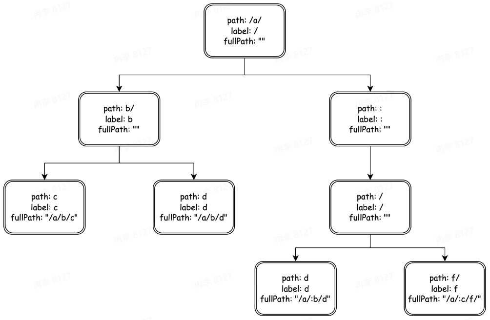

# HTTP架构学习笔记
[PPT](https://bytedance.larkoffice.com/file/boxcnQ1BgTNrXqOHQGAuTSbKWPh)
[HTTP框架：Hertz](https://github.com/cloudwego/hertz)
[sync.Pool用法](https://pkg.go.dev/sync#Pool)
[netpoll](https://github.com/cloudwego/netpoll)
[netpoll-examples](https://github.com/cloudwego/netpoll-examples)
[SIMD维基百科](https://en.wikipedia.org/wiki/Single_instruction,_multiple_data)
[Improving performance with SIMD intrinsics in three use cases](https://stackoverflow.blog/2020/07/08/improving-performance-with-simd-intrinsics-in-three-use-cases/)


#### HTTP协议
HTTP：超文本传输协议(Hypertext Transfer Protocol)

协议第一个要素：需要明确的边界
协议第二个要素：能够携带信息

POST请求内容

第一行是请求行，包含协议信息
剩下的是元数据
最后一行是内容Body


PUT和PATCH区别：二者都是用于更新，但PUT是幂等的，PATCH不是幂等的

请求流程
从上到下分别是
+ 业务层
+ 服务治理层、中间件层
+ 路由层
+ 协议编(解)码层
+ 传输层


HTTP是基于TCP的，对于基于TCP来说都会有队头阻塞问题，HTTP1不支持多路复用，明文传输不安全

HTTP2支持多路复用，提升了效率，但仍然是基于TCP协议来进行传输，没有解决队头阻塞问题

基于UDP实现可以解决基于TCP的队头阻塞

#### HTTP框架

**分层设计**

+ 专注性
+ 扩展性
+ 复用性


+ 应用层：跟用户直接打交道的一层
+ 中间件层：含有对用户预处理、后处理的逻辑
+ 路由层
+ 协议层
+ 传输层

特点
+ 高内聚、低耦合
+ 易复用
+ 高扩展性


**如何做设计**
+ 明确需求：考虑清楚要解决什么问题、有哪些需求
+ 业界调研：业界都有哪些解决方案可供参考
+ 方案权衡：思考不同方案的取舍
+ 方案评审：相关同学对不同方案做评审
+ 确定开发：确定最合适的方案进行开发

**应用层设计**
核心：提供合理的API
+ 可理解性：要使用主流的概念，如ctx.Body(), ctx.GetBody()，不要用ctx.BodyA()
+ 简单性：如ctx.Request.Header.Peek(key)/ctx.GetHeader(key)
+ 冗余性：如简单性里的两个接口，只出现一个就够了
+ 兼容性：实际开发中尤其重要
+ 可测性：写出的接口可测试
+ 可见性

不要试图在文档中说明，很多用户不看文档

**中间件设计**
中间件需求
+ 配合Handler实现一个完整的请求处理生命周期
+ 拥有预处理逻辑与后处理逻辑
+ 可以注册多中间件
+ 对上层模块、用户逻辑模块易用

`洋葱模型`
中间件的核心：将核心逻辑与通用逻辑分离


大部分中间件都是基于洋葱模型
适用场景
+ 日志记录
+ 性能统计
+ 安全控制
+ 事务处理
+ 异常处理

例如：打印每个请求的request和response
没有中间件时

有中间件时


中间件设计
+ 既然要实现预处理和后处理，就很像调用了一个函数

+ 路由上可以注册多Middleware，同时也可以满足请求级别有效，这样就不需要区分是中间件还是业务逻辑，只需要将Middleware设计为和业务、Handler相同即可
+ 用户如果不主动调用下一个处理函数怎么办？可以主动帮用户去调用函数，核心是在任何场景下index保持递增


+ 出现异常想停止怎么办？直接将index设置为最大值，跳出循环


`调用链`

中间件B是不调用Next中间件的，中间件C调用Next中间件，A首先调用中间件B，由于B不调用Next则直接执行结束返回，然后A调用中间件C，C显式调用Next，因此调用业务Handler，对于Go来说它们是不在一个调用栈上的，Recovery中间件是不能捕获其他协程里的panic的，它只能捕获本协程或本调用栈中的，如果C是Recovery中间件的话，那么它就不能捕获业务Handler中间件的

适用场景
+ 不调用Next：初始化逻辑且不需要在同一调用栈
+ 调用Next：后处理逻辑或需要在同一调用栈上

**路由设计**
框架路由实际上是为URL匹配对应的处理函数(Handlers)
+ 静态路由：/a/b/c、/a/b/d
+ 参数路由：/a/:id/c(冒号形式只匹配冒号中间一段，/a/b/c,/a/d/c)、/*all(星号可以匹配任意路由)
+ 路由修复：/a/b <-> /a/b/
+ 冲突路由以及优先级：/a/b、/:id/c
+ 匹配HTTP方法
+ 多处理函数：方便添加中间件
+ ...

+ 初级：map[string]handlers，只对静态路由有效，对参数路由就比较困难
  + /a/b/c、/a/b/d
  + /a/:id/c、/*all
+ 高级：前缀匹配树
  + /a/b/c、/a/b/d


对于参数路由可以构建下面的路由树

+ /a/b/c
+ /a/b/d
+ /a/:id/d
+ /a/:c/f

如何匹配HTTP方法？
直接构造多棵路由树

路由映射表
外层Map：根据Method进行初步筛选

如何实现添加多处理函数？
在每个节点上使用一个list存储handler
```go
type node struct {
    prefix string
    parent *node
    children children
    handlers app.HandlersChain
}
```

**协议层设计**
抽象出合适的接口
```go
type Server interface {
    Serve(c context.Context, conn network.Conn) error
}
```

+ Do not store Contexts inside a struct type; instead, pass a Context explicitly to each function that needs it. The Context should be the first parameter.不要把contexts写到一个struct里，而是要显式的表现出来
+ 需要在连接上读写数据

**网络层设计**
BIO(Block Input Output)：阻塞IO
```go
go func() {
    for {
        conn, _ := listener.Accept()
        go func() {
            conn.Read(request)

            handle...

            conn.Write(response)
        }()
    }
}()
```

NIO
```go
go func() {
    for {
        readableConns, _ := Monitor(conns)
        for conn := range readableConns {
            go func() {
                conn.Read(request)

                handle...

                conn.Write(response)
            }()
        }
    }
}()
```

go net在用户来看就是明显的BIO
用户管理buffer
```go
type Conn interface {
    Read(b []byte) (n int, err error)
    Write(b []byte) (n int, err error)
    ...
}
```

netpoll采用NIO模型
网络库管理buffer
```go
type Reader interface {
    Peek(n int) ([]byte, error)
    ...
}

type Write interface {
    Malloc(n int) (buf []byte, err error)
    Flush() error
    ...
}
```

对网络库抽象的接口
```go
type Conn interface {
    net.Conn
    Reader
    Writer
}
```

**针对网络库的优化**
`buffer设计`
go net采用BIO模型

需求
+ 存下全部Header
+ 减少系统调用次数
+ 能够复用内存
+ 能够多次读
```go
type Conn interface {
    Read(b []byte) (n int, err error)
    Write(b []byte) (n int, err error)
    ...
}
```

go net with bufio
为每一个连接绑定一块缓冲区
```go
type Reader interface {
    Peek(n int) ([]byte, error)
    Discard(n int) (discarded int, err error)
    Release() error
    Size() int
    Read(b []byte) (l int, err error)
    ...
}

type Writer interface {
    Write(p []byte)
    Size() int
    Flush() error
    ...
}
```

netpoll

需求
+ 存下全部Header
+ 拷贝出完整的Body


链表带来的问题就是跨节点

优化

netpoll with nocopy peek
+ 分配足够大的buffer
+ 限制最大buffer size

```go
type Conn interface {
    net.Conn
    Reader
    Writer
}
```

不同网络库优势
+ go net
  + 流式友好
  + 小包性能好
+ netpoll
  + 中大包性能好
  + 时延低

**针对协议优化**
`Headers解析`
+ 找到Header Line边界：\r\n，两个连续的\r\n就说明读完了

针对有特征的数据
+ 先找到\n再看它前一个是不是\r，SIMD(Single Instruction Multiple Data)是一种单指令流多数据流技术，可以用一组指令对多组数据进行并行操作，对这个场景可以从一个一个匹配到多个多个进行匹配，速度更快。[Sonic](https://github.com/bytedance/sonic)


针对协议相关的Headers快速解析

+ 通过Header key首字母快速筛除掉完全不可能的key
+ 解析对应value到独立字段
+ 使用byte slice管理对应header存储，方便复用

请求体中同样处理的Key：User-Agent、Content-Type、Content-Length、Connection、Transfer-Encoding

Headers解析
+ 取
  + 核心字段快速解析
  + 使用byte slice存储
  + 额外存储到成员变量中
+ 舍
  + 普通header性能较低
  + 没有map结构，对用户来说使用起来更麻烦

Header Key规范化
采用表映射方式
aaa-bbb -> Aaa-Bbb

+ 取
  + 超高的转换效率
  + 比net.http提高40倍
+ 舍
  + 额外的内存开销
  + 变更困难

`热点资源池化`
一个请求进来之后，会有一个RequestContext与请求一一对应，贯穿一个请求始终，但这样在高并发场景下对于内存分配、GC等压力较大


可以构建一个RequestContext池，需要哪一个就提取哪一个，实现Request复用


+ 取
  + 减少了内存分配
  + 提高了内存复用
  + 降低了GC压力
  + 性能提升
+ 舍
  + 额外的Reset逻辑
  + 请求内有效
  + 问题定位难度增加

#### 企业实践
对于一个架构
+ 追求性能
+ 追求易用、减少误用
+ 打通内部生态
+ 文档建设、用户群建设

课后问题
+ 为什么HTTP框架要做分层设计？分层设计有哪些优势和劣势
+ 现有开源社区HTTP框架有哪些优势与不足
+ 中间件还有没有其他实现方式？可以用伪代码说明
+ 完成基于前缀路由树的注册与查找功能。可以用伪代码说明
+ 路由还有没有其他实现方式？
