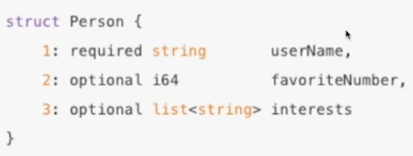

# RPC框架学习笔记额
[PPT](https://bytedance.larkoffice.com/file/boxcn5DUtKdJDDitx8NHShv2xZd)
[RPC概念模型](https://web.eecs.umich.edu/~mosharaf/Readings/RPC.pdf)
[Thrift Header协议](https://github.com/apache/thrift/blob/master/doc/specs/HeaderFormat.md)
[KiteX整体架构](https://github.com/cloudwego/kitex)
[自研网络库Netpoll](https://github.com/cloudwego/netpoll)
[KiteX性能优化实践](https://www.infoq.cn/article/spasfyqgaaid5rguinl4)
[字节跳动微服务架构体系演进](https://www.infoq.cn/article/asgjevrm8islszo7ixzh)

#### 本地函数调用
```go
func main() {
    var a = 2
    var b = 3
    result := calculate(a, b)
    fmt.Println(result)
    return
}

func calculate(x, y int) {
    z := x * y
    return z
}
```
+ 将a和b的值压栈
+ 通过函数指针找到calculate函数，进入函数取出栈中的值2和3，将其赋予给x和y
+ 计算x*y，并将结果存在z
+ 将z的值压栈，然后从calculate返回
+ 从栈中取出z返回值，并赋值给result

#### 远程函数调用
RPC：Remote Procedure Calls
需要解决的问题
+ 函数映射
+ 数据转换成字节流
+ 网络传输

**概念模型**

1984年Nelson发表的《Implementing Remote Procedure Calls》论文，提出了RPC的过程由五个模型组成：User、User-Stub、RPC-Runtime、Server-Stub、Server

**一次完整的RPC过程**

IDL(Interface description language)文件
IDL通过一种中立的方式来描述接口，使得在不同平台上运行的对象和用不同语言编写的程序可以相互通信

生成代码
通过编辑器工具把IDL文件转换成语言对应的静态库

编解码
从内存中表示到字节序列的转换称为编码，反之为解码，也常叫做序列化和反序列化

通信协议
规范了数据在网络中的传输内容和格式，除必须的请求/响应数据外，通常还会包含额外的元数据

网络传输
通常基于成熟的网络库走TCP/UDP传输

**RPC的好处**

+ 单一职责，有利于分工协作和运维开发
+ 可扩展性强，资源使用率更优，扩容和底层资源复用
+ 故障隔离，服务的整体可靠性更高，某个服务故障不会影响其他服务

**RPC带来的问题**
+ 服务器宕机，对方应该如何处理？
+ 在调用过程中发生网络异常，如何保证消息的可达性？
+ 请求量突增导致服务无法及时处理，有哪些措施？

#### 分层设计
以Apache Thrift为例


**编解码层**


生成代码


数据格式
+ 语言特定的格式
  + 许多编程语言都内建了将内存对象编码为字节序列的支持，如Java有java.io.Serializable，缺点是和语言绑定，在兼容性上有问题
+ 文本格式
  + JSON、XML、CSV等文本格式，具有人类可读性
+ 二进制编码
  + 具备跨语言和高性能等优点，将数据转化为二进制流，常见有Thrift的BinaryProtocol，Protobuf等

TLV编码
+ Tag：标签，可以理解为类型
+ Length：长度
+ Value：值，Value也可以是个TLV结构




选编码格式需要考虑的方向
+ 兼容性
  + 支持自动增加新的字段，而不影响老的服务，这将提高系统的灵活度
+ 通用性
  + 支持跨平台、跨语言
+ 性能
  + 从空间和时间两个维度来考虑，也就是编码后数据大小和编码耗费时长

**协议层**

编解码后并不是直接把数据流传输出去，需要封装通信协议

概念
+ 特殊结束符
  + 一个特殊字符作为每个协议单元结束的标示

+ 变长协议
  + 以定长加不定长的部分组成，其中定长的部分需要描述不定长的内容长度


[协议构造](https://github.com/apache/thrift/blob/master/doc/specs/HeaderFormat.md)

+ LENGTH：数据包大小，不包含自身
+ HEADER MAGIC：标识版本信息，协议解析时快速校验
+ SEQUENCE NUMBER：表示数据包的seqID，可用于多路复用，单连接内递增
+ Header Size：头部长度，从第14个字节开始计算一直到PAYLOAD前
+ PROTOCOL ID：编解码方式，有Binary和Compact两种
+ TRANSFORM ID：压缩方式，如zlib和snappy
+ INFO ID：传递一些定制的meta信息
+ PAYLOAD：消息体

协议解析

通过MagicNumber知道是什么类型协议，通过PayloadCodec知道是什么编码类型，然后进行解码得到Payload

**网络通信层**


Sockets API


网络库衡量指标
+ 提供易用API
  + 封装底层Socket API
  + 连接管理和事件分发
+ 功能
  + 协议支持：tcp、udp和uds等
  + 优雅退出、异常处理等
+ 性能
  + 应用层buffer减少copy
  + 高性能定时器、对象池等

#### 关键指标

**稳定性**

保障策略
+ 熔断：保护调用方，防止被调用的服务出现问题而影响到整个链路
+ 限流：保护被调用方，防止大流量把服务压垮
+ 超时控制：避免浪费资源在不可用节点上


提高请求成功率
+ 负载均衡
+ 重试

负载均衡


重试


长尾请求
耗时明显高于常规请求且占比比较小的请求

正常情况


Bakeup Requst
t3时间后发现Req1还没返回，然后重试发送Req2，其中t3是绝大多数情况下能够收到Resp的等待时间


注册中间件


**易用性**
+ 开箱即用
  + 合理的默认参数选项、丰富的文档

+ 周边工具
  + 生成代码工具、脚手架工具


**扩展性**
+ Middleware
+ Option
+ 编解码层
+ 协议层
+ 网络传输层
+ 代码生成工具插件扩展


**观测性**
+ Log(日志)、Metric(监控)、Tracing(跟踪)
+ 内置观测性服务


**高性能**
+ 场景
  + 单机多机
  + 单连接多连接
  + 单/多client
  + 单/多server
  + 不同大小的请求包
  + 不同请求类型，如pingpong、streaming等
+ 目标
  + 高吞吐
  + 低延迟
+ 手段
  + 连接池
  + 多路复用
  + 高性能编解码协议
  + 高性能网络库

#### 企业实践

**Kitex**

整体架构
+ Kitex Core：核心组件
+ Kitex Byted：与公司内部基础设施集成
+ Kitex Tool：代码生成工具


自研网络库Netpoll

背景
+ 原生库无法感知连接状态
  + 在使用连接池时，池中存在失效连接，影响连接池的复用
+ 原生库存在goroutine暴涨的风险
  + 一个连接一个goroutine的模式，由于连接利用率低下，存在大量goroutine占用调度开销，影响性能

Netpoll
+ 解决无法感知连接状态问题
  + 引入epoll主动监听机制，感知连接状态
+ 解决goroutine暴涨的风险
  + 建立goroutine池，复用goroutine
+ 提升性能
  + 引入NoCopy Buffer，向上层提供NoCopy的调用接口，编解码层面零拷贝

Kitex扩展性设计
支持多协议，也支持灵活的自定义协议扩展


性能优化
+ 网络库优化
  + 调度优化
    + epoll_wait在调用上的控制
    + gopool重用goroutine，降低同时运行协议数
  + LinkBuffer
    + 读写并行无锁，支持NoCopy地流式读写
    + 高效扩缩容
    + NoCopy Buffer池化，减少GC
  + Pool
    + 引入内存池和对象池，减少GC开销
+ 编解码优化
  + Codegen
    + 预计算并预分配内存，减少内存操作次数，包括内存分配和拷贝
    + InLine减少函数调用次数和避免不必要的反射操作等
    + 自研了Go语言实现的Thrift IDL解析和代码生成器，支持完善的Thrift IDL语法和语义检查，并支持了插件机制-[Thriftgo](https://github.com/cloudwego/thriftgo)
  + JIT
    + 使用JIT编译技术改善用户体验的同时带来更强的编解码性能，减轻用户维护生成代码的负担
    + 基于JIT编译技术的高性能动态Thrift编解码器-Frugal(https://github.com/cloudwego/frugal)

合并部署
微服务过微，传输和序列化开销越来越大
将亲和性强的服务实例尽可能调度到同一个物理机，远程RPC调用优化本地RPC调用


+ 中心化的部署调度和流量控制
+ 基于共享内存的通信协议
+ 定制化的服务发现和连接池实现
+ 定制化的服务启动和监听逻辑


