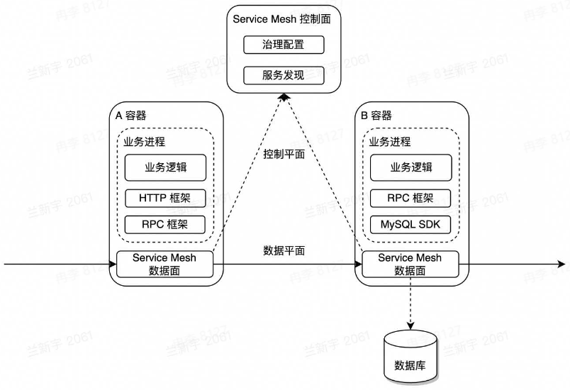
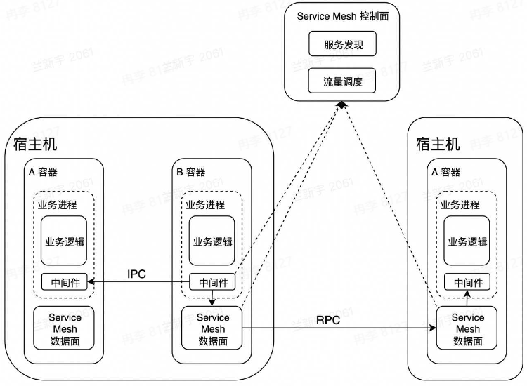

# 后端架构学习笔记
[PPT](https://bytedance.larkoffice.com/file/boxcnu5qAsrCmW6eVdlGZYs7DDo)
[C10K问题](http://www.kegel.com/c10k.html)
[CNCF](https://www.cncf.io/)
[CNCF landscape](https://landscape.cncf.io/)

#### 架构

架构又称为软件架构
+ 是有关软件整体结构与组件的抽象描述
+ 用于指导软件系统各个方面的设计

实现一个软件有很多种方法，架构在方法选择上起着至关重要的指导作用

单机架构
软件系统需要具备对外提供服务，单机就是把所有功能都实现在一个进程里，并部署到一台机器上
优点
+ 简单

问题
+ C10K problem
+ 运维需要停服

单体架构：分布式部署
垂直应用架构：按应用垂直切分的单体，把功能进行划分
优点
+ 水平扩容
+ 运维不需要停服

问题
+ 责任太多，开发效率不高
+ 爆炸半径大

SOA(Service-Oriented Architecture)架构
+ 将应用的不同功能单元抽象为服务
+ 定义服务之间的通信标准

微服务架构：SOA的去中心化演进方向
问题
+ 数据一致性
+ 高可用，合作方式
+ 治理，怎样容灾
+ 解耦 vs 过微，考虑运维成本

架构的演进初衷
+ 需求量越来越大，需要增加人手
+ 越做越复杂，需要分工合作

架构的演进思路
+ 垂直切分
+ 水平切分

#### 云计算
云计算是指通过软件自动化管理，提供计算资源的服务网络，是现代互联网大规模熟悉分析和存储的基石

基础
+ 虚拟化技术
+ 编排方案

架构
+ IaaS(Infrastructure as a Service)：屏蔽物理资源的概念
+ PaaS(Platform as a Service)
+ SaaS(Software as a Service)
+ FaaS(Function as a Service)

#### 云原生
云原生(Cloud Native)技术是组织(公司)在公有云、自由云、混合云等新型的动态环境中，构建和运行可弹性扩展的应用提供了可能

**弹性资源**
+ 虚拟化容器
+ 快速扩缩容

弹性计算资源类型
+ 服务资源调度
  + 微服务
  + 大服务
+ 计算资源调度
  + 在线
  + 离线
+ 消息队列
  + 在线：削峰、解耦，消息队列吞吐量大
  + 离线：支持大数据分析套件

弹性存储资源类型：将存储资源当成服务一样
+ 经典
  + 对象
  + 大数据
+ 关系型数据库
  + 记录
+ 元数据
  + 服务发现
+ NoSQL存储
  + KV键值对存储

**微服务架构**
+ 业务功能单元解耦
+ 统一的通信标准

通信标准
+ HTTP(RESTful API)
+ RPC(Thrift, gRPC)远程过程调用

微服务中间件RPC vs HTTP
+ 性能，RPC会有很多通信压缩方案，性能比一般的HTTP协议好
+ 服务治理，RPC中间件具备天生服务治理能力
+ 协议可解释性，HTTP使用json格式，具有比较好的协议可解释性，而RPC具有很多通信压缩方案

云原生场景下，微服务大可不必在业务逻辑中实现符合通信标准的交互逻辑，而是交给框架来做

**DevOps**
+ 敏捷开发
+ CI/CD

DevOps是云原生时代软件交付的利器，贯穿整个软件开发周期。结合自动化流程，提高软件开发、交付效率

**服务网格**
+ 业务与治理解构
+ 异构系统的治理统一化
+ 复杂治理能力

服务网格(Service Mesh)
+ 微服务之间通讯的中间层
+ 高性能网络代理
+ 业务代码与治理解耦

相比较于RPC/HTTP框架
+ 异构系统治理统一化
+ 与服务进程解耦，生命周期易管理

#### 后端架构挑战
挑战
+ 基础设施层面
  + 物理资源是有限的
    + 机器
    + 带宽
  + 资源利用率受制于部署服务
+ 用户层面
  + 网络通信开销较大
  + 网络抖动导致运维成本提高
  + 异构环境下，不同实例资源使用不均

**离在线资源并池**：讲离线资源池和在线资源池合并，根据离线和在线资源需求关系，动态调整离线资源和在线资源的比例
核心收益
+ 降低物理资源成本
+ 提供更多的弹性资源，增加收入

在线业务特点
+ IO密集型为主
+ 潮汐性、实时性

离线业务特点
+ 计算密集型占多数
+ 非实时性

同一个机器怎么做离在线隔离？
+ 可以用虚拟化方式对CPU的核心资源做隔离，不同的任务使用不同的CPU

**自动扩缩容**
核心收益
+ 降低业务成本

解决思路
+ 利用在线业务潮汐性自动扩缩容

扩缩容依据什么指标？
+ 使用CPU某一个统计的分类数，如CPU的P50，也就是50%作为衡量资源的整个使用情况的指标
+ CPU利用率或内存利用率方向考虑，基于IO目前来看在可行性上较困难

**微服务亲合性部署**
核心收益
+ 降低业务成本
+ 提高服务可用性

微服务亲合性部署
+ 将满足亲合性条件的容器调度到一台宿主机
+ 微服务中间件与服务网格通过共享内存通信
+ 服务网格控制面实施灵活、动态的流量调度

**流量治理**
核心收益
+ 提高微服务调用容错性
+ 容灾
+ 进一步提高开发效率，DevOps发挥到极致

基于微服务中间件与服务网格的流量治理
+ 熔断、重试
+ 单元化
+ 复杂环境(功能、预览)的流量调度

**CPU水位负载均衡**
核心收益
+ 打平异构环境算力差异
+ 为自动扩缩容提供正向输入

CPU水平负载均衡
+ IaaS
  + 提供资源探针
+ 服务网格
  + 动态负载均衡

#### 后端架构实战
问题背景
+ 不同计算资源工作效率差距大

考虑方向
+ 需要哪些输入
+ 设计时需要考虑哪些关键点

输入
+ 服务网格数据面
  + 支持带权重的负载均衡策略
+ 注册中心存储了所有容器的权重信息
+ 宿主机能提供
  + 容器的资源使用情况
  + 物理资源信息(如CPU型号)

关键点
+ 紧急回滚能力
+ 大规模情况下如何使用
+ 极端场景

**自适应静态权重**
方案
+ 采集宿主机物理资源信息
+ 调整容器注册的权重

优势
+ 复杂度低
+ 完全分布式，可用性高
+ 微服务中间件无适配成本

缺点
+ 无紧急回滚能力
+ 缺乏运行时自适应能力

**自适应动态权重 Alpha**
方案
+ 容器动态权重的自适应调整
+ 服务网格的服务发现与流量调度能力

动态权重决策中心首先从注册中心获取服务注册信息，根据配置中心获取服务在注册中心的名称，帮助动态权重决策中心能更好的跟注册中心进行交互，然后根据宿主信息采集服务所有容器指标进行复杂运算来更新服务注册信息
再根据服务网格提供的流量调度能力，来决定使用动态权重还是静态权重，解决无法紧急回滚的问题

演进方向
+ 解决无法紧急回滚的问题
+ 运行时权重自适应

缺点
+ 过度流量倾斜可能会有异常情况

**自适应动态权重 Beta**
方案
+ 服务网格上报RPC指标

演进方向
+ 极端场景的处理成为可能

缺点
+ 时序数据库压力较大
+ 动态权重决策中心职责越来越多，迭代->变更->风险

**自适应动态权重 Release**
演进方向
+ 微服务化
+ 引入消息队列削峰、解耦
+ 离在线链路切分
+ 梳理强弱依赖

通过在线分析引擎拿到数据链路上负载均衡所使用的权重的数据，快速得到权重反馈给注册中心，同时写一份离线数据到时序数据库，最后通过离线分析引擎反馈给在线分析引擎，如通过机器学习等帮助在线分析引擎在进行分析时做更好的算法调优

+ 没有最好的架构，只有最合适的架构
+ 如何做架构设计
  + 需求先行。弄清楚要解决什么问题
  + 业界调研。业界都有哪些解决方案可供参考
  + 技术选型。内部/社区都有哪些基础组件
  + 异常情况。考虑清楚xxx不行了怎么办
+ 架构与工程师成长
  + 技术经理
  + 架构师
