# 分布式定时任务学习笔记
[PPT](https://bytedance.larkoffice.com/file/boxcn5rQn9Mc3SocB22Aph3kKMe)

#### 发展历程
**Windows批处理**
Case 1：10分钟后Windows电脑自动关机
步骤
+ 桌面空白处右键单击-新建-文本文档
+ 更改文件名和后缀为"自动关机.bat"
+ 修改文件内容为"shutdown -s -t 600"，代表10分钟后关机
+ 双击运行该批处理文件，电脑将会在10分钟后关机

**Windows计划任务程序**
Case 2：每天12：00自动打卡
步骤
+ 右键此电脑找到管理
+ 在管理内找到任务计划程序

**Linux命令 CronJob**
Case 3：每天2：30定时清理机器日志
```
30 2 * * * clean_log.sh
```
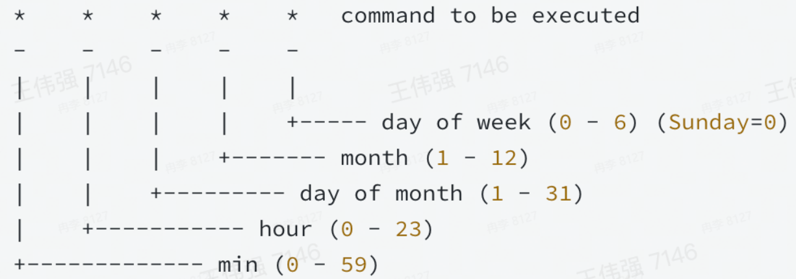
+ Linux系统命令使用简单，稳定可靠
+ 只能控制单台机器，且无法适用于其他操作系统

**单机定时任务 Timer、Ticker**
Case 4：每隔5分钟定时刷新本地缓存数据
```Java
public static void main(String[] args) throws ParseException {
    Timer timer = new Timer();
    timer.schedule(new TimerTask() {
        @override
        public void run() {
            SyncLocalCache();
        }
    }, 5000, 5 * 60 * 100);
}
```
```go
func main() {
    ticker := time.NewTicker(5 * time.Minute)
    for {
        select {
        case <-ticker.C:
            SyncLocalCache()
        }
    }
}
```
+ 跨平台
+ 仅单机可用

**单机定时任务 ScheduledExecutorService**
Case 5：每隔5分钟定时执行多个任务
```Java
private static ScheduledExecutorService scheduler;

public static void main(String[] args) throws Exception {
    scheduler = Executors.newScheduledThreadPool(5);

    scheduler.scheduleAtFixedRate(((
        new Runnable() {
            @override
            public void run() {
                DoSomething();
            }
        }
    )), 0, 300, TimeUnit.SECONDS);
}
```
+ 拥有线程池功能
+ 仅单机可用

**任务调度 Quartz**
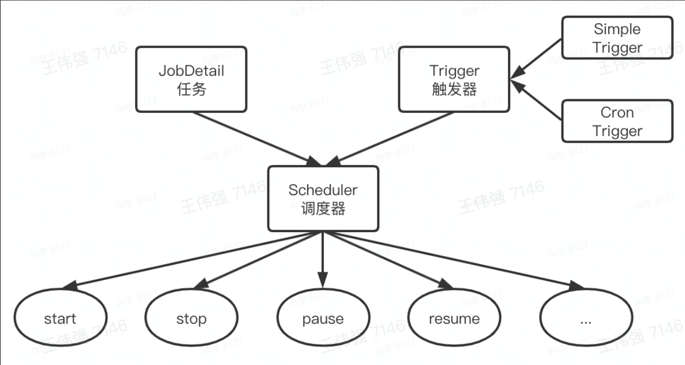
+ 单任务极致控制
+ 没有负载均衡机制

**分布式定时任务**
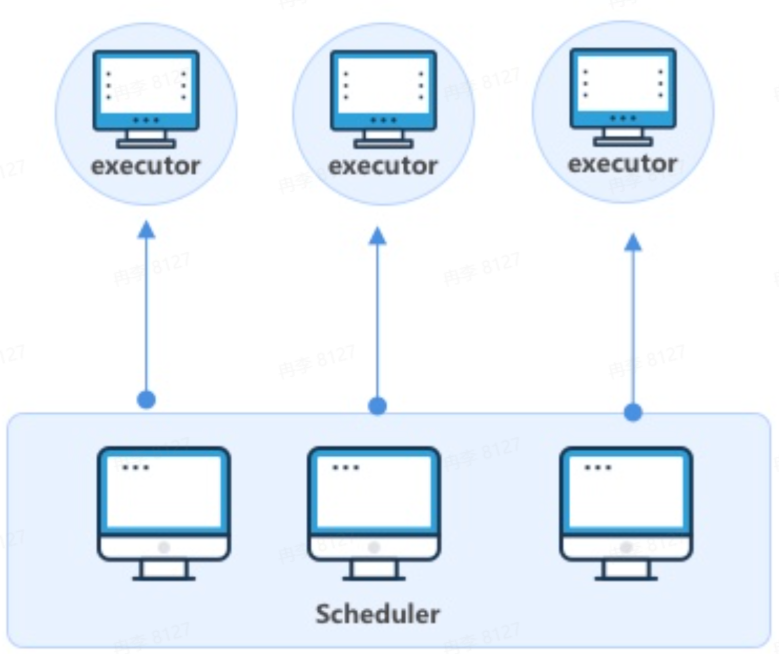
+ 平台化管理
+ 分布式部署
+ 支持海量数据

定时任务是指系统为了自动完成特定任务，实时、延时、周期性完成任务调度的过程
定时任务解决了自动化和准时两个问题
分布式定时任务是把分散的、可靠性差的定时任务纳入统一的平台，并实现集群管理调度和分布式部署的一种定时任务的管理方式
分布式定时任务解决高性能、可靠性、分布式部署等问题

按触发时机分类
+ 定时任务：特定时间触发，比如今天15：06执行
+ 延时任务：延时触发，比如10s后执行
+ 周期任务：固定周期时间，或固定频率周期调度触发，比如每隔5s或者每天12点执行

特点
+ 自动化：全自动完成定时任务的调度和执行
+ 平台化：基于平台化的思维管控一系列的分布式定时任务
+ 分布式：在分布式系统环境下运行任务调度，突破单机定时任务的性能瓶颈
+ 伸缩性：采用集群方式部署，可以随时按需扩缩容
+ 高可用：单点故障不影响最终任务结果，可以做到故障转移

执行方式
+ 单机任务：随机触发一台机器执行任务，适用于计算量小、并发度低的任务
+ 广播任务：广播到所有机器上执行同一个任务，比如所有机器一起清理日志
+ Map任务：一个任务可以分出多个子任务，每个子任务负责一部分的计算，适用于计算量大，单机无法满足要求的任务
+ MapReduce任务：在Map任务的基础上，还可以对所有子任务的结果做汇总计算，适用于计算量大，并且需要对子任务结果做汇总的任务
发奖金额计算就是MapReduce任务，定时开奖就是Map任务
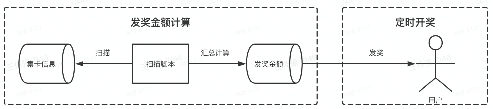

业内定时任务框架
||Xxl-job|SchedulerX|TCT|Elastic-job|Saturn|
|-|-|-|-|-|-|
|来源公司|美团点评|阿里巴巴|腾讯|当当网|唯品会|
|是否开源|是|否|否|是|是|
|任务编排|子任务依赖|支持|支持|不支持|不支持|
|任务分片|支持|支持|支持|支持|支持|
|高可用|支持|支持|支持|支持|支持|
|故障转移|支持|支持|支持|支持|支持|
|可视化运维|支持|支持|支持|支持|支持|

Xxl-job
Xxl-job是大众点评员工许雪里于2015年发布的分布式任务调度平台，是一个轻量级分布式任务调度框架，其核心设计目标是开发迅速、学习简单、轻量级、易扩展。XXL-JOB支持分片，简单支持任务依赖，支持子任务依赖，不是跨平台的。
Xxl-job很大一个优势在于开源且免费，并且轻量级，开箱即用，操作简易，上手快，企业维护起来成本不高，因而在中小型公司使用非常广泛

SchedulerX
分布式任务调度SchedulerX 2.0是阿里巴巴基于Akka架构自研的新一代分布式任务调度平台，提供定时调度、调度任务编排和分布式批量处理等功能。
SchedulerX可在阿里云付费使用。它功能非常强大，在阿里巴巴内部广泛使用并久经考验。

TCT
分布式任务调度服务(Tencent Cloud Task)是腾讯云自主研发的一款高性能、高可靠通用的分布式任务调度中间件，通过指定时间规则严格触发调度任务，保障调度任务的可靠有序执行。该服务支持国际通用的时间表达式、调度任务执行生命周期管理，解决传统定时调度任务单点及并发性能问题。同时，支持任务分片、流程编排复杂调度任务处理能力，覆盖广泛的任务调度应用场景。
TCT仅在腾讯内部使用，未开源，也未商用。

分布式定时任务 vs 单机定时任务
+ 关系
  + 都可以实现自动化的定时、延时、周期任务调度
+ 差异
  + 分布式定时任务可支撑更大的业务体量
  + 分布式定时任务的性能、伸缩性、稳定性更高

分布式定时任务 vs 大数据处理引擎
+ 关系
  + 都可以对海量数据做处理
  + 性能、伸缩性、稳定性都很高
+ 差异
  + 定时并不是大数据处理引擎要解决的核心问题
  + 大数据处理引擎往往致力于将源数据处理成结果数据，分布式定时任务除了能做这个之外，还可以调用HTTP和RPC服务

总结
+ 生活用途
  + Windows批处理
  + Windows任务计划程序
+ 工作用途
  + Linux命令--cronjob
  + 单机定时任务--Timer、Ticker
  + 单机定时任务--ScheduledExecutorService
  + 任务调度--Quartz
  + 分布式定时任务
+ 分布式定时任务
  + 触发时机：定时、延时、周期
  + 执行方式：单机、广播、Map、MapReduce
  + 业内流行框架：Xxl-job、ScheduleX、TCT
  + 关联技术：单机定时任务、大数据处理引擎

#### 实现原理
核心架构
分布式定时任务核心要解决触发、调度、执行三个关键问题
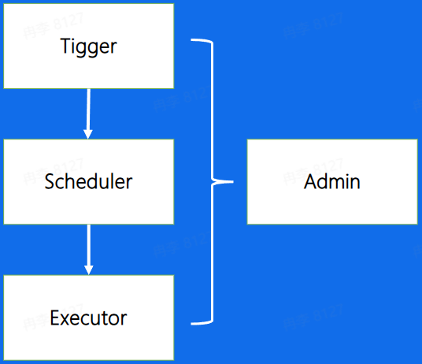
+ 触发器：Trigger，解析任务，生成触发事件
+ 调度器：Scheduler，分配任务，管理任务生命周期
+ 执行器：Executor，获取执行任务单元，执行任务逻辑
+ 控制台：Admin，提供任务管理和干预的功能

数据流
用户先填写任务基础信息，如创建者、触发时间或者是归属，然后设置触发规则，如周期性执行或单次执行，用户需要提交自己的任务代码，调度时执行用户提交的任务代码，用户把它们提交给控制台，然后控制台把任务放到任务队列中
控制台需要判断任务需要在什么时间节点执行，依赖触发器去触发，依靠调度器去做任务的整体协调，最后把任务分派到执行器中执行
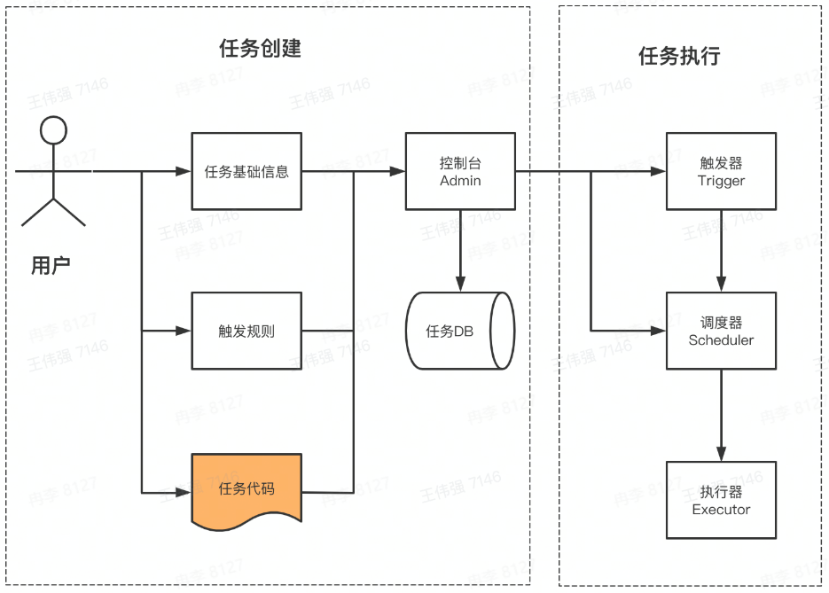

功能架构
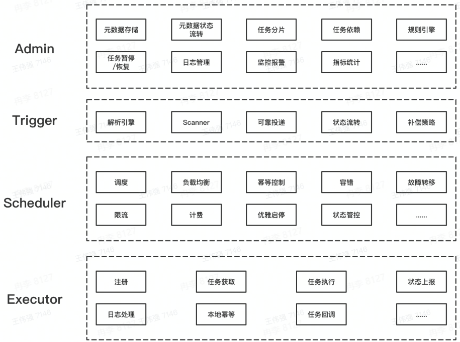

**控制台**
基本概念
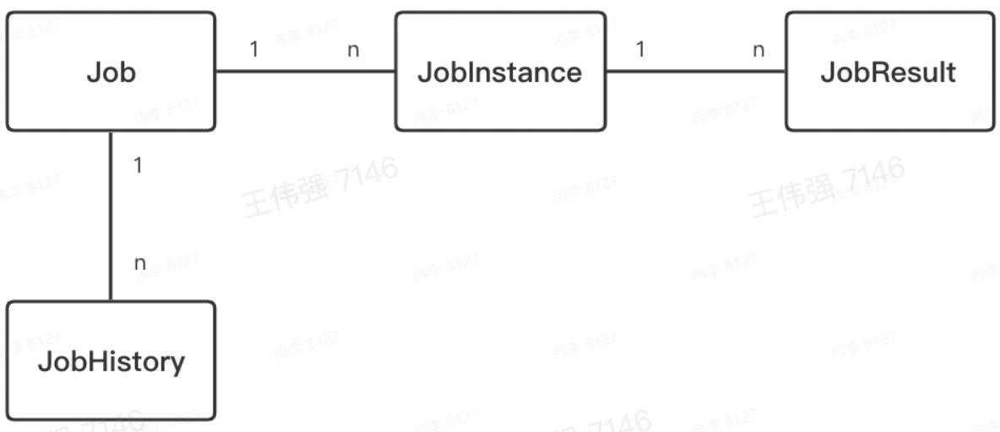
+ 任务：Job，任务元数据
+ 任务实例：JobInstance，周期任务会生成多个任务实例，因为每个任务不一定会执行成功，某些任务实例会不断重复执行，得到若干执行结果
+ 任务结果：JobResult，任务实例运行的结果
+ 任务历史：JobHistory，用户可以修改任务信息，任务实例对应的任务元数据可以不同，因而使用任务历史存储

+ 任务元数据(Job)：是用户对任务属性定义，包括任务类型调度时机、执行行为等
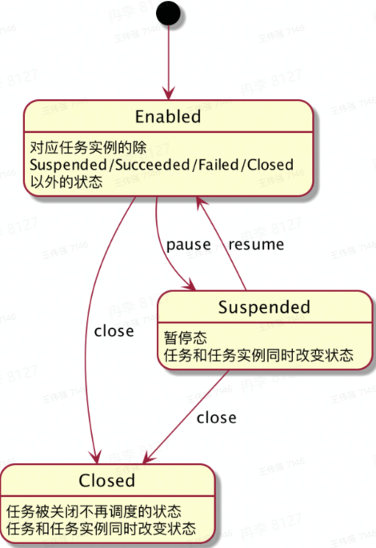
+ 任务实例(JobInstance)：是一个确定的Job的一次运行实例
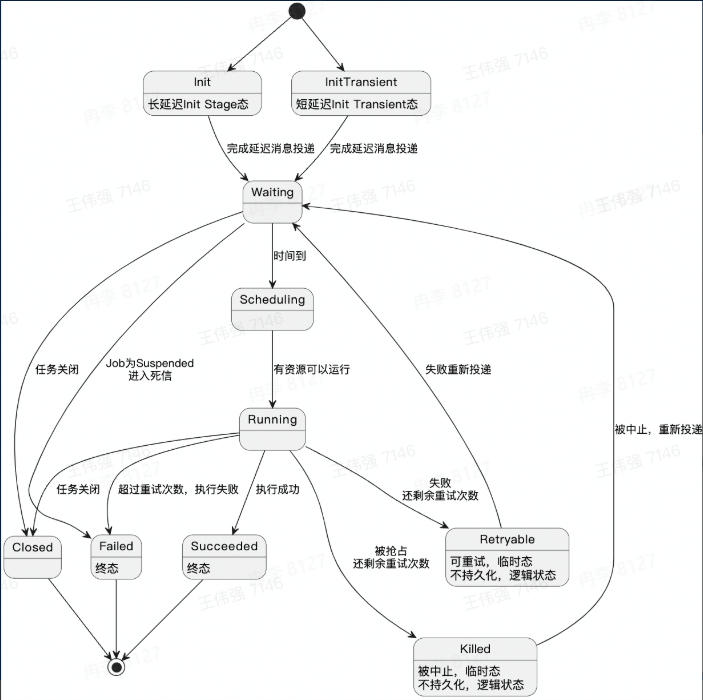

**触发器**
核心职责
+ 给定一系列任务，解析它们的触发规则，在规定的时间点触发任务的调度

设计约束
+ 需支持大量任务
+ 需支持秒级的调度
+ 周期任务需要多次执行
+ 需保证秒级扫描的高性能，并避免资源浪费

方案1
定期扫描 + 延时消息(腾讯、字节方案)
Trigger由Scanner和processor组成，Scanner定期扫描DB里的任务，把将要触发的任务发送给processor，然后processor把任务放到延时MQ里，并改变任务在DB内的状态，最后延时MQ根据任务触发时间进行执行
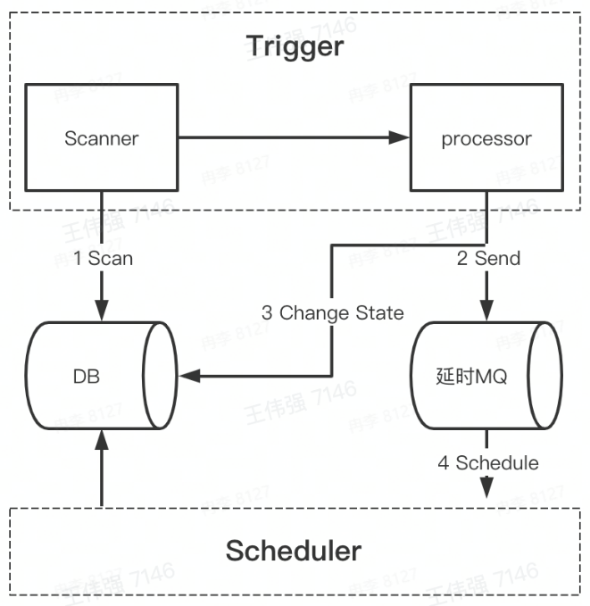

方案2
时间轮(Quartz所用方案)
时间轮是一种高效利用线程资源进行批量化调度的一种调度模型，时间轮是一个存储环形队列，底层采用数组实现，数组中的每个元素可以存放一个定时任务列表
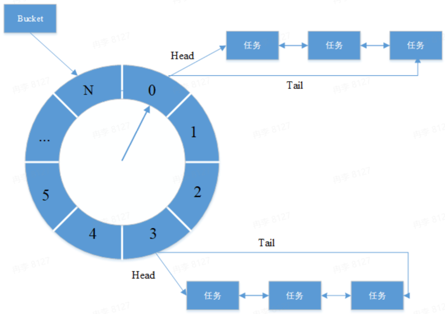

目标：遍历任务列表，从中找出当前时间点需触发的任务列表
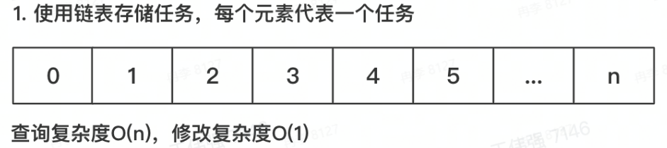
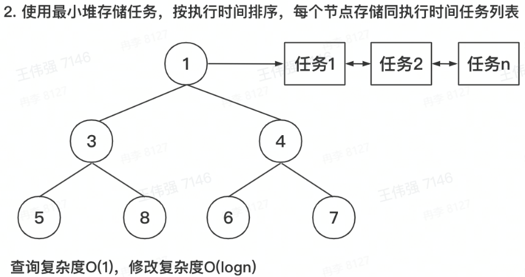
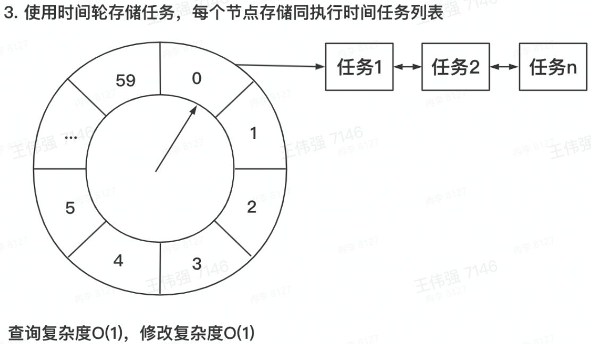
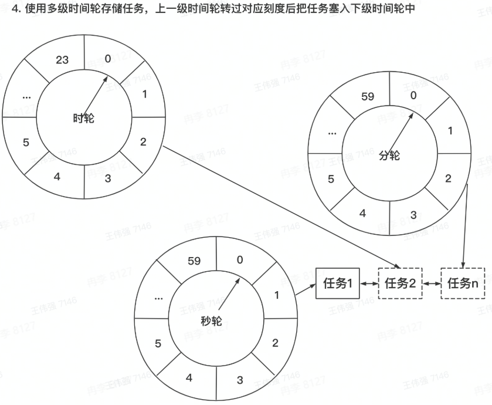

高可用
核心问题
+ 不同业务之间，任务的调度相互影响怎么办？
+ 负责扫描和触发的机器挂了怎么办？

解决思路
+ 存储上，不同国别、业务做资源隔离
+ 运行时，不同国别、业务分开执行
+ 部署时，采用多机房集群化部署，避免单点故障，通过数据库锁或分布式锁保证任务只被触发一次

单Trigger模式会有单点故障，机器故障时平台崩溃

Trigger集群模式可避免单点故障，需要避免同一任务被多次触发，导致业务紊乱


数据库行锁模式
在触发调度之前，更新数据库中JobInstance的状态，成功抢锁的才会触发调度
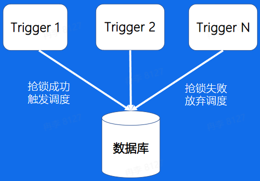
多台机器频繁竞争数据库锁，节点越多性能越差

分布式锁模式
在触发调度之前，尝试抢占分布式锁，可使用Redis锁或Zookeeper锁
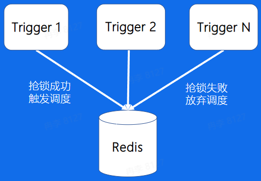
性能较高，多家公司使用此方案

**调度器**
资源来源
+ 业务系统提供机器资源
  + 使用该方案的公司
    + 阿里、美团、字节等
  + 优点
    + 任务执行逻辑与业务系统共用同一份资源，利用率较高
  + 缺点
    + 更容易发生定时任务脚本影响在线服务的事故
    + 不能由定时任务平台控制扩缩容
+ 定时任务平台提供机器资源
  + 使用该方案的公司
    + 字节等
  + 优点
    + 任务执行逻辑与业务系统提供的在线服务隔离，避免相互影响
    + 可以支持优雅地扩缩容
  + 缺点
    + 消耗更多机器资源
    + 需要额外为定时任务平台申请接口调用权限，而不能直接继承业务系统的权限

节点选择
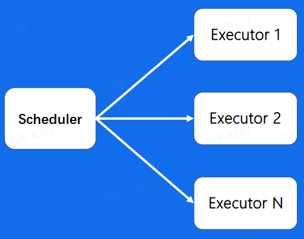
+ 随机节点执行：选择集群中一个可用的执行节点执行调度任务，适用场景：定时对账
+ 广播执行：在集群中所有的执行节点分发调度任务并执行，适用场景：批量运维
+ 分片执行：按照用户自定义分片逻辑进行拆分，分发到集群中不同节点并行执行，提升资源利用效率，适用场景：海量日志统计

任务分片
通过任务分片来提高任务执行的效率和资源的利用率
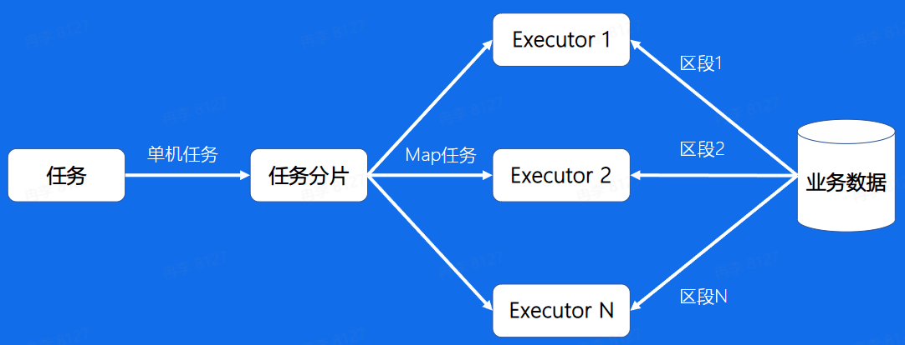
N个执行器Executor，M个业务逻辑区段，最好$M \geq N$，且M是N的整数倍

高级特性
+ 任务编排：使用有向无环图DAG(Directed Acyclic Graph)进行可视化任务编排，用户可以通过拖拽编辑任务执行的顺序
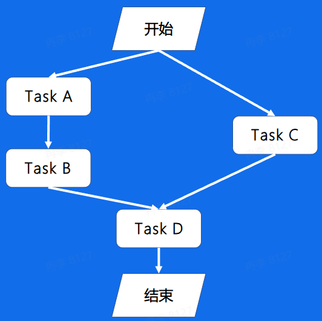
+ 故障转移：确保部分执行单元任务失败时，任务最终成功
分片任务基于一致性hash策略分发任务，当某Executor异常时，调度器会将任务分发到其他Executor
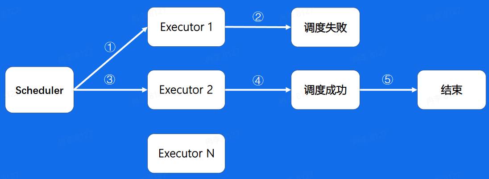

高可用
调度器可以集群部署，做到完全的无状态，靠消息队列的重试机制保障任务一定会被调度
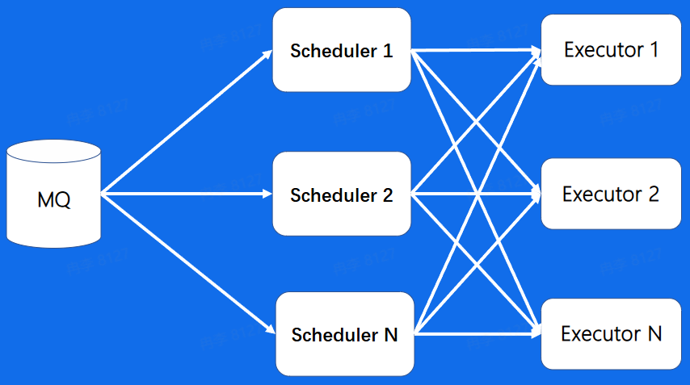

**执行器**
基于注册中心，可以做到执行器的弹性扩缩容
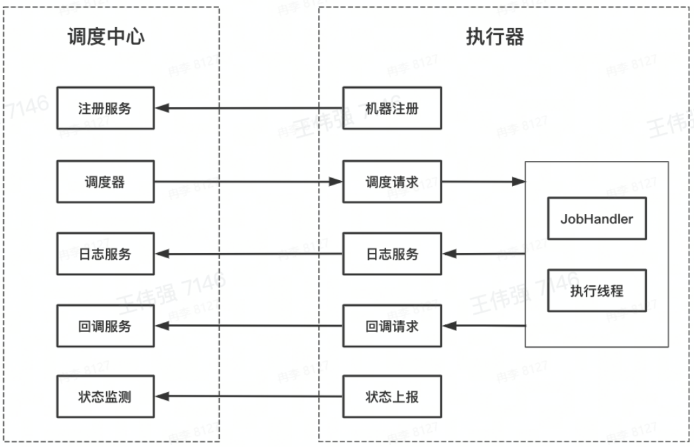

总结
+ 核心架构
  + 控制台Admin、触发器Trigger、调度器Scheduler、执行器Executor
+ 业务模型
  + 任务元数据Job、任务实例JobInstance、任务结果JobResult、任务历史JobHistory
+ 触发器
  + 定时扫描 + 延时消息
  + 时间轮
    + 链表、最小堆、时间轮、多级时间轮
+ 调度器
  + 资源来源
  + 资源调度：节点选择、任务分片、任务编排、故障转移
+ 执行器
  + 注册、调度、回调、心跳检测

#### 业务应用
所有需要定时、延时、周期性执行任务的业务场景，都可以考虑使用分布式定时任务

发货后超过10天未收货时系统自动确认收货
+ 使用分布式定时任务的延时任务
+ 使用消息队列的延时消息或者定时消息

春节集卡活动统计完成集卡的用户个数和总翻倍数
+ 使用分布式定时任务的MapReduce任务
+ 使用大数据离线处理引擎Hive离线做统计
+ 使用大数据实时处理引擎Flink实时做累计

方案对比
||时效性|可控性|简洁性|主要缺点|
|-|-|-|-|-|
|分布式定时任务|秒级|高|高|-|
|单机定时任务|秒级|高|高|无法支撑很大业务体量|
|延时消息|实时|低|中|在任务有变化时，已发送的延时消息不便于做变更|
|离线计算|小时级|中|高|时延至少小时级|
|实时计算|秒级|高|中|仅能做数据处理，无法调用HTTP/RPC请求完成业务逻辑处理|
