# 笔记

vscode快捷键
+ 查找：ctrl + f
+ 替换：ctrl + h
+ 把当前行往上/下移动一行：alt + up或down
+ 整理代码格式：shift + alt + f
+ 快速创建html基本骨架：!

[课程地址](https://www.bilibili.com/video/BV1oz421q7BB/?spm_id_from=333.999.0.0&vd_source=4e74b8661b357c2d336cb4ed544d1b32)
## HTML篇
HTML(HyperText Markup Language)

标定文档开始和结束
```
<html>
</html>
```

定义文档的头部，描述文档属性信息
```
<head>
</head>
```

定义文档的主体
```
<body>
</body>
```

定义文档抬头，即浏览器最顶上的显示名称，是head标签中唯一必须要求包含的东西，title标签的增加有利于SEO优化
SEO是搜索引擎优化的英文缩写，通过对网站内容调整，满足搜索引擎的排名需求。
```
<title>
</title>
```

描述网页文档的属性、关键字，如编码格式，是单标签
```
<meta>
```

h1到h6是最大到最小标题
该标签只用于标题，不要因为字体大而是用该标题标签
正确使用标题有益于SEO
在标签中添加属性设置标题放置位置：`align="left|center|right"`，默认居左
```
<h1 align="left"></h1>
<h2 align="center"></h2>
<h3 align="right"></h3>
<h4></h4>
<h5></h5>
<h6></h6>
```

段落标签
```
<p></p>
```

换行标签，即不产生一个新的段落，只换行
```
内<br />容
```

水平线标签，在页面中产生一条水平线
属性
+ color：颜色
+ width：宽度
+ size：高度
+ align：位置，可取值left或right，默认是center
```
<hr color="red" width="300px" size="20px" align="left" />
```

图片标签，定义页面中的图像
属性
+ src：路径
+ alt：当图片无法显示时，规定图像的代替文本
+ width：图像宽度
+ height：图像高度，一般只规定宽度，不规定高度
+ title：鼠标悬停在图片上的提示
```

```

相对路径
+ 子级关系：`/`
+ 父级关系：`../`
+ 同级关系：`./`，可以省略

超文本链接标签，内容可以是字，句子或者是一张图片img
使用`href`属性来描述标签的地址
默认情况下，链接将以以下形式出现在浏览器中
+ 未访问过的链接显示蓝色字体并带有下划线
+ 访问过的链接显示为紫色并带有下划线
+ 点击链接时，链接显示为红色并带有下划线

使用CSS可以修改上述出现的情况
```
<a href="">内容</a>
```

常用文本标签，与段落不同，文本标签只代表文本词汇
|标签|描述|
|-|-|
|`<em>`|着重文字|
|`<b>`|粗体文本|
|`<i>`|斜体字|
|`<strong>`|加重语气|
|`<del>`|删除字|
|`<span>`|元素没有特定的含义，为了CSS添加方便而存在|

列表标签
有序列表是一列项目，始于`ol`，每个列表项用`li`标签
`ol`属性type拥有的选项
+ 1：数字
+ a：小写字母
+ A：大写字母
+ i：小写罗马数字
+ I：大写罗马数字

有序列表可以再嵌套有序列表
```
<ol type="">
    <li>内容1</li>
    <li>内容2</li>
    <li>内容3</li>
</ol>
```
无序列表是一个项目列表，使用粗体圆点进行标记，没有顺序
始于`ul`，每个列表项用`li`
`ul`的属性type拥有的选项
+ disc：实心圆，默认值
+ circle：空心圆
+ square：方块
+ none：什么也不显示

无序列表也是可以嵌套无序列表的
常见应用场景
+ 导航栏效果
+ 无序列表效果

快捷键：快速生成ul + li的布局`ul>li*3`，数字根据需求定义
```
<ul type="">
    <li>内容1</li>
    <li>内容2</li>
</ul>
```

表格标签，由行、列、单元格组成，同行等高，同列等宽
表格`<table></table>`，行`<tr></tr>`，单元格`<td></td>`
快捷键：快速生成表格`table>tr*2>td*3{文本信息}`，生成2行3列表格，数字由需求定义
属性大部分由CSS定义，以下是较为常用的
+ border：表格边框
+ width：宽度
+ height：高度

```
<table border="1" width="" height="">
    <tr>
        <td>单元格</td>
        <td>单元格</td>
        <td>单元格</td>
    </tr>
    <tr>
        <td>单元格</td>
        <td>单元格</td>
        <td>单元格</td>
    </tr>
</table>
```

合并表格的单元格
水平合并`colspan`，保留左边，删除右边
垂直合并`rowspan`，保留上边，删除下边
```
<table border="1" width="600px" height="400px">
    <tr>
        <td colspan="2">单元格1</td>
        <td>单元格2</td>
        <td rowspan="2">单元格3</td>
    </tr>
    <tr>
        <td>单元格4</td>
        <td>单元格5</td>
        <td>单元格6</td>
    </tr>
</table>
```

Form表单，让用户填写信息，使网站具有交互功能
表单由容器和控件组成，输入框和按钮等叫控件，表单就是容器
属性
+ action：服务器地址
+ method
  + Get和Post区别
    + 数据提交方式，get是把提交的数据url可以看到，post看不到
    + get一般用于提交少量数据，post用来提交大量数据
+ name：表单名称

```
<form action="" method="get|post" name="">
</form>
```

表单元素
一个表单包含：表单标签、表单框、表单按钮
文本框用`<input type="text">`来设定，输入信息时使用
密码框用`<input type="password">`来设定，密码一般不用明文
提交按钮用`<input type="submit">`来设定，点击即可提交给服务器
```
<form>
    <input type="text">
    <input type="submit">
    <input type="submit" value="文本">
</form>
```

HTML5之前经常把元素按照块级元素和内联元素来区分，在HTML5中元素不再按照这种方式来区分，而是按照内容模型来区分，分为元数据型(metadata content)、区块型(sectioning content)、标题型(heading content)、文档流型(flow content)、语句型(phrasing content)、内嵌型(embedded content)、交互型(interactive content)。元素不属于任何一个类型，被称为穿透的。元素可能属于不止一个类别，称为混合的。

内联元素和块级元素区别
|内联元素|块级元素|
|-|-|
|行内元素不会独占页面中的一行，只占自身的大小|块元素会在页面中独占一行(自上而下垂直排列)|
|行内元素设置width、height属性无效|可以设置width、height属性|
|一般内联元素包含内联元素，不包含块级元素|一般块级元素可以包含行内元素和其他块级元素|

常见块级元素：`div`、`form`、`h1~h6`、`hr`、`p`、`table`、`ul`等
常见内联元素(行内元素)：`a`、`b`、`em`、`i`、`span`、`strong`等
行内块级元素(特点：不换行、能够识别宽高)：`button`、`img`、`input`等

HTML5新增标签

容器标签，可以让内容模块更加清晰，页面中见到的最多的元素
HMTL5支持的新标签
+ `<header></header>`：头部
+ `<nav></nav>`：导航
+ `<section></section>`：文档中的节，如章节、页眉、页脚
+ `<aside></aside>`：侧边栏
+ `<footer></footer>`：脚部
+ `<article></article>`：代表一个独立的、完整的相关内容块，如论文帖子、博客文章、评论等

新标签必须用新版本浏览器，不支持向下兼容
```
传统容器标签
<div id="header"></div>
<div id="nav"></div>
<div id="article">
    <div id="section"></div>
</div>
<div id="silder"></div>
<div id="footer"></div>

HTML5新增标签
<header></header>
<nav></nav>
<article>
    <section></section>
</article>
<aside></aside>
<footer></footer>
```

## CSS篇
CSS(Cascading Style Sheets)层叠样式表，又称级联样式表，简称样式表，文件后缀`.css`，用于HTML文档中元素样式的定义，唯一目的使网页具有美观一致的页面

CSS规则由两个主要部分构成：选择器，以及一条或多条声明
选择器通常是需要改变样式的HTML元素
每条声明由一个属性和一个值组成
`选择器{属性:属性值;属性:属性值}`
属性(property)是希望设置的样式属性(style attribute)
在`head`中添加`style`使用
```
<style>
    h1{
        color:blue;
        font-size:20px;
    }
</style>
```

CSS引入方式

内联样式(行内样式)
需要在相关的标签内使用样式(style)属性，style属性可以包含任何CSS属性，但缺乏整体性和规划性，不利于维护，维护成本高
```
<p style="background:orange; font-size:24px;">CSS</p>
```

内部样式
当单个文档需要特殊样式时，就应该使用内部样式表，可以使用`<style></style>`标签在文档头部定义内部样式表
单个页面内的CSS代码具有统一性和规划性，便于维护，但是在多个页面之间容易混乱
```
<head>
    <style>
        p{
            color:red;
            font-size:30px;
        }
    </style>
</head>
```

外部样式(**推荐**)
当样式需要应用于很多页面时，外部样式表是理想的选择
使用外部样式表的情况下，你可以通过改变一个文件来改变整个站点的外观，每个页面使用`<link>`标签链接到样式表，定义在文档的头部
```
<link rel="stylesheet" type="text/css" href="xxx.css">
```
在xxx.css中可以写
```
p{
    color:red;
    font-size:30px;
}
```

选择器

全局选择器
可以与任何元素匹配，优先级最低，一般做样式初始化
```
*{
    margin:0;
    padding:0;
}
```

元素选择器
HTML文档中的元素，`p`、`b`、`div`、`a`、`img`、`body`等
标签选择器选择的是页面上所有这种类型的标签，所以通常描述共性，无法描述一个元素的个性
所有的标签都可以是选择器，无论标签藏得多深都一定能被选择
```
p{
    font-size:14px;
}
```

类选择器
规定用圆点`.`来定义，针对你想要的所有标签使用
特点
+ 类选择器可以被多种标签使用
+ 类名不能以数字开头
+ 同一个标签可以使用多个类选择器，用空格隔开
```
<h2 class="oneclass">内容</h2>

.oneclass{
    width:800px;
}

<h3 class="classone classtwo">内容</h3>
```

ID选择器
针对某一种特定的标签来使用，一种ID只能使用一次，用`#`来定义css
ID是唯一的，不能以数字开头
```
<h2 id="mytitle">内容</h2>
<h2 id="title">内容</h2>

#mytitle{
    border:3px dashed green;
}

#title{
    color:green;
}
```

合并选择器
提供共同的样式，减少重复代码
```
<p class="text">内容</p>
<h2 class="content">内容</h2>

p, h2{
    color:red;
}

.header, .footer{
    height:300px;
}
```

选择器优先级
CSS中权重用数字衡量
+ 元素选择器权重为1
+ 类选择器权重为10
+ id选择器权重为100
+ 内联样式权重为1000

优先级从高到低：行内样式 > ID选择器 > 类选择器 > 元素选择器

字体属性
颜色、大小、加粗、文字样式

color
文本颜色，可以用英文单词、十六进制(#0000ff)、rgb(0,0,0)、rgba(0,0,0,0.5)

font-size
文本大小，chrome浏览器能够接受的最小字体为12px

font-weight
文本粗细
|值|描述|
|-|-|
|bold|粗体字符|
|bolder|更粗的字符|
|lighter|更细的字符|
|100~900|由细到粗，400等同默认，700等同bold|

font-style
文本字体样式
|值|描述|
|-|-|
|normal|默认值|
|italic|斜体字|

font-family
指定一个元素的字体，每个值用逗号分开，如果字体名称包含空格必须加上引号
`font-family:"Microsoft YaHei","Simsun","SimHei";`

背景属性
|属性|描述|
|-|-|
|background-color|背景颜色|
|background-image|背景图片|
|background-position|背景图片显示位置|
|background-repeat|背景图片如何填充|
|background-size|背景图片大小属性|

background-color
背景颜色
```
div{
    width:400px;
    height:400px;
    background-color:#ffff00;
}
<div></div>
```

background-image
元素的背景图像
元素的背景是元素的总大小，包含填充和边界(不包括外边距)
默认情况下background-image属性放置在元素的左上角，如果图像不够大的话会在垂直和水平方向平铺图像，如果图像大小超过元素大小，从图像的左上角显示元素大小的那部分
```
div{
    width:400px;
    height:400px;
    background-image:url("图片路径");
}
<div></div>
```

background-repeat
设置如何平铺背景图像，即如果图像比容器小，那么会循环平铺该图像
|值|说明|
|-|-|
|repeat|默认值|
|repeat-x|只向水平方向平铺|
|repeat-y|只向垂直方向平铺|
|no-repeat|不平铺|
```
div{
    width:1200px;
    height:1200px;
    background-repeat:no-repeat;
}
<div></div>
```

background-size
设置背景图像的大小
|值|说明|
|-|-|
|length|设置背景图片的宽度和高度，第一个值宽度，第二个值高度，如果只设置一个，第二个值是auto|
|percentage|计算相对位置区域的百分比，第一个值宽度，第二个值高度，如果只设置一个，第二个值是auto|
|cover|保持图片纵横比并将图片缩放成完全覆盖背景区域的最小大小|
|contain|保持图片纵横比并将图片缩放成适合背景定位区域的最大大小|
```
div{
    width:1200px;
    height:1200px;
    <!-- background-size:1200px 1200px; -->
    <!-- background-size:50% 50%; -->
    <!-- background-size:cover; -->
    background-size:contain;
}
<div></div>
```

background-position
设置背景图像的起始位置，默认值是0% 0%
|值|说明|
|-|-|
|left top|左上角|
|left center|左中|
|left bottom|左下|
|right top|右上角|
|right center|右中|
|right bottom|右下|
|center top|中上|
|center center|中中|
|center bottom|中下|
|x% y%|第一个值是水平位置，第二个值是垂直位置，左上角是0% 0%，右下角是100% 100%，如果只指定了一个值，其他值默认是50%|
|xpos ypos|单位是像素|

文本属性

text-align
指定元素文本的水平对齐方式
|值|描述|
|-|-|
|left|文本居左排列，默认值|
|right|文本排列到右边|
|center|文本排列到中间|
```
h1{
    text-align:left;
}
```

text-decoration
规定添加到文本的修饰，下划线、上划线、删除线等
|值|描述|
|-|-|
|underline|下划线|
|overline|上划线|
|line-through|删除线|
```
h1{
    text-decoration:underline;
}
```

text-transform
控制文本的大小写
|值|描述|
|-|-|
|captialize|每个单词开头大写|
|uppercase|全部大写字母|
|lowercase|全部小写字母|
```
h1{
    text-transform:uppercase;
}
```

text-indent
规定文本块中首行文本的缩进，允许是负值，如果是负数，第一行向左缩进
```
p{
    text-indent:50px;
}
```

表格属性

表格边框
使用border属性
```
table, td{
    border:1px solid red;
    //边框大小 线 颜色
}
```

折叠边框
设置表格的边框是否被折叠成一个单一的边框或隔开
```
table{
    border-collapse:collapse;
}
table, td{
    border:1px solid red;
    //边框大小 线 颜色
}
```

表格宽度和高度
定义表格宽高
```
table{
    border:3px solid green;
    width:500px;
    height:500px;
}
```

表格文字对齐
文本对齐和垂直对齐属性
`text-align`设置水平对齐方式，左、右、中心
`vertical-align`设置垂直对齐
```
td{
    text-align:left|right|center;
}

td{
    height:50px;
    vertical-align:top|bottom|center;
}
```

表格填充
如果在表的内容中控制文字和框之间的距离，应使用`td`和`th`元素的填充属性
```
td{
    padding:15px;
}
```

表格颜色
指定边框颜色，和`th`元素的文本和背景颜色
```
table, td, th{
    border:1px solid green;
}
td{
    background-color:red;
    color:black;
}
```

关系选择器
+ 后代选择器
+ 子代选择器
+ 相邻兄弟选择器
+ 通用兄弟选择器

后代选择器
选择所有被E元素包含的F元素，中间用空格隔开
```
E F{}

ul li{
    color:red;
}

<ul>
    <li>内容1</li>
    <li>内容2</li>
    <div>
        <ol>
            <li>列表1</li>
            <li>列表2</li>
        </ol>
    </div>
</ul>
```

子代选择器
选择所有作为E元素的直接子元素F，对更深一层的元素不起作用
```
E>F{}

div>p{
    color:red;
}

<div>
    <p>1</p>
    <ul>
        <li>
            <p>2</p>
        </li>
    </ul>
</div>
```

相邻兄弟选择器
选择紧跟E元素后的F元素，用加号标识，选择相邻的第一个兄弟元素，只能向下选择
```
E+F{}

h3+p{
    color:red;
}

<p>4</p>
<h3>1</h3>
<p>2</p>
<p>3</p>
```

通用兄弟选择器
选择E元素之后的所有兄弟元素F，作用于多个元素，用~隔开
```
E~F{}

h1~p{
    color:red;
}

<h1>1</h1>
<p>2</p>
<div>4</div>
<p>3</p>
```

CSS盒子模型(box model)
CSS盒模型本质上是一个盒子，封装周围的HTML元素，包括外边距(margin)、边框(border)、内边距(padding)和实际内容(content)
+ margin：清除边框外的区域，外边距是透明的，一个参数代表上下左右，两个参数第一个值代表上下、第二个值代表左右，四个参数遵循上右下左的顺序
+ border：围绕在内边距和内容外的边框
+ padding：清除内容周围的区域，内边距是透明的，一个参数代表上下左右，两个参数第一个值代表上下、第二个值代表左右，四个参数遵循上右下左的顺序
+ content：盒子内容，显示文字和图像

如果把盒子模型比作快递，content就是实物，padding就是盒子和实物之间的泡沫，border就是盒子，margin就是两个快递盒子之间的距离
```
div{
    width:100px;
    height:100px;
    background-color:red;
    <!-- padding:50px 20px; -->
    padding-left:20px;
    padding-right:20px;
    padding-top:10px;
    padding-bottom:5px;

    border:5px solid blue;
    <!-- margin:50px; -->
    margin-left:20px;
    margin-right:10px;
    margin-top:5px;
    margin-bottom:15px;
}
<div>内容</div>
```

弹性盒模型(flex box)
CSS3的一种新的布局模式，是一种当页面需要适应不同的屏幕大小以及设备类型时确保元素拥有恰当的行为的布局方式
弹性盒子由弹性容器和弹性子元素组成

**父元素上的属性**

弹性容器通过设置`display`属性的值为`flex`，将其定义为弹性容器，包含了一个或多个弹性子元素
默认弹性盒子内的元素横向摆放
flex-direction属性指定了弹性子元素在父容器中的位置
`flex-direction:row|row-reverse|column|column-reverse`
+ row：横向从左到右排列，默认的排列方式
+ row-reverse：反转横向排列且右对齐
+ column：纵向排列
+ column-reverse：反转纵向排列，从底部向顶部开始排列

justify-content属性应用在弹性容器上，把弹性项沿着弹性容器对应列的主轴线对齐
`justify-content:flex-start|flex-end|center`
+ flex-start：默认值，弹性项目向行头紧挨着填充，第一个弹性项的main-start外边距边线被放置在该行的main-start边线，而后续弹性项依次水平摆放
+ flex-end：弹性项目向行尾紧挨着填充，第一个弹性项的main-end外边距边线被放置在该行的main-end边线，而后续弹性项依次平齐摆放
+ center：弹性项目居中紧挨着填充，如果剩余的自由空间是负的，则弹性项将在两个方向上溢出

align-items设置或检索弹性盒子元素在横向方向上的位置
`align-items:flex-start|flex-end|center`
+ flex-start：元素的左边起始位置紧挨着该行左边界
+ flex-end：元素的右边起始位置紧挨着该行右边界
+ center：元素在该行居中放置，如果该行的尺寸小于元素的尺寸，则会向两个方向溢出相同的长度

**子元素上的属性**

`flex-grow`或`flex`根据元素所设置的扩展因子作为比率来分配剩余空间
写在子元素上，默认是0，即如果存在剩余空间也不放大
`flex`的优先级大于`width`，如果设置了`flex`那么`width`就不生效了
如果只有一个子元素设置，那么按扩展因子转化的百分比对其分配剩余空间，0.1即10%，1即100%，超出也按100%
```
.container{
    width:500px;
    height:500px;
    background-color:#555;
    display:flex;
    flex-direction:row;
    <!-- flex-direction:row-reverse; -->
    <!-- flex-direction:column; -->
    <!-- flex-direction:column-reverse; -->
    
}
.box1{
    width:100px;
    height:100px;
    background-color:red;
    flex:2;
}
.box2{
    width:100px;
    height:100px;
    background-color:green;
    flex:2;
}
.box3{
    width:100px;
    height:100px;
    background-color:blue;
    flex:1;
}

<div class="container">
    <div class="box1">1</div>
    <div class="box2">2</div>
    <div class="box3">3</div>
</div>
```

浮动
`float`属性定义了元素在哪个方向浮动，任何元素都可以浮动
|值|描述|
|-|-|
|left|元素向左浮动|
|right|元素向右浮动|
浮动的原理
+ 浮动以后使元素脱离了文档流
+ 浮动只有左右浮动，没有上下浮动

元素向左、右浮动
脱离文档流之后，元素相当于在页面上面增加了一个浮层来放置内容，此时可以理解为有两层页面，一层是底层的原页面，一层是脱离文档流的上层页面，所以会出现折叠现象
浮动可以让元素呈横向摆放方式
当容器不足以横向摆放内容时，会在下一行摆放
```
.box{
    width:200px;
    height:200px;
    background-color:blue;
    <!-- float:left; -->
    float:right;
}
.container{
    width:400px;
    height:400px;
    background-color:green;
}

ul li{
    float:left;
}

<div class="box"></div>

<div class="container"></div>

<ul>
    <li><a hred="#">1</a></li>
    <li>2</li>
</ul>
```

清除浮动
浮动副作用
当元素设置`float`浮动后，该元素就会脱离文档流并向左/右浮动
+ 浮动元素会造成父元素高度塌陷，子元素不会把父元素撑开
+ 后续元素会受到影响

当父元素出现塌陷的时候，对布局是不利的，因此必须清除副作用
+ 父元素设置高度，如果父元素高度塌陷可以设置高度，撑开元素
+ 受影响的元素增加clear属性，`clear:left|right|both`分别是清除左浮动|右浮动|左右浮动
+ overflow清除浮动，在父级元素增加`overflow:hidden`和`clear:both`（常见）
+ 伪对象方式
```
.container{
    width:100px;
    background-color:red;
}
# 伪对象方式
.container::after{
    content:"";
    display:block;//换行
    clear:both;
}
.box{
    width:100px;
    height:100px;
    background-color:blue;
    float:left;
    margin:5px;
}

<div class="container">
    <div class="box">1</div>
    <div class="box">2</div>
</div>
```

定位
`position`属性指定了元素的定位类型
|值|描述|
|-|-|
|relative|相对位置|
|absolute|绝对位置|
|fixed|固定位置|
其中，绝对位置和固定位置会脱离文档流
设置定位后可以使用四个方向值进行调整位置:`left`、`right`、`top`、`bottom`
设置定位后，相对位置和绝对位置他是相对于具有定位的父级元素进行位置调整，如果父级元素没有定位，则继续向上逐级寻找，直到顶层文档
`z-index`属性设置元素的堆叠顺序，拥有更高堆叠顺序的元素总是会处于堆叠顺序较低的元素的前面
```
# 相对位置
div{
    width:200px;
    height:200px;
    background-color:red;
    position:relative;
    left:200px;
    top:100px;
}
<div></div>

# 绝对位置
.box1{
    width:200px;
    height:200px;
    background-color:blue;
    position:absolute;
    left:100px;
    top:200px;
}

.box2{
    width:200px;
    height:200px;
    background-color:blue;
}

<div class="box1"></div>
<div class="box2"></div>

#固定定位
.box1{
    width:100px;
    height:100px;
    background-color:red;
    position:fixed;
    top:100px;
    left:100px;
    z-index:1;
}
.box2{
    width:500px;
    height:500px;
    background-color:blue;
    z-index:2;
}

<div class="box1"></div>
<div class="box2"></div>
```

CSS3新特性

圆角
使用CSS3`border-radius`属性可以给任何元素制作"圆角"
`border-radius`可以使用以下规则
+ 四个值：分别是左上角、右上角、右下角、左下角
+ 三个值：分别是左上角、右上角和左下角、右下角
+ 两个值：分别是左上角和右下角、右上角和左下角
+ 一个值：四个圆角值相同

```
div{
    width:100px;
    height:100px;
    background-color:#888;
    <!-- border-radius:10px; -->
    border-radius:50%;//变成圆形
    border-radius:100%;//变成圆形
}

<div></div>
```

阴影
`box-shadow`向框添加一个或多个阴影
`box-shadow:h-shadow v-shadow blur color;`
|值|描述|
|-|-|
|h-shadow|必选，水平阴影的位置，0px表示左右都有一点点，>0px表示只在右边有，<0px表示只有左边有|
|v-shadow|必选，垂直阴影的位置，0px表示上下都有一点点，>0px表示只在下边有，<0px表示只有上边有|
|blur|可选，模糊距离|
|color|可选，阴影颜色|
```
.box{
    width:400px;
    height:400px;
    background-color:red;
    margin:0 auto;//auto是让左右的空间平均分配
    box-shadow:10px -10px 20px rgba(0,0,0,0.5);
}

<div class="box"></div>
```

动画
动画是使元素从一种样式逐渐变化为另一种样式的效果
可以改变任意多的样式，任意多的次数
使用百分比来规定变化发生的时间，或用关键词`from`和`to`，等同于0%和100%
0%是动画的开始，100%是动画的完成

使用`@keyframes`创建动画
```
@keyframes name{
    percent{

    }
    percent{

    }
}
```
+ name：动画名称，开发人员自己命名
+ percent：百分比值，可以添加多个百分比值

`animation`执行动画
`animation:name duration timing-function delay iteration-count direction;`
|值|描述|
|-|-|
|name|动画的名称|
|duration|动画的持续时间|
|timing-function|动画效果的速率|
|delay|动画的开始时间|
|iteration-count|动画循环的次数，infinite为无限次数的循环|
|direction|动画播放的方向|
|animation-play-state|控制动画的播放状态：running代表播放，而paused代表停止播放|

|timing-function值|描述|
|-|-|
|ease|逐渐变慢(默认)|
|linear|匀速|
|ease-in|加速|
|ease-out|减速|
|ease-in-out|先加速后减速|

|direction值|描述|
|-|-|
|normal|默认值，表示向前播放|
|alternate|动画播放在第偶数次向前播放，奇数次向反方向播放|
```
<style>
    div{
        width:200px;
        height:200px;
        background-color:red;
        animation:myAnim 3s linear 0s infinite;
    }
    div:hover{//鼠标划上去呈现另一个颜色
        background-color:coral;
        animation-play-state:paused;
    }
    @keyframes myAnim{
        0%{
            width:200px;
            background-color:red;
        }
        50%{
            width:400px;
            background-color:green;
        }
        100%{
            width:200px;
            background-color:red;
        }
    }

</style>


<div></div>
```
呼吸效果
```
.box{
    width:500px;
    height:500px;
    margin:40px auto;
    background-color:#2b92d4;
    border-radius:50%;
    box-shadow:0 1px 2px rgba(0, 0, 0, 0.3);
    animation:breathe 1s ease-in-out infinite alternate;
}
@keyframes breathe{
    0%{
        opacity:0.2;//不透明度，关键！
        box-shadow:0 1px 2px rgba(255, 255, 255, 0.1);
    }
    50%{
        opacity:0.5;
        box-shadow:0 1px 2px rgba(18, 190, 84, 0.76);
    }
    100%{
        opacity:1;
        box-shadow:0 1px 30px rgba(59, 255, 255, 1);
    }
}

<div class="box"></div>
```

媒体查询
媒体查询能使页面在不同终端设备下达到不同的效果，会根据设备的大小自动识别加载不同的样式
`meta`标签
使用设备的宽度作为视图宽度并禁止初始的缩放
`<meta name="viewport" content="width=device-width,initial-scale=1,maximum-scale=1,user-scalable=no">`
+ `width=device-width`：宽度等于当前设备的宽度
+ `initial-scale`：初始的缩放比例，默认1.0
+ `maximum-scale`：允许用户缩放到的最大比例，默认1.0
+ `user-scalable`：用户是否可以手动缩放，默认no

```
<meta name="viewport" content="width=device-width,initial-scale=1,maximum-scale=1,user-scalable=no">
.box{
    width:300px;
    height:300px;
    background-color:red;
}

<div class="box"></div>
```
媒体查询语法
一套代码可以适应不同设备
```
<meta name="viewport" content="width=device-width,initial-scale=1,maximum-scale=1,user-scalable=no">
<style>
    .box{
        width:300px;
        height:300px;
        background-color:red;
    }

    //相当于if语句
    @media screen and (max-width: 768px){
        .box{
            background-color:blue;
        }
        .p1{
            display:none;
        }
        .p2{
            display:none;
        }
    }
    @media screen and (min-width:768px) and (max-width:996px) {
        .box{
            background-color:green;
        }
        .p1{
            display:block;
        }
        .p2{
            display:none;
        }
    }
    @media screen and (min-width:996px) {
        .box{
            background-color:red;
        }
        .p1{
            display:block;
        }
        .p2{
            display:block;
        }
    }

</style>

<div class="box">
<p class="p1">111</p>
<p class="p2">222</p>
</div>
```

雪碧图
CSS Sprite也叫CSS精灵图、CSS雪碧图，是一种网页图片应用处理方式，它允许你将一个页面涉及到的所有零星图片都包含到一张大图中去
优点
+ 减少图片的字节
+ 减少网页的http请求，从而大大的提高页面的性能

原理
+ 通过`background-image`引入背景图片
+ 通过`background-position`把背景图片移动到自己需要的位置

```
.icon1{
    display:block; //把行内元素变成块级元素
    //display:inline;把元素变成行内元素

    width:45px;
    height:70px;
    background-image:url(图片地址);
    border:1px solid red;
    background-position:-20px -12px;
}
.icon2{
    display:block; //把行内元素变成块级元素
    //display:inline;把元素变成行内元素

    width:45px;
    height:70px;
    background-image:url(图片地址);
    border:1px solid red;
    background-position:-100px -135px;
}

<span class="icon1"></span>
<span class="icon2"></span>
```

字体图标
我们经常会用到一些图标，但我们在使用这些图标时往往会遇到失真的情况，而且图片数量多的话，网页加载就很慢。因此我们可以使用字体图标的方式来显示图标
[阿里字体图标库](https://www.iconfont.cn/)
优点
+ 轻量性：加载速度快，减少http请求
+ 灵活性：可以利用CSS设置大小颜色等
+ 兼容性：网页字体支持所有现代浏览器，包括IE低版本

`<link rel="stylesheet" href="文件地址/文件名.css">`
```
<link rel="stylesheet" href="./iconfont.css">

<style>
    .home{
        font-size:100px;
    }
</style>

<span class="iconfont icon-home home"></span>
```

## JavaScript篇

JS是一种轻量级的脚本语言，是一种嵌入式语言
脚本语言指的是不具备开发操作系统的能力，而是只用来编写控制其他大型应用程序的脚本

JavaScript和ECMAScript的关系
ECMAScript是JavaScript的规格，JavaScript是ECMAScript的一种实现，日常场合二者可以互换
ES6其实就是JavaScript的一个版本/规范

**ECMAScript5.0**
目前很多开发的还是ES5

语句
JS程序的单位是行，一行一行地执行，语句以分号结尾
```
<body>
    <script>
        var num = 10;
    </script>
</body>
```
标识符
指的是用来标识各种值的合法名称，由字母、\$、数字和下划线组成，数字不能开头
中文是合法的标识符可以用作变量名，但不推荐

JS保留关键字
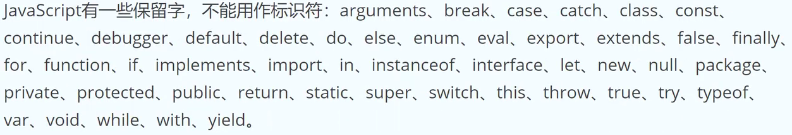

打印值
```
<script>
    var num = 10;
    console.log(num);
    //在页面内先 检查，然后控制台找到console即可找到打印的数
</script>
```

变量提升
JS引擎的工作方式是先解析代码，获取所有被声明的变量，然后一行一行地执行，这造成的结果就是所有的变量声明语句都会被提升到代码的头部
```
<script>
    console.log(num);
    var num = 10;
    //这样并不会报错，只是会返回undefined，说明num已经被创建了，只是没有赋值
    /*
    这个顺序是
    var num;
    console.log(num);
    num = 10;
    */
</script>
```

JS引入到文件

JS常见引入方式
+ 嵌入到HTML文件中
+ 引入本地独立js文件
+ 引入网络来源文件

嵌入到HTML文件中
也就是直接在`body`中嵌入`script`标签
```
<body>
    <script>
        var num = 10;
    </script>
</body>
```

引入本地独立js文件
该方式使用较为频繁
即把所有js代码写成一个xxx.js文件
xxx.js文件代码
```
var num = 10;
console.log(num);
```
```
<body>
    <script src="./xxx.js">
    </script>
</body>
```

引入网络来源文件
使用较为频繁
在页面中右键 检查，然后在控制台选择Network，然后执行代码，然后Filter选择All，能看到资源成功引用到页面当中
```
<head>
    <script src="网络地址"></script>
</head>
```

JS注释
快捷键：ctrl + /
```
// 单行注释

/*
多行注释
*/

嵌入在HTML文件中的注释
<!-- 注释 -->
```

JS输出方式
```
//在浏览器中弹出一个对话框，alert是把要输出的内容先转换成字符串然后输出
alert("内容");

//输出到页面当中
document.write("内容");

//在控制台输出，用的最多
console.log("内容");
```

数据类型
JS的每一个值都属于某一种数据类型，共有六种：数值、字符串、布尔值、undefined、null、对象，其中ES6新增了Symbol类型和BigInt类型

原始类型(基础类型)
数值、字符串、布尔值
```
<script>
    //数字
    var age = 10;

    //字符串
    var name = "shit";
    var name1 = 'fuck';

    //布尔值
    var flag = true;
    var ok = false;
</script>
```

合成类型(复合类型)
一个对象中可以声明多种数据类型的值
undefined和null一般将它们看成两个特殊值
```
<script>
    //引用数据类型，对象可以嵌套
    var user = {
        age:10,
        name:"shit",
        flag:false
    }
</script>
```

typeof运算符
用于判断数据类型，一般判断基本数据类型，判断其他的不够准确，如对象、null和数组都返回的是`object`
null一般代表对象为空，undefined一般代表定义了但没有赋值
```
<script>
    var age = 10;
    console.log(typeof age);// number
    
    var x = "fuck";
    console.log(typeof x);// string

    var p = false;
    console.log(typeof p);// boolean

    console.log(typeof undefined);// undefined

    var user = {};
    console.log(typeof user);// object
    console.log(typeof []);// object
</script>
```

JS中与其他语言不一样的比较运算符
|比较运算符|描述|
|-|-|
|===|严格相等|
|!==|严格不相等|
`==`和`===`、`!==`和`!=`的区别就是`==`只看值是否相等，`===`不仅看值是否相等，还要看类型是否相等
```
<script>
    var num = 10;
    var num1 = "10";
    console.log(num == num1);// true
    console.log(num === num1);// false
</script>
```

以下六个值取反后为true，其他均为false
+ undefined
+ null
+ false
+ 0
+ NaN
+ 空字符串''

单引号和双引号可以互相嵌套
单/双引号内部使用单/双引号必须在引号前面加`\`表示转义
字符串默认只能写在一行内，分成多行会报错
如果长字符串必须分成多行，可以在每一行的行尾使用反斜杠
```
var longString = 'Long \
long \
string';
console.log(longString.length);
```

`charAt`方法返回指定位置的字符，参数从`0`开始，如果参数为负数或者大于等于字符串长度，则返回空字符串
```
var s = new String('fuck');
console.log(s.charAt(1)); // "u"
console.log(s.charAt(s.length - 1));// "k"
```

`concat`用于连接两个字符串，即创建一个新的字符串，新字符串的值是两个字符串进行拼接，不改变原字符串
```
var str1 = "hello";
var str2 = "world";
var str3 = "!"
var res = str1.concat(str2, str3);
//也可以使用
var res = str1 + str2 + str3;
```

`substring`用于从原字符串中提取出子字符串并返回，不改变原字符串，第一个参数是子字符串开始的位置，第二个参数是子字符串结束的位置但不包含这个位置，如果省略第二个参数则子字符串一直到原字符串结尾。如果第一个参数大于第二个参数，`substring`会自动更换二者位置，如果参数是负数则自动转换为0
`substr`和`substring`作用相似，但`substr`第一个参数是子字符串开始的位置，第二个参数是子字符串的长度，如果省略第二个参数则子字符串一直到原字符串结尾，如果第一个参数是负数则表示倒着计算字符的位置，如果第二个参数是负数默认为0，返回空字符串
`indexOf`用于确定一个字符串在另一个字符串中第一次出现的位置，返回结果是匹配开始的位置，返回`-1`则表示不匹配，其还可以接收第二个参数，表示从该位置开始向后匹配，`string.indexOf('n', 2)`
`trim`用于去除字符串两端的空格、制表符(`\t`、`\v`)、换行符(`\n`)、回车符(`\r`)，返回一个新字符串，不改变原字符串，如果字符之间有空格则去不掉。`'\r\nbbbbb \t'.trim();`
ES6扩展方法`trimEnd()`和`trimStart()`分别可以单独去除尾部和首部的空格
`split`按照给定规则分割字符串，返回一个由分割出来的子字符串组成的数组，如果分隔规则为空字符串，则返回的数组是原字符串的每一个字符，如果省略参数，则返回只有原字符串一个参数的数组
`split`还可以接受第二个参数，限定返回数组的最大长度
```
'it|fuck|shit'.split('|'); // ["it", "fuck", "shit"]
```

数组

任意类型数据都可以放进数组
```
var info = [20, "fuck", [1, 2, 3]];
console.log(info.length);// 返回数组的成员数量
```
`Array.isArray(数组名)`返回一个布尔值，表示参数是否是数组，弥补`typeOf`的不足
```
var arr = [10, false, 23];
console.log(Array.isArray(arr));// true
```
`push`用于在数组的末端添加一个或多个元素，并返回添加新元素后数组的长度，会改变原数组
`pop`用于删除数组的最后一个元素，并返回该元素，会改变原数组
`shift`用于删除数组的第一个元素，并返回该元素，会改变原数组
`unshift`用于在数组的第一个位置添加元素，并返回添加新元素后的数组长度，其可以接受多个参数，这些参数会依次添加到数组首部，会改变原数组
`join`以指定参数作为分隔符，将所有数组成员连接为一个字符串返回，如果不提供参数则使用逗号分隔
如果数组成员是`undefined`或`null`或空位，会被转成空字符串
数组的`join`配合字符串的`split`可以实现数组与字符串的互换
```
var a = [1, 2, 3, 4];
a.join(' ');// [1 2 3 4]
a.join('|');// [1|2|3|4]
a.join();// [1, 2, 3, 4]
[undefine, null].join('#');// '#'
['a',, 'b'].join('-');// 'a--b'
```
`concat`用于多个数组的合并，它将创建一个新数组，把参数依次添加到新数组当中，返回新数组，不改变原数组
除了数组作为参数，`concat`也接受其他类型的值作为参数，添加到目标数组尾部
应用场景：上拉加载(朋友圈)，合并数据
```
['hello'].concat(['world'], ['!']);// ["hello", "world", "!"]
[1, 2, 3].concat(4, 5, 6);// [1, 2, 3, 4, 5, 6]
```
`reverse`用于颠倒数组元素，返回改变后的数组，会改变原数组
```
var a = ['a', 'b', 'c'];
a.reverse();// ["c", "b", "a"]

//实现一个字符串的反转
var s = "helloworld";
s.split("").reverse().join("");// dlrowolleh
```
`indexOf`返回给定元素在数组中第一次出现的位置，如果没有则返回`-1`，如果增加第二个参数表示开始搜索的位置
```
var arr = [10, 20, 30];

arr.indexOf(20);// 1
arr.indexOf(50);// -1
arr.indexOf(10, 1);// -1
```

函数

函数声明，函数可以先调用后创建，没必要把创建函数写在调用前面
```
function print(s) {
    console.log(s);
    return 1;
}
var res = print("fuck");
console.log(res);
```

对象

对象是一组键值对的集合，是一种无序的复合数据集合
如果一个属性的值是函数，它可以像函数一样调用
如果属性的值是一个对象，就形成了链式引用
```
<script>
    var usr = {
        name:"zhangsan",
        age:13,
        get: function(name) {
            return name;
        }
        container:{
            frontEnd:["f", "u", "c", "k"],
            backEnd:["s", "h", "i", "t"]
        }
    };
    usr.getName(usr.name);
    usr.container.frontEnd;
</script>
```

Math对象
Math是JS的原生对象，提供各种数学功能
`Math.abs(x)`返回x的绝对值
`Math.max(1, 2, 3)`返回最大值
`Math.min(1, 2, 3)`返回最小值
`Math.max()`返回Infinity
`Math.min()`返回-Infinity
`Math.floor(x)`返回小于x的最大整数
`Math.ceil(x)`返回大于x的最小整数
`Math.random()`返回[0, 1)之间的一个伪随机数，是浮点数

Date对象
Date是JS的原生时间库，以1970年1月1日00：00：00作为时间的零点，可以表示的时间范围是前后各一亿天(单位为毫秒)
`Date.now()`返回当前时间距离时间零点的毫秒数，相当于Unix时间乘1000
时间戳指的是格林威治时间1970年1月1日00：00：00起到现在的总秒数
Date对象提供了一系列`get`方法，用来获取实例对象某个方面的值
`getTime()`返回实例距离1970年1月1日00：00：00的毫秒数
`getDate()`返回实例是每个月的几号(从1开始)
`getDay()`返回星期几，星期天是0，星期一是1
`getYear()`返回距离1900年的年数
`getFullYear()`返回四位的年份
`getMonth()`返回月份(0表示1月，11表示12月)
`getHours()`返回小时([0, 23])
`getMilliseconds()`返回毫秒([0, 999])
`getMinutes()`返回分钟([0, 59])
`getSeconds()`返回秒([0, 59])
```
console.log(new Date(Date.now()).getDate());
console.log(new Date(Date.now()).getYear());
console.log(new Date(Date.now()).getFullYear());

var d = new Date('January 6, 2022');
d.getDate(); // 6

// 获取今年剩余时间
var today = new Date();
var endYear = new Date(today.getFullYear(), 11, 31, 23, 59, 59, 999);;
var msPerDay = 24 * 60 * 60 * 1000;
var res = (endYear.getTime(), today.getTime()) / msPerDay;
```

DOM

DOM是JS操作网页的接口，全称为文档对象模型(Document Object Model)，它的作用是将网页转为一个JS对象，从而可以用脚本进行各种操作
浏览器会根据DOM模型，将结构化文档HTML解析成一系列的节点，再由这些节点组成一个树状结构(DOM Tree)，所有的节点和最终的树状结构都有规范的对外接口
DOM只是一个接口规范，可以用各种语言实现，所以DOM不是JS的一部分，但DOM操作是JS最常见的任务，没有DOM，JS就无法控制页面，JS也是最常用于DOM操作的语言

节点
DOM的最小组成单位，文档的树形结构就是由各种不同类型的节点组成，每个节点可以看作是文档树的一片叶子
节点类型有七种
+ Document：整个文档树的顶层节点
+ DocumentType：doctype标签
+ Element：网页的各种HTML标签
+ Attribute：网页元素的属性，如class="one"
+ Text：标签之间或标签包含的文本
+ Comment：注释
+ DocumentFragment：文档的片段

节点树
一个文档的所有节点，按照所在的层级可以抽象成一种树状结构，也就是DOM树。它有一个顶层节点，下一层都是顶层节点的子节点，然后子节点又有自己的子节点
浏览器原生提供`document`节点，代表整个文档
除了根节点，其他节点都有三种层级关系
+ 父节点关系(parentNode)：直接相连的父节点
+ 子节点关系(childNode)：直接相连的儿子节点
+ 同级节点关系(sibling)：拥有一个共同的父节点

Node.nodeType属性
使用次数不多
不同节点的nodeType属性值和对应的常量
+ 文档节点(document)：9，对应常量Node.DOCUMENT_NODE
+ 元素节点(element)：1，对应常量Node.ELEMENT_NODE
+ 属性节点(attr)：2，对应常量Node.ATTRIBUTE_NODE
+ 文本节点(text)：3，对应常量Node.TEXT_NODE
+ 文档片段节点(DocumentFragment)：11，对应常量Node.DOCUMENT_FRAGMENT_NODE

```
document.nodeType; // 9
document.nodeType === Node.DOCUMENT_NODE; // true
```

document对象

`document.getElementByTagName()`搜索HTML标签名，返回符合条件的元素，它的返回值是一个类似数组对象(HTMLCollection实例)，可以实时反映HTML文档的变化，如果没有匹配元素则返回空集
```
<div>hello1</div>
<div>hello2</div>

<script>
    var paras = document.getElementByTagName("div")[0];
    div1.innerHTML = "Hello world";

    //如果传入*则获取所有内容
    var p = document.getElementByTagName('*');
</script>
```

`document.getElementByClassName()`返回一个类似数组的对象(HTMLCollection实例)，包括了所有`class`名字符合指定条件的元素，元素的变化实时反映在返回结果中
由于`class`是保留字，因此JS一律使用`className`表示CSS的`class`
参数可以是多个`class`，之间用空格分隔
```
<p class="text">Hello</p>

<script>
    var text = document.getElementByClassName("text")[0];
    text.innerHTML("hello world");
</script>
```

`document.getElementByName()`用于选择拥有`name`属性的HTML元素(比如`<form>`、`<radio>`、``等)，返回一个类似数组的对象(NodeList实例)，因为`name`属性相同的元素可能不止一个
```
<form name="login"></form>

<script>
    //使用率极低
    var name = document.getElementByName('login');
</script>
```

`document.getElementById()`返回匹配指定`id`属性的元素节点，如果没有发现匹配节点，则返回`null`
该方法最常用，参数是大小写敏感的
```
<div id="root">内容</div>

<script>
    var root = document.getElementById('root');
    root.innHTML = "fuck";
</script>
```

`document.querySelector()`接受一个CSS选择器作为参数，返回匹配该选择器的元素节点，如果有多个节点满足匹配条件，则返回第一个匹配的节点，如果没有发现匹配节点则返回`null`
```
<div class="nav">1</div>
<div class="nav">2</div>

<script>
    var ele = document.querySelector(".nav");
</script>
```

`document.querySelectorAll()`与`document.querySelector()`用法类似，区别是返回一个`NodeList`对象，包含所有匹配给定选择器的节点
```
<div class="nav">1</div>
<div class="nav">2</div>

<script>
    var ele = document.querySelectorAll(".nav")[1];
    ele.innerHTML = "fuck";
</script>
```

`document.createElement()`用来生成元素节点，并返回该节点
```
<script>
    var text = document.createElement("p");
</script>
```

`document.createTextNode()`用来生成文本节点(`Text`实例)，并返回该节点，它的参数是文本节点的内容
`appendChild`将内容或子元素放到容器中
```
<script>
    var text = document.createElement("p");
    var content = document.createTextNode("内容");
    text.appendChild(content);
</script>
```

`document.createAttribute()`生成一个新的属性节点(`Attr`实例)，并返回它
除了设置属性使用`setAttribute()`方法，其他放入标签内容或子元素都是用`appendChild()`方法
```
<div id="container"></div>

<script>
    var text = document.createElement("p");
    var content = document.createTextNode("内容");
    var id = document.createAttribute("id");
    //设置属性值
    id.value = "root";
    //把内容放到文本当中
    text.appendChild(content);
    //把属性放到文本标签当中
    text.setAttribute(id);

    //把设置好的文本标签显示在页面内
    var container = document.getElementById("container");
    container.appendChild(text);
</script>
```

Element对象
Element对象对应网页的HTML元素，每一个HTML元素在DOM树上都会转化成一个Element节点对象

`Element.id`属性返回指定元素的`id`属性，该属性可读写
```
<div class="box" id="root">内容</div>

<script>
    var root = document.getElementById("root");
    root.id = "roots";
</script>
```

`Element.className`用来读写当前元素节点的`class`属性，它的值是一个字符串，每个`class`之间用空格分隔
```
<div class="box" id="root">内容</div>

<script>
    var root = document.getElementById("root");
    root.className = "box1 box2";
</script>
```

`Element.classList`有下列方法
+ `add()`：增加一个`class`
+ `remove()`：删除一个`class`
+ `contains()`：检查当前元素是否包含某个`class`
+ `toggle()`：将某个`class`增加或删除当前元素

```
<div class="box" id="root">内容</div>

<script>
    var root = document.getElementById("root");
    root.className = "box1 box2";
    
    console.log(root.classList.add("box3"));
    root.classList.remove("box1");

    if (root.classList.contains("box2")) {
        console.log("yes");
    } else {
        console.log("no");
    }

</script>
```

`Element.innerHTML`返回一个字符串，等同于该元素包含的所有HTML代码，该属性可读写，常用来设置某个节点的内容，它能改写所有元素节点的内容，包括`<HTML>`和`<body>`元素
`Element.innerText`和`Element.innerHTML`类似，但`Element.innerText`无法识别元素或标签，会直接原封不动的渲染成字符串，而不会以标签形式输出
```
<div class="box" id="root">内容</div>

<script>
    var root = document.getElementById("root");
    root.className = "box1 box2";
    
    console.log(root.classList.add("box3"));
    root.classList.remove("box1");

    if (root.classList.contains("box2")) {
        console.log("yes");
    } else {
        console.log("no");
    }

    root.innerHTML = "fuck";
    console.log(root);

    root.innerText = "shit";
    console.log(root);

    var s = "<a href="https://www.baidu.com">百度</a>"
    root.innerHTML = s;
    // root.innerText = s;
</script>
```

Element获取元素位置
|属性|描述|
|-|-|
|`clientHeight`|获取元素高度包括`padding`部分，但不包括`border`和`margin`|
|`clientWidth`|获取元素宽度包括`padding`部分，但不包括`border`和`margin`|
|`scrollHeight`|元素总高度，包括`padding`，包括溢出的不可见内容，但不包括`border`、`margin`|
|`scrollWidth`|元素总宽度，包括`padding`，包括溢出的不可见内容，但不包括`border`、`margin`|
|`scrollLeft`|元素的水平滚动条向右滚动的像素数量|
|`scrollTop`|元素的垂直滚动条向下滚动的像素数量|
|`offsetHeight`|元素的CSS垂直高度(单位：像素)，包括元素本身的高度、`padding`和`border`，不包括`margin`|
|`offsetWidth`|元素的CSS水平高度(单位：像素)，包括元素本身的高度、`padding`和`border`，不包括`margin`|
|`offsetLeft`|到定位父级左边界的间距，如果父级没有定位父元素则整个文档作为父级|
|`offsetTop`|到定位父级上边界的间距，如果父级没有定位父元素则整个文档作为父级|

视口高度(即浏览器窗口的高度)`document.documentElement.clientHeight`
网页总高度(即网页的实际高度)`document.body.clientHeight`
```
<style>
    .box{
        width:200px;
        height:200px;
        border:5px solid red;
        padding:10px;
        margin:20px;
        background:green;
    }
    .box1{
        width:200px;
        height:200px;
        background-color:red;
        margin:100px;
    }
</style>

<div class="box" id="box"></div>
<div class="box1" id="box1"></div>

<script>
    var box = document.getElementById("box");
    console.log(box.clientWidth);
    console.log(box.clientHeight);
    console.log(document.documentElement.clientHeight);
    console.log(document.body.clientHeight);

    console.log(box.scrollWidth);
    console.log(box.scrollHeight);
    console.log(document.documentElement.scrollHeight);
    console.log(document.body.scrollHeight);

    //获取滚动高度
    console.log(document.documentElement.scrollTop);

    console.log(box.offsetWidth);
    console.log(box.offsetHeight);


    var box1 = document.getElementById("box1");
    console.log(box1.offsetLeft);//108，因为浏览器左右自带8px
    console.log(box1.offsetTop);//100
</script>
```

CSS操作

`HTML`元素的`style`属性
操作CSS样式最简单的方法，就是使用网页元素节点的`setAttribute`方法直接操作网页元素的`style`属性
```
<div class="box" id="box"></div>
<script>
    var box = document.getElementById("box");
    box.setAttribute("style", "width:200px;height:200px;background-color:red;");
</script>
```

元素节点的`style`属性
```
<div class="box" id="box"></div>
<script>
    var box = document.getElementById("box");
    <!-- box.setAttribute("style", "width:200px;height:200px;background-color:red;"); -->

    box.style.width = "300px";
    box.style.height = "300px";
    box.style.border = "1px solid black";
    box.style.fontSize = "10em";
</script>
```

`cssText`属性
```
<div class="box" id="box"></div>
<script>
    var box = document.getElementById("box");
    <!-- box.setAttribute("style", "width:200px;height:200px;background-color:red;"); -->

    <!-- box.style.width = "300px";
    box.style.height = "300px";
    box.style.border = "1px solid black";
    box.style.fontSize = "10em"; -->

    box.style.cssText = "width:200px;height:200px;background-color:green;";
</script>
```

事件处理程序

事件处理程序分为
+ HTML事件处理
+ DOM0级事件处理
+ DOM2级事件处理

HTML事件
缺点是HTML和JS没有分开，不推荐
```
<button onClick="click()">按钮</button>
<script>
    function click(){
        console.log("shit");
    }
</script>
```

DOM0级事件
优点是HTML和JS是分离的，不需要把JS代码放入HTML标签中
缺点是无法同时添加多个事件
```
<button id="btn">按钮</button>
<script>
    var btn = document.getElementById("btn");
    btn.onclick = function() {
        console.log("shit");
    }
    btn.onclick = function() {
        console.log("fuck");
    }
</script>
```

DOM2级事件
优点是事件不会被覆盖，缺点是写起来麻烦
```
<button id="btn">按钮</button>
<script>
    var btn = document.getElementById("btn");
    btn.addEventListener("click", function(){
        console.log("fuck");
    });
    btn.addEventListener("click", function(){
        console.log("shit");
    });
</script>
```

事件类型

鼠标事件
鼠标事件指与鼠标相关的事件，具体事件如下
+ click：按下鼠标时触发
+ dblclick：在同一个元素上双击鼠标时触发
+ mousedown：按下鼠标键时触发
+ mouseup：释放按下的鼠标键时触发
+ mousemove：当鼠标在节点内部移动时触发，当鼠标持续移动时，该事件会连触发
+ mouseenter：鼠标进入一个节点时触发，进入子节点不会触发这个事件
+ mouseleave：鼠标离开一个节点时触发，离开父节点不会触发这个事件
+ mouseover：鼠标进入一个节点时触发，进入子节点会再一次触发
+ mouseout：鼠标离开一个节点时触发，离开父节点也会触发这个事件
+ wheel：滚动鼠标的滚轮时触发

**事件如果要执行，前面加上`on`**
```
<button id="btn1">单击</button>
<button id="btn2">双击</button>

<script>
    var btn1 = document.getElementById("btn1");
    var btn2 = document.getElementById("btn2");
    var btn3 = document.getElementById("btn3");

    btn1.onclick = function() {
        console.log("单击");
    }
    btn2.ondblclick = function() {
        console.log("双击");
    }
    btn3.onmouseup = function() {
        console.log("fuck");
    }
</script>
```

Event事件对象
事件发生后，会产生一个事件对象，作为参数传给监听函数
```
<button id="b">1</button>

<script>
    var b = document.getElementById("b");
    // Event事件对象其实就是参数
    b.onclick = function(event) {
        console.log(event);
    }
</script>
```

Event对象常用属性
+ Event.target：返回事件当前所在的节点
```
<button id="b">1</button>

<script>
    var b = document.getElementById("b");
    // Event事件对象其实就是参数
    b.onclick = function(event) {
        console.log(event.target);
        event.target.innerHTML = "已点击";
    }
</script>
```
+ Event.type：返回一个字符串，表示事件类型，事件的类型是在生成事件的时候，该属性只读
```
<button id="b">1</button>

<script>
    var b = document.getElementById("b");
    // Event事件对象其实就是参数
    b.onclick = function(event) {
        console.log(event.target);
        event.target.innerHTML = "已点击";
        console.log(event.type);// click
    }
</script>
```

Event对象方法
+ Event.preventDefault()：取消浏览器对当前事件的默认行为。比如点击链接后，浏览器会默认跳转到另一个页面，使用这个方法以后就不会跳转了
```
<a href="https://www.baidu.com" id="x">bd</a>
<script>
    var bd = document.getElementById("x");
    bd.onclick = function(event) {
        event.preventDefault();
        console.log("点击");
    }
</script>
```
+ Event.stopPropagation()：阻止事件在DOM中继续传播，防止再触发定义在别的节点上的监听函数，但是不包括在当前节点上其他的事件监听函数
```
<style>
    .root{
        width:200px;
        height:200px;
        background-color:#999;
    }
    .box{
        width:100px;
        height:100px;
        background-color:red;
    }
</style>

<div class="root" id="root">
    <div class="box" id="box"></div>
</div>
<script>
    var root = document.getElementById("root");
    var box = document.getElementById("box");
    //默认效果是你点击了box，默认你也点击了root，因此二者都触发
    root.onclick = function() {
        console.log("root");
    }

    /*
    box.onclick = function() {
        console.log("box");
    }
    */

    //阻止事件冒泡
    box.onclick = function(event) {
        event.stopPropagation();
        console.log("box");
    }
</script>
```

键盘事件
键盘事件由用户击打键盘触发，主要有keydown、keypress、keyup三个事件
+ keydown：按下键盘时触发，keyCode为13
+ keypress：按下有值的键时触发，即按下Ctrl、Alt、Shift、Meta这样的无值键时不会触发。对于有值键，按下时先触发keydown事件，再触发keypress事件，使用率较低
+ keyup：松开键盘时触发该事件

大部分情况下是在onkeyup时获取输入的数据
```
<input type="text" id="username">

<script>
    var username = document.getElementById("username");
    username.onkeydown = function(event) {
        // console.log(event.target.value);// value属性就是输入框的数据
        console.log("点击");
    }

    username.onkeyup = function(event) {
        console.log(event.target.value);
    }

    //数字和字母是有值的，其他无值
    username.onkeypress = function() {
        console.log("keypress");
    }
</script>
```

event对象
keyCode：每一个按键的唯一标识
```
<input type="text" id="password"></input>

<script>
    var password = document.getElementById("password");

    password.onkeyup = function(e) {
        console.log(e.keyCode);
    }
</script>
```

表单事件
表单事件是在使用表单元素及输入框元素可以监听的一系列事件
+ input事件
+ select事件
+ change事件
+ reset事件
+ submit事件

input事件
input事件当`<input>`、`<select>`、`<textarea>`的值发生变化时触发，对于复选框(`<input type=checkbox>`)或单选框(`<input type=radio>`)，用户改变选项时，也会触发这个事件
input事件的一个特点就是会连续触发
```
<input type="text" id="username">

<script>
    var username = document.getElementById("username");
    username.oninput = function(e) {
        console.log(e.target.value);
    }
</script>
```

select事件
当在`<input>`、`<textarea>`里面选中文本时触发
```
<input type="text" id="username">

<script>
    var username = document.getElementById("username");
    username.oninput = function(e) {
        console.log(e.target.value);
    }

    username.onselect = function() {
        console.log("选中");
    }
</script>
```

change事件
当`<input>`、`<select>`、`<textarea>`的值发生变化时触发，它与input事件最大的不同是不会连续触发，只有当全部修改完成时才会触发
```
<input type="text" id="password">

<script>
    var password = document.getElementById("password");
    //只有password回车提交的时候或鼠标点击了其他地方时才会触发
    password.onchange(e) {
        console.log(e.target.value);
    }
</script>
```

reset和submit事件
这两个事件发生在表单对象`<form>`上，而不是发生在表单的成员上
reset事件当表单重置时(所有表单成员变回默认值)触发
submit事件当表单数据向服务器提交时触发，submit事件的发生对象是`<form>`元素，而不是`<button>`元素，因为提交的是表单而不是按钮
```
<form action="服务器地址" id="myForm" onsubmit="submitHandle">
    <input type="text">
    <button id="reset">重置</button>
    <button>提交</button>
</from>

<script>
    var reset = document.getElementById("reset");
    var myForm = document.getElementById("myForm");
    //reset是DOM0级事件
    reset.onclick = function() {
        myForm.reset();// 触发在表单上
    }
    //submitHandle是HTML事件
    function submitHandle() {
        console.log("想做的事");
    }
</script>
```

事件代理
由于事件会在冒泡阶段向上传播到父节点，因此可以把子节点的监听函数定义在父节点上，由父节点的监听函数统一处理多个子元素的事件，这种方法叫做事件的代理(delegation)
```
<ul id="list">
    <li>列表1</li>
    <li>列表1</li>
    <li>列表1</li>
    <p>内容</p>
</ul>

<script>
    var list = document.getElementById("list");
    list.addEventListener("click", function(e) {
        if (e.target.tagName === "LI") {
            console.log(e.target.innerHTML);
        }
    })
</script>
```

定时器

JS提供定时执行代码的功能，叫做定时器(timer)，主要由`setTimeout()`和`setInterval()`两个函数来完成

`setTimeout`函数用来指定某个函数或某段代码，在多少毫秒之后执行，它返回一个整数，表示定时器的编号，以后可以用来取消这个定时器
`setTimeout`函数接受两个参数，第一个参数`func|code`是将要推迟执行的函数名或一段代码，第二个参数是`delay`是推迟执行的毫秒数
`var timerId = setTimeout(func|code, delay);`
```
<script>
    setTimeout(function() {
        console.log("fuck");
    }, 3000);
</script>
```
需要注意的是，如果回调函数是对象的方法，那么`setTimeout`使得方法内部的`this`关键字指向全局环境，而不是定义时所在的那个对象
```
<script>
    var name = "fuck";
    var user = {
        name:"shit",
        getName:function() {
            //该this永远指向当前调用者
            //console.log(this.name);
            
            //这个this指向的当前user
            var that = this;
            setTimeout(function() {
                //这个this指向的是全局环境
                console.log(this.name);// fuck

                console.log(that.name);// shit
            }, 1000);
        }
    }
    console.log(user.getName());// shit
    
</script>
```
定时器可以取消
```
<script>
    var timer = setTimeout(function() {
        console.log("fuck");
    }, 1000);
    
    //取消定时器
    clearTimeout(timer);
</script>
```

`setInterval()`用法与`setTimeout()`完全一致，区别仅仅是`setInterval()`指定某个任务每隔一段时间就执行一次，也就是无限次的定时执行
```
<script>
    var i = 0;
    setInterval(function() {
        i++;
        console.log(i);
    }, 1000);
</script>
```

通过`setInterval`实现页面动画效果
```
<!DOCTYPE html>
<html lang="en">

<head>
	<meta charset="UTF-8">
	<meta name="viewport" content="width=device-width, initial-scale=1.0">
	<title>Document</title>
    <style>
        #someDiv{
            width:100px;
            height:100px;
            background-color:red;
            opacity:0.5;
        }
    </style>
</head>

<body>
	
    <div id="someDiv"></div>

    <script>
        
        var div = document.getElementById("someDiv");
        
        //透明度：opacity:取值范围[0,1]

        var opacity = 1;
        var fader = setInterval(function(){
            opacity -= 0.05;
            if (opacity > 0) {
                div.style.opacity = opacity;
            } else {
                clearInterval(fader);
            }
        }, 60);

    </script>

</body>

</html>
```

防抖(debounce)
防抖属于性能优化的知识，但实际上遇到的频率相当高，处理不当或放任不管就容易引起浏览器卡死
以下场景由于每一次滚动都会得到反馈，但实际上我们不需要如此高频的反馈，毕竟浏览器的性能有限
防抖的含义就是让某个时间期限内，事件处理函数只执行一次
```
<style>
    h3 {
        height:300px;
    }
</style>

<h3>内容</h3>
<h3>内容</h3>
<h3>内容</h3>
<script>
    //滚动事件
    window.onscroll = scrollHandle;

    function scrollHandle() {
        var scrollTop = document.documentElement.scrollTop;
        console.log(scrollTop);
    }
</script>
```
第一种思路：第一次触发事件时，不立即执行函数，而是给出一个期限值比如200ms，如果200ms内没有再次触发滚动事件就执行，如果触发了，那么定时器取消，重新开始计时
```
<style>
    h3 {
        height:300px;
    }
</style>

<h3>内容</h3>
<h3>内容</h3>
<h3>内容</h3>
<script>
    function debounce(fn, delay) {
        var timer = null;
        return function() {
            //如果事件一直触发，全局变量timer一直都是null，因此定时器一直被取消
            if (timer) {
                clearTimeout(timer);
            } 
            timer = setTimeout(fn, delay);
        }
    }

    //滚动事件
    window.onscroll = debounce(scrollHandle, 200);

    function scrollHandle() {
        var scrollTop = document.documentElement.scrollTop;
        console.log(scrollTop);
    }
</script>
```

节流(throttle)
节流属于性能优化的知识，但实际上遇到的频率相当高，处理不当或放任不管就容易引起浏览器卡死
跟防抖不一样的是，防抖如果用户拖着滚动条不停地移动是不会触发事件的，但如果想让它在不停滚动的时候也触发事件，就是用节流
```
<style>
    h3 {
        height:500px;
    }
</style>

<h3>内容</h3>
<h3>内容</h3>
<h3>内容</h3>
<h3>内容</h3>
<h3>内容</h3>
<h3>内容</h3>
<script>
    //如果一直拖着滚动条进行滚动，每隔2000ms的时间间隔仍会触发事件
    function throttle(fn, delay) {
        var valid = true;
        return functin() {
            if (!valid) {
                return false;
            }
            valid = false;
            setTimeout(function() {
                fn();
                valid = true;
            }, delay);
        }
    }

    //滚动事件
    window.onscroll = throttle(scrollHandle, 2000);

    function scrollHandle() {
        var scrollTop = document.documentElement.scrollTop;
        console.log(scrollTop);
    }
</script>
```
开发中常遇到的场景：
+ 搜索框input事件，例如要支持输入实时搜索可以使用节流方案(间隔一段时间就必须查询相关内容)，或者实现输入间隔大于某个值，就当作用户输入完成，然后开始搜索，具体使用哪个方案要看业务需求
+ 页面resize事件，常见于需要做页面适配的时候，需要根据最终呈现的页面情况进行DOM渲染，这种情况一般是使用防抖，因为只需要判断最后一次的变化情况

命令行工具

常用命令行工具
+ `CMD`命令行
+ `PowerShell`命令行

`CMD`命令行
- 打开方式：
  - win:`win + r`然后输入`cmd`
  - mac：`command + 空格`，输入`terminal`
- 选择盘符：盘符名 + 冒号
- 查看盘符及目录下文件与文件夹：
  - win：`dir`
  - mac：`ls`
- 清空命令行信息：
  - win：`cls`
  - mac：`clear`
- 进入文件夹或目录：`cd 文件夹名称`
- 返回上一级目录：`cd ..`
- 快速补全名称：`tab`键
- 创建文件夹：`mkdir 文件夹名称`

`PowerShell`命令行
- 打开方式：开始位置搜索`PowerShell`或在对应目录下按住`shift` + 右键


**ECMAScript6**

[nodejs安装以及配置](https://blog.csdn.net/jennycisp/article/details/144721124)

Babel转码器
Babel是一个广泛使用的ES6转码器，可以将ES6代码转为ES5代码，从而在老版本的浏览器执行
[浏览器支持性查看](https://caniuse.com/)
[Babel官网](https://babeljs.io/)

转码示例
原始代码用了箭头函数，Babel将其转为普通函数，就能在不支持箭头函数的JS环境中执行了
```
//转码前
input.map(item => item + 1);

//转码后
input.map(function(item) {
    return item + 1;
});
```

Babel安装流程

第一步
先在项目目录下打开终端，输入
```
cnpm install --save-dev @babel/core
```
如果禁止安装，那就用管理员身份登录cmd然后到指定目录下再进行安装

第二步
配置文件`.babelrc`
Babel的配置文件是`.babelrc`，存放在项目的根目录下，使用Babel第一步就是配置这个文件，`.babelrc`是老版本配置文件，`babel.config.js`是新版本配置文件，二者没有区别
该文件用来设置转码规则和插件，基本格式如下
```
{
    "presets": [],
    "plugins": []
}
```

第三步
`presets`字段设定转码规则，官方提供以下的规则集，可以根据需求安装
```
cnpm install --save-dev @babel/preset-env
```

第四步
将规则加入`.babelrc`
```
{
    "presets": [
        "@babel/env"
    ],
    "plugins": []
}
```

Babel命令行转码
Babel提供命令行工具`@babel/cli`，用于命令行转码
执行下面命令在命令行安装
```
cnpm install --save-dev @babel/cli
```

基本用法
```
//转码结果输出到标准输出，一般不使用，因为不可能把转码代码放在控制台里
npx babel example.js

//转码结果写入一个文件 --out-file 或 -o参数指定输出文件
npx babel example.js --out-file compiled.js
//或
npx babel example.js -o compiled.js

//整个目录转码 --out-dir 或 -d参数指定输出目录
npx babel src --out-dir lib
//或
npx babel src -d lib
```

`let`命令
ES6新增了`let`命令，用来声明变量，它的用法类似于`var`，但是所声明的变量只在`let`命令所在的代码块内有效，`var`是函数级别作用域，只在当前函数内有效，除了函数就报错
`let`不存在变量提升，即定义元素必须在调用元素之前
`var`可以重复声明变量名相同的变量，而`let`不允许在相同作用域内重复声明同一个变量，多个作用域内可以声明同样的
`let`块级作用域
```
<script>
    {
        let i = 1;
        var j = 2;
    }
    console.log(i); //报错
    console.log(j); // 2

    var a = [];
    for (var i = 0; i < 5; i++) {
        a[i] = function() {
            console.log(i);
        };
    }
    a[3](); // 5

    var b = [];
    for (let i = 0; i < 5; i++) {
        a[i] = function() {
            console.log(i);
        };
    }
    b[3](); // 3

</script>
```

`const`命令
`const`声明一个只读的变量，一旦声明，常量的值就不能改变，`const`一旦声明变量，就必须立即初始化，不能留到以后赋值
`const`的作用域和`let`命令相同，只在声明所在的块级作用域内有效，`const`命令也不做变量提升，必须先定义再调用，`const`也不可重复声明

对象解构赋值

解构可以用于对象
对象的属性没有次序，变量必须与属性同名才能取到正确的值
对象的解构赋值可以很方便地将现有对象的方法赋值到某个变量
注意，如果要将一个已经声明的变量用于解构赋值，必须非常小心
```
<script>
    var user = {
        name: "fuck",
        age: 20
    }

    // 利用解构赋值方式简化命名
    const {name, age} = user;
    console.log(name, age);

    //解构赋值
    const {log} = console;
    log(name, age);

    const {abs, ceil, floor, random} = Math;
    log(random());


    let hello = "Hello";
    let {hello} = {hello:"hello"};// 报错
</script>
```

字符串扩展

字符串Unicode表示法
ES6加强了对Unicode的支持，允许采用`\uxxxx`形式表示一个字符，其中`xxxx`表示字符的Unicode码

字符串遍历器接口
`for...of`循环遍历
```
for (let i of 'fuck') {
    console.log(i);
}
```

模板字符串
模板字符串(template string)是增强版的字符串，用反引号(\`)标识，它可以当作普通字符串使用，也可以用来定义多行字符串，或者在字符串中嵌入变量
```
<script>
    // 动态创建一个A标签，A标签的href也是动态的
    // 当我向页面动态写入标签时，标签的数据一般来源于服务器
    var href = "https://www.baidu.com"
    var text = "bd"
    var bd = "<a hred='"+ href + "'>"+ text + "</a>";
    console.log(bd);

    //字符串模板
    var bd1 = `<a href="${href}">${text}</a>`
    console.log(bd1);
</script>
```

字符串新增方法

传统上，JS只有`indexOf`方法可以用来确定一个字符串是否包含在另一个字符串中，ES6又提供了三中心方法
+ `includes()`：返回布尔值，表示是否找到了参数字符串
+ `startsWith()`：返回布尔值，表示参数字符串是否在原字符串的首部
+ `endsWith()`：返回布尔值，表示参数字符串是否在原字符串的尾部

这三个方法都支持第二个参数，表示开始搜索的位置

`repeat()`返回一个新字符串，表示将原字符串重复`n`次
`'shit'.repeat(2);// shitshit`

`padStart()`和`padEnd()`是ES2017引入了字符串补全长度的功能，如果某个字符串不够指定长度，会在首部或尾部补全，`padStart()`用于首部补全，`padEnd()`用于尾部补全
`'fuck'.padStart(10, 'shit');// shitshfuck`

`trimStart()`和`trimEnd()`是ES2019对字符串实例新增的方法，它们的行为与`trim()`一致，`trimStart()`消除字符串首部的空格，`trimEnd()`消除尾部的空格，它们返回的都是新字符串，不会修改原始字符串

`at()`方法接受一个整数作为参数，返回参数指定位置的字符，支持负索引(即倒数的位置)，如果参数位置超出了字符串范围，`at()`返回`undefined`，与`charAt()`类似
`const s = "fuck"; s.at(1);// u`

数组扩展运算符

扩展运算符(spread)是三个点(`...`)，将一个数组转为用逗号分隔的参数序列
```
console.log(...[1, 2, 3]);// 1 2 3
console.log(1, ...[2, 3, 4], 5);// 1 2 3 4 5
```
由于扩展运算符可以展开数组，所以就不需要`apply`方法将数组转为函数的参数了
```
var arr = [10, 20, 30, 40];

//求数组的最大值
//ES5版本
console.log(Math.max.apply(null, arr));
//ES6版本
console.log(Math.max(...arr));
```
合并数组
```
var arr1 = [10, 20, 30];
var arr2 = [40, 50, 60];

//ES5
console.log(arr1.concat(arr2));
//ES6
console.log(...arr1, ...arr2);
```

`Array.from()`用于将类数组转为真正的数组
常见类数组
+ `arguments`
+ 元素集合(`NodeList`)
+ 类似数组的对象

arguments
类数组和伪数组只能使用数组的读取方式和`length`属性，不能使用数组方法
```
<h3>内容</h3>
<h3>内容</h3>
<script>
    function add() {
        console.log(arguments);//可以读取到传入的参数数组
        //转成真正的数组
        var res = Array.from(arguments);
        console.log(res);
    }

    add(10, 20, 30);

    //元素集合
    let t = document.querySelectorAll('h3');
    console.log(t);
    console.log(Array.from(t));

    //伪数组
    var user = {
        "0":"bd",
        "1":20,
        "2":"shit"
    }
    console.log(user);
    console.log(Array.from(user));
</script>
```

`Array.of()`用于将一组值转换为数组
`Array.of(10, 20, 30);// [10, 20, 30]`

对象的扩展

属性的简洁表示法
ES6允许在大括号内，直接写入变量和函数，作为对象的属性和方法
```
<script>
    var name = "shit";
    var user = {
        //属性名和属性值是同样的变量名称就可以省略
        //name:name,
        name,
        age:20,

        //函数也可以简略写
        //getName:function() {
        //    console.log(this.name);
        //}
        getName() {
            console.log(this.name);
        }
    }
</script>
```

属性名表达式
ES6允许字面量定义对象时，用表达式作为对象的属性名，即把表达式放在方括号内
```
var key = "flag";
let obj = {
    [key]: true,
    ['shit' + 'fuck']: 123
};
console.log(obj);//[flag: true, shitfuck: 123]
```

对象的扩展运算符
ES2018将这个运算符引入了对象，以前是在字符串引入
```
var z = {a:10, b:20};
var n = {nz:z};
console.log(n);
var n = {...z};
console.log(n);
```

箭头函数

基本用法
ES6允许使用箭头(`=>`)表示函数
`(参数1, 参数2) => 返回值`
如果不需要参数或者多个参数就是用一个圆括号代表参数部分，一个参数不需要括号
箭头函数的一个用处就是简化回调函数(匿名函数)
```
//最常用场景
var arr = [10, 20, 30];
arr.map(function(element, index){
    console.log(element);
});

//改写箭头函数
arr.map((element, index) => {
    console.log(element);
});
```
```
//第一种
function fn(x, y) {
    var z = 10;
    return x + y + z
}

//第二种
var fn = function(x, y) {
    var z = 10;
    return x + y + z
}

//第三种
var fn = (x, y) => {
    var z = 10;
    return x + y + z
}
var fn = (x, y) => x + y;
```
箭头函数注意点
对于普通函数来说，内部的`this`指向函数运行时所在的对象，但是这对箭头函数不成立，它没有自己的`this`对象，内部的`this`就是定义时上层作用域中的`this`
箭头函数内部没有`this`，而是引用外层的`this`

Set数据结构
ES6提供了新的数据结构`Set`，它类似于数组但它里面没有重复数据，无序
`Set`本身是一个构造函数，用来生成`Set`数据结构
`Set`也可以接受数组作为参数`var a = new Set(array)`
```
var s = new Set();
//通过add()方法向Set结构加入成员
[2, 3, 5, 4, 5, 2, 2].forEach(x => s.add(x));

for(let i of s) {
    console.log(i);// 2 3 5 4
}
```
数组去重，`Set`也可以用扩展运算符来读取数据
```
[...new Set(array)];
```
字符串去重
```
[...new Set("ffucksshit")].join('');
```
向`Set`加入值的时候不会发生类型转换，数字5和字符5不一样
使用`名.size`可以返回`Set`实例的成员总数

`add(x)`是`Set`的添加方法
`delete(x)`删除某个值，返回一个布尔值，表示删除是否成功
`has(x)`返回一个布尔值，表示该值是否是`Set`的成员
`clear()`清除所有成员，没有返回值

Promise对象
Promise是异步编程的一种解决方案，ES6提供原生`Promise`对象
`Promise`是一个容器，里面保存着某个未来才会结束的事件(通常是一个异步操作)的结果，从语法上，`Promise`是一个对象，从它可以获取异步操作的消息，`Promise`提供统一的API，各种异步操作都可以用同样的方法进行处理
有了`Promise`对象就可以将异步操作以同步操作的流程表达出来，避免了层层嵌套的回调函数
`Promise`对象提供统一的接口，使得控制异步操作更加容易
```
<script>
    ajax({
        success:function(data) {
            callback(data) {
                mycallback(data) {

                }
            }
        }
    })
</script>
```

ES6规定，`Promise`对象是一个构造函数
`Promise`构造函数接受一个函数作为参数，该函数的两个参数分别是`resolve`和`reject`，这两个名字是固定的，它们是两个函数，由JS引擎提供
`Promise`实例生成以后，可以用`then`方法分别指定`resolved`状态和`rejected`状态的回调函数
```
//加载图片示例
<div id="box"></div>
<script>
    var box = document.getElementById("box");

    function loadImageAsync(url) {
        const promise = new Promise(function(resolve, reject){
            // 异步处理：消耗时间的代码
            const image = new Image();
            image.src = url;
            image.onload = function() {
                resolve(image);
            }
            image.onerror = functin() {
                reject(new Error("fuck"));
            }
        });
        return promise;
    }

    const promise = loadImageAsync("图片地址");
    promise.then(function(data) {
        //成功
        box.appendChild(data);
    }, functin(error) {
        //失败
        box.innerHTML = "图片加载失败";
        console.log(error);
    });
</script>
```

`Promise`封装`Ajax`，让网络请求的异步操作变得更简单
```
<script>
    //XHR对象
    const getJSON = functin(url) {
        const promise = new Promise(function(resolve, reject) {
            //异步操作：网络请求代码
            const handler = function() {
                if (this.readyState !== 4) {
                    //一共有五种值，0 1 2 3 4
                    return;
                }
                if (this.status ==== 200) {
                    resolve(this.response);
                } else {
                    reject(new Error(this.statusText));
                }
            }
            const client = new XMLHttpRequest();
            client.open("GET", url);
            client.onreadystatechange = handler;
            client.responseType = "json";
            client.setRequestHeader("Accept", "application/json");
            client.send();
        });

        return promise;
    };

    //实际应用中只需要会用下面的代码
    getJSON("网络地址").then(function(data) {
        console.log(data);
    }, function(error) {
        console.log(error);
    });
    
</script>
```

`Async`函数
ES2017标准引入了`async`函数，使得异步操作变得更加方便
`async`函数可以将异步操作变成同步操作
```
<script>
    function print() {
        //定时器是异步的
        setTimeout(() => {
            console.log("fuck");
        }, 10);
        console.log("shit");
    }
    print();

    //使用async来将异步变成同步，让程序等待某步执行成功后再执行
    function timeout(ms) {
        const promise = new Promise((resolve, reject) => {
            setTimeout(function() {
                console.log("shit");
                resolve();
            }, ms);
        });
        return promise;
    }

    async functin asyncPrint(ms, value) {
        //把具有异步操作的代码前面放入 await
        await timeout(ms);
        console.log(value);
    }

    asyncPrint(100, "hello");
</script>
```

异步应用
如果网络请求之间有依赖关系，就需要把异步的网络请求转为同步的网络请求
```
<head>
    <script src="电脑中jquery.min.js的地址"></script>
</head>
<body>
    <script>
        function ajax(url) {
            return new Promise(function(resolve, reject) {
                $.getJSON(url, function(result) { //$是jQuery的方式
                    resolve(result);
                }, function(error) {
                    reject(error);
                })
            })
        }

        async function getInfo() {
            // id info result网络请求是异步的，这里需要把他转成同步的，必须加await
            var id = await ajax("网络接口地址");
            var info = await ajax("网络接口地址" + id[0]);
            var result = await ajax("网络接口地址" + info.name);
            
            result.then(data => {
                console.log(data);
            }, error => {
                console.log(error);
            });
        }

        getInfo();
    </script>
</body>
```

class
ES5以前没有类的概念，ES6提供了类的概念，作为对象的模板，通过`class`关键字可以定义类
ES6的`class`可以看作是一个语法糖，它的绝大部分功能ES5都可以做到，新的`class`写法只是让对象原型的写法更加清晰、更像面向对象编程的语法而已
`constructor()`方法是类的默认方法，通过`new`命令生成对象实例时，自动调用该方法，一个类必须有`constructor()`，如果没有显式定义，一个空的`constructor()`会被默认添加
注意，类不存在变量提升，与ES5完全不同，必须先定义再调用，ES5用函数方式声明，函数本身是存在变量提升的，可以先调用再定义
```
<script>
    //ES5类的表现形式，基于函数的写法
    function Person(name, age) {
        this.name = name;
        this.age = age;
    }
    Person.prototype.getName = function() {
        console.log(this.name);
    }

    var p = new Person("shit", 23);
    p.getName();

    //ES6类的表现形式
    class Person{
        constructor(name, age) {
            this.name = name;
            this.age = age;
        }

        getName() {
            console.log(this.name);
        }
    }

    var p = new Person("shit", 23);
    p.getName();
</script>
```

类的静态方法不会被实例继承，如果在一个类方法前面加上`static`就转成了静态方法，直接通过类来调用，而不能用创建的实例来调用，与Java类似
如果静态方法包含`this`关键字，这个`this`指的是类，而不是实例
静态方法可以和普通类方法重名，调用时看是实例调用还是类调用，返回结果不同
静态属性指的是`class`本身的属性，即`class类名.propName添加的属性名`，可以直接用`类名.属性名`的方式添加静态属性

`class`可以通过`extends`关键字实现继承，让子类继承父类的属性和方法
ES6规定，子类必须在`constructor()`方法中调用`super()`，否则就会报错，这是因为子类自己的`this`对象必须先通过父类的构造函数完成构造，得到与父类同样的实例属性和方法，然后再对其进行加工，添加子类自己的属性和方法

历史上JS一直没有模块体系，无法将一个大程序拆分成互相依赖的小文件
ES6的模块是通过`export`命令显式指定输出的代码，再通过`import`命令输入。该命令只能在ES6以后版本使用，ES5不能使用，因此可以使用Babel进行转义
首先创建两个文件分别是`hello.js`和`index.js`
在`hello.js`中
```
export var hello = "Hello";
```
在`index.js`中
```
//引入hello，这样就可以打印出来了
improt { hello } from "./hello.js"
console.log(hello);
```

`export`命令导出变量、函数
```
export var year = 2025;

export function add(x, y) {
    return x + y;
};
```

`import`命令
使用`export`命令定义了模块的对外接口后，其他JS文件就可以通过`import`命令加载这个模块
`import {引入的变量名} from "引入文件的路径";`
如果想为输入的变量重新取一个名字或两个文件的名字有冲突，`import`命令要使用`as`关键字，将输入的变量重新命名
`import {引入的变量名 as 想定义的变量名} from "引入文件的路径";`
除了指定加载某个输出值，还可以使用整体加载，即用星号(\*)指定一个对象，所有输出值都加载在这个对象上面
`import * as 想定义的变量名 from "引入文件的路径";`，然后使用`想定义的变量名.xxx`调用
为了给用户提供方便，用户不必去阅读文档，去了解模块有哪些属性和方法，而直接就能加载模块，就要用到`export default`命令，为模块指定默认输出
一个文件中默认只能存在一个`export default`
```
//在hello.js中
export default function getName() {
    console.log("shit");
}

//在index.js中
import fuck from "./hello.js";
//直接运行fuck就相当于调用了getName()
fuck();
```

## Vue篇

安装Vue工具`Vue CLI`
以管理员身份运行终端，输入
```
cnpm install -g @vue/cli
```
输入`ver --version`查看是否安装成功

创建项目
使用`vue create 小写英文名称`来创建项目，不能用大写英文字母，可以用小写英文字母和`-`来分开单词
在控制台中使用上下按键调整选择项，使用空格选择是否选中和取消选中
可以选择默认项目模板(Default)，或者选手动选择特性来选取需要的特性
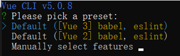

选择第三个`Manually select features`
然后选择`Babel`和`Progressive Web App (PWA) Support`两个选项即可
学习期间不要选中`Linter/Formatter`以避免不必要的错误提示，该选项是代码规范化，代码不规范也会报错
然后选择`vue3.x`版本
然后是配置放在哪里，`Indedicated config files`专用配置文件或者`In package.json`在`package.json`文件中，选择专用配置文件
最后就是自动下载安装，显示以下信息表示成功
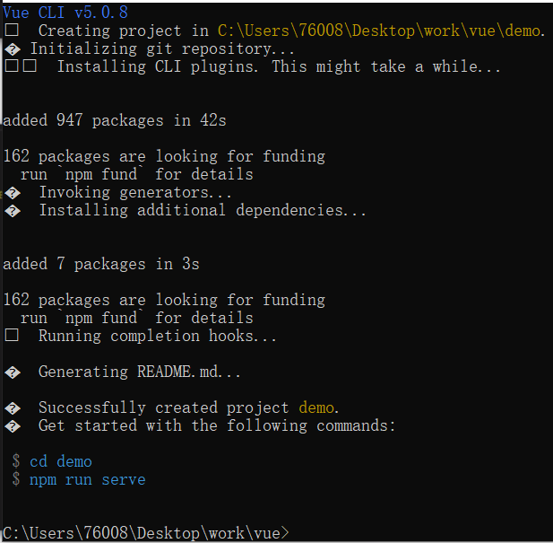

运行项目
根据提示`cd`到文件目录内
然后输入`npm run serve`启动项目
显示以下两个信息表示启动成功，在浏览器输入`localhost:8080`
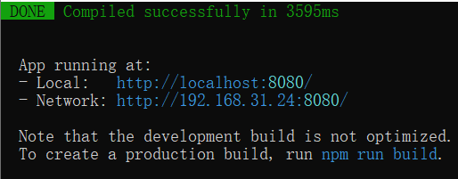
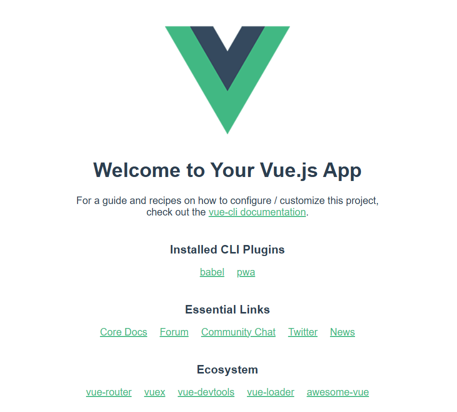

完成以上步骤以后，在项目目录里只需要关注`src`文件，这是源码文件夹，其他都是配置文件
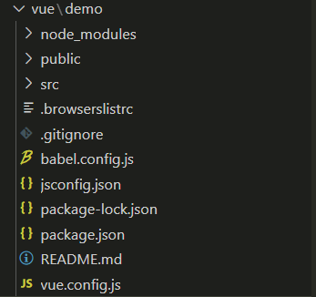

`src`目录下的`assets`文件夹是存放静态资源的，`components`文件夹存放的是公共组件，`App.vue`是根组件，所有组件都是从这里开始的，由它进行引入和显示，`main.js`是所有文件的入口，`registerServiceWorker.js`是监听文件
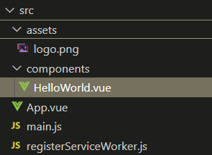

模板语法

文本
数据绑定最常见的形式就是使用"Mustache"（双大括号）语法的文本插值，也就是配合页面动态显示文本
```
<span>Message: {{ msg }}</span>
```
一般配合`js`中的data()设置数据
```
<template>
  <div class="hello">
    <h3>学习Vue：模板语法</h3>
    <p>{{ message }}</p>
  </div>
</template>

<script>
export default {
  name: 'HelloWorld',
  data() {
    return {
      message: "学习Vue"
    }
  }
}
</script>
```

原始HTML

双大括号会将数据解释为普通文本，而非HTML代码，为了输出真正的HTML，需要使用`v-html`命令。也就是`innerHTML`和`innerText`的区别
```
<template>
  <div class="hello">
    <h3>学习Vue：模板语法</h3>
    <p>{{ message }}</p>
    <div>{{ rawHtml }}</div>
    <div v-html="rawHtml"></div>
  </div>
</template>

<script>
export default {
  name: 'HelloWorld',
  data() {
    return {
      message: "学习Vue",
      rawHtml: "<a href='https://www.baidu.com/'>百度</a>"
    }
  }
}
</script>
```

属性Attribute
Mustache语法不能在HTML属性中使用，然而可以使用`v-bind`命令，`v-bind`可以直接简写成`:`
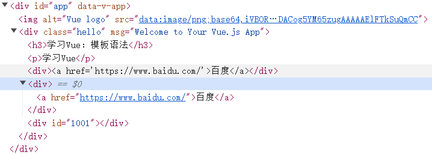
```
<template>
  <div class="hello">
    <h3>学习Vue：模板语法</h3>
    <p>{{ message }}</p>
    <div>{{ rawHtml }}</div>
    <div v-html="rawHtml"></div>
    <div v-bind:id="container"></div>
    // <div :id="container"></div>
  </div>
</template>

<script>
export default {
  name: 'HelloWorld',
  data() {
    return {
      message: "学习Vue",
      rawHtml: "<a href='https://www.baidu.com/'>百度</a>",
      container:1001
    }
  }
}
</script>
```

使用JS表达式
在模板中，Vue.js提供了完全的JS表达式支持，双括号里可以做运算
```
{{ num + 1 }}

{{ ok ? "Yes" : "No" }}
```
这些表达式会在当前活动实例的数据作用于下作为JS被解析。注意的是，每个绑定都只能包含单个表达式，语句、流程控制等不会生效
```
{{ var a = 1 }}

{{ if (ok) { return message } }}
```

条件渲染
根据条件不同，页面渲染不同的内容

`v-if`指令用于条件性地渲染一块内容，这块内容只会在指令的表达式返回`true`值的时候被渲染
```
<template>
  <div class="hello">
    <p v-if="flag">fuck</p>
  </div>
</template>

<script>
export default {
  name: 'HelloWorld',
  data() {
    return {
      flag:true
    }
  }
}
</script>
```

`v-else`指令可以表示`v-if`的else块
```
<template>
  <div class="hello">
    <p v-if="flag">fuck</p>
    <p v-else>shit</p>
  </div>
</template>

<script>
export default {
  name: 'HelloWorld',
  data() {
    return {
      flag:false
    }
  }
}
</script>
```

`v-show`用于条件性展示元素的选项
```
<template>
  <div class="hello">
    <p v-if="flag">fuck</p>
    <p v-else>shit</p>
    <p v-show="flag">1</p>
  </div>
</template>

<script>
export default {
  name: 'HelloWorld',
  data() {
    return {
      flag:true
    }
  }
}
</script>
```

`v-if`和`v-show`的区别
`v-if`是真正的条件渲染，因为它会确保在切换过程中，条件块内的事件监听器和子组件适当地被销毁和重建
`v-if`也是惰性的，如果在初始渲染时条件为假，则什么也不做，直到条件第一次为真，才会开始渲染条件块
`v-show`不管初始条件是什么，元素总是被渲染，并且只是简单地基于CSS进行切换
一般来说，`v-if`有更高的切换开销，`v-show`有更高的初始渲染开销。如果需要频繁切换，则使用`v-show`，如果运行时条件很少改变，则使用`v-if`

列表渲染
用`v-for`把一个数组映射成一组元素
可以用`v-for`指令基于一个数组来渲染一个列表，`v-for`指令需要使用`item in items`形式的特殊语法，其中`items`是源数据数组，`item`是被迭代的数组元素的别名
```
<template>
  <div class="hello">
    <ul>
      <li v-for="item in newsList">
        {{ item.title }}
      </li>
    </ul>
  </div>
</template>

<script>
export default {
  name: 'HelloWorld',
  data() {
    return {
      newsList:[
        {
          id:1001,
          title:"新闻1"
        },
        {
          id:1002,
          title:"新闻2"
        },
        {
          id:1003,
          title:"新闻3"
        }
      ]
    }
  }
}
</script>
```

维护状态
当Vue正在更新使用`v-for`渲染的元素列表时，它默认使用就地更新的策略，如果数据项的顺序被改变，Vue将不会移动DOM元素来匹配数据项的顺序，而是就地更新每个元素，并且确保它们在每个索引位置正确渲染
也就是说当数据发生改变时，Vue只渲染改变的那一部分，没改变的部分不再变动
为了给Vue一个提示，以便它能跟踪每个节点的身份，从而重用和重新排序现有元素，你需要为每项提供一个唯一的`key`属性
如果元素本身不存在唯一标识的属性，可以直接使用`index`遍历下标，在`v-for="(item, index) in xxx"`中的`index`就是元素下标
```
<template>
  <div class="hello">
    <ul>
      <li v-for="item in newsList" :key="item.id">
        {{ item.title }}
      </li>
    </ul>
  </div>
</template>

<script>
export default {
  name: 'HelloWorld',
  data() {
    return {
      newsList:[
        {
          id:1001,
          title:"新闻1"
        },
        {
          id:1002,
          title:"新闻2"
        },
        {
          id:1003,
          title:"新闻3"
        },
        {
          id:1004,
          title:"新闻4"
        }
      ]
    }
  }
}
</script>
```

事件处理

监听事件
使用`v-on`指令(通常缩写为`@`符号)来监听DOM事件，并在触发事件时执行一些JS代码，用法为`v-on:click="methodName"`或用快捷方式`@click="methodName"`
```
<template>
  <div class="hello">
    <!-- <button v-on:click="counter += 1">点击:{{ counter }}</button> -->
    <button @click="counter += 1">点击:{{ counter }}</button>
  </div>
</template>

<script>
export default {
  name: 'HelloWorld',
  data() {
    return {
      counter:1
    }
  }
}
</script>
```

事件处理方法
许多事件处理逻辑会更为复杂，直接把JS代码写在`v-on`指令中是不可行的，`v-on`还可以接收一个需要调用的方法名称
```
<template>
  <div class="hello">
    <!-- <button v-on:click="counter += 1">点击:{{ counter }}</button> -->
    <button @click="counter += 1">点击:{{ counter }}</button>
    <button @click="clickHandle">按钮</button>
    <p>{{ message }}</p>
  </div>
</template>

<script>
export default {
  name: 'HelloWorld',
  data() {
    return {
      counter:1,
      message:"消息通知"
    }
  },
  methods: {
    clickHandle(event) {
      // console.log('fuck');
      // 在事件中，读取data中的属性需要通过this
      this.message = "消息被撤回";
      
      // event是原生DOM event
      console.log(event);
      event.target.innerHTML = "点击之后"
    }
  }
}
</script>
```

内联处理器中的方法
或者称为事件传递参数
```
<template>
  <div class="hello">
    <!-- <button v-on:click="counter += 1">点击:{{ counter }}</button> -->
    <button @click="counter += 1">点击:{{ counter }}</button>
    <button @click="clickHandle">按钮</button>
    <p>{{ message }}</p>
    <button @click="say('hi')">say hi</button>
    <button @click="say('what')">say what</button>

    <ul>
      <li @click="clickItemHandle(item)" v-for="(item, index) in names" :key="index">{{ item }}</li>
    </ul>
  </div>
</template>

<script>
export default {
  name: 'HelloWorld',
  data() {
    return {
      counter:1,
      message:"消息通知",
      names:['fuck', 'shit', 'yes']
    }
  },
  methods: {
    clickHandle(event) {
      // console.log('fuck');
      // 在事件中，读取data中的属性需要通过this
      this.message = "消息被撤回";
      
      // event是原生DOM event
      console.log(event);
      event.target.innerHTML = "点击之后";
    },
    say(data) {
      console.log(data);
    },
    clickItemHandle(item) {
      console.log(item);
    }
  }
}
</script>
```

表单输入绑定
使用`v-model`指令在表单`<input>`、`<textarea>`及`<select>`元素上创建双向数据绑定，它会根据控件类型自动选取正确的方法来更新元素，`v-model`本质上不是语法糖，它负责监听用户的输入事件来更新数据，并在某种极端场景下进行一些特殊处理
```
<template>
  <div class="hello">
    <input type="text" v-model="username">
    <p>{{ username }}</p>
    <button @click="clickGetName">获取用户名</button>
  </div>
</template>

<script>
export default {
  name: 'HelloWorld',
  data() {
    return {
      username:""
    }
  },
  methods:{
    clickGetName() {
      console.log(this.username);
    }
  }
}
</script>
```

修饰符

`.lazy`
在默认情况下，`v-model`在每次`input`事件出发后将输入框的值与数据进行同步。可以添加`lazy`修饰符，从而转为在`change`事件之后进行同步，减少了立刻显示的渲染

`.trim`
如果要自动过滤用户输入的首尾空白字符，可以给`v-model`添加`trim`修饰符
```
<template>
  <div class="hello">
    <input type="text" v-model.lazy="username">
    <input type="text" v-model.trim="password">
    <p>{{ username }}</p>
    <p>{{ password }}</p>
    <button @click="clickGetName">获取用户名</button>
  </div>
</template>

<script>
export default {
  name: 'HelloWorld',
  data() {
    return {
      username:"",
      password:""
    }
  },
  methods:{
    clickGetName() {
      console.log(this.username);
    }
  }
}
</script>
```

组件基础

单文件组件
Vue单文件组件后缀名是`.vue`缩写为SFC，它允许将Vue组件的模板、逻辑与样式封装在单个文件中

加载组件流程
- 引入组件`import 组件名 from '组件路径'`
- 挂载组件在`App.vue`中`conponents:{组件名}`
- 显示组件`<组件名 />`

test.vue
```
//模板
<template>
  <h3>我是单文件组件</h3>
</template>

//逻辑
<script>
export default {
  name: 'test',
  
}
</script>

//样式
//scoped:如果在style中添加此属性，就代表只在当前组件生效
<style scoped>
h3{
    color:red;
}
</style>
```
App.vue
```
<template>
  
  <HelloWorld msg="Welcome to Your Vue.js App"/>
  <test />
</template>

<script>
import HelloWorld from './components/HelloWorld.vue'
import test from './components/test.vue'
export default {
  name: 'App',
  components: {
    HelloWorld,
    test
  }
}
</script>

<style>
#app {
  font-family: Avenir, Helvetica, Arial, sans-serif;
  -webkit-font-smoothing: antialiased;
  -moz-osx-font-smoothing: grayscale;
  text-align: center;
  color: #2c3e50;
  margin-top: 60px;
}
</style>
```

组件的组织
通常一个应用会以一棵嵌套的组件树的形式来组织
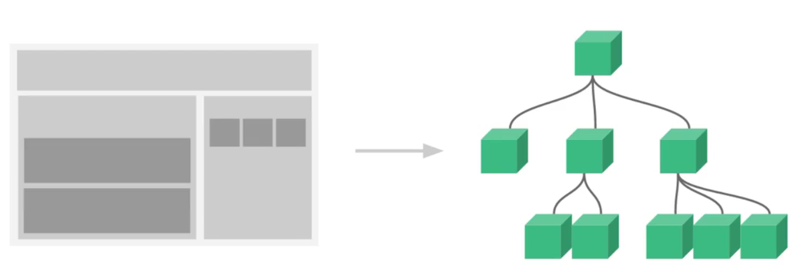

Props组件交互
组件与组件之间是需要交互的
`Prop`是可以在组件上注册的一些自定义属性
test.vue
```
<template>
    <h3>prop传递数据</h3>
    <p>{{ title }}</p>
    <p>age={{ age }}</p>
</template>

<script>
export default {
    name: 'test',
    props:{
        title:{
            type:String,
            default:""
        },
        age:{
            type:Number,
            default:0
        }
    }
}
</script>

<style scoped>

</style>
```
App.vue
```
<template>
  
  <HelloWorld msg="Welcome to Your Vue.js App"/>
  <test :title="title" :age="age"/>
</template>

<script>
import test from './components/test.vue'
import HelloWorld from './components/HelloWorld.vue'
export default {
  name: 'App',
  data() {
    return {
      title:'标题',
      age:20
    }
  },
  components: {
    HelloWorld,
    test
  }
}
</script>

<style>
#app {
  font-family: Avenir, Helvetica, Arial, sans-serif;
  -webkit-font-smoothing: antialiased;
  -moz-osx-font-smoothing: grayscale;
  text-align: center;
  color: #2c3e50;
  margin-top: 60px;
}
</style>
```
Prop类型传递参数没有类型限制
数据类型为数组或者对象的时候，默认值是需要返回工厂模式，也就是必须使用函数类型进行返回

自定义事件组件交互
自定义事件可以在组件中反向传递数据，`prop`可以将数据从父组件传递到子组件，利用自定义事件`$emit`实现子组件传递到父组件
test.vue
```
<template>
    <h3>自定义事件传递数据</h3>
    <button @click="send">传递</button>
</template>

<script>
export default {
    name: 'test',
    data(){
        return {
            message:"fuck"
        }
    },
    methods:{
        send() {
            //参数1：字符串，理论上是随意的，但需要具有意义
            //参数2：传递的数据
            this.$emit("onEvent", this.message);
        }
    }
}
</script>

<style scoped>

</style>
```
App.vue
```
<template>
  
  <HelloWorld msg="Welcome to Your Vue.js App"/>
  <test @onEvent="getData" />
  <p>{{ message }}</p>
</template>

<script>
import test from './components/test.vue'
import HelloWorld from './components/HelloWorld.vue'
export default {
  name: 'App',
  data() {
    return {
      message:""
    }
  },
  components: {
    HelloWorld,
    test
  },
  methods:{
    getData(data) {
      this.message = data;
    }
  }
}
</script>

<style>
#app {
  font-family: Avenir, Helvetica, Arial, sans-serif;
  -webkit-font-smoothing: antialiased;
  -moz-osx-font-smoothing: grayscale;
  text-align: center;
  color: #2c3e50;
  margin-top: 60px;
}
</style>

```

组件生命周期
每个组件在被创建时都要经过一系列的初始化过程，在这个过程中也会运行一些叫做生命周期钩子的函数，给了用户在不同阶段添加自己代码的机会
一共有八个生命周期函数
- 创建时：`beforeCreate`、`created`
- 渲染时：`beforeMount`、`mounted`
- 更新时：`beforeUpdate`、`updated`
- 卸载时：`beforeUnmount`、`unmounted`

把网络请求放在`mounted`内
在组件数据发生变化之前发生`beforeUpdate`
卸载之前把消耗性能的处理关闭，如定时器

test.vue
```
<template>
    <h3>生命周期函数</h3>
    <p>{{ message }}</p>
    <button @click="message='数据'">点击</button>
</template>

<script>
export default {
    name: 'test',
    data(){
        return {
            message:"你好"
        }
    },
    beforeCreate() {
        console.log("beforeCreate");
    },
    created() {
        console.log("created");
    },
    beforeMount() {
        console.log('beforeMount');
    },
    mounted() {
        console.log('mounted');
    },
    beforeUpdate() {
        console.log('beforeUpdate');
    },
    updated() {
        console.log('updated');
    },
    beforeUnmount() {
        console.log('beforeUnmount');
    },
    unmounted() {
        console.log('unmounted');
    }
}
</script>

<style scoped>

</style>
```
App.vue
```
<template>
  
  <HelloWorld msg="Welcome to Your Vue.js App"/>
  <test />
</template>

<script>
import test from './components/test.vue'
import HelloWorld from './components/HelloWorld.vue'
export default {
  name: 'App',
  
  components: {
    HelloWorld,
    test
  }
}
</script>

<style>
#app {
  font-family: Avenir, Helvetica, Arial, sans-serif;
  -webkit-font-smoothing: antialiased;
  -moz-osx-font-smoothing: grayscale;
  text-align: center;
  color: #2c3e50;
  margin-top: 60px;
}
</style>

```

Vue引入第三方
[Swiper](https://swiperjs.com/vue)
[Swiper中文网](https://swiper.com.cn/)
`Swiper`开源、免费、强大的触摸滑动插件
`Swiper`是纯JS打造的滑动特效插件，面向手机、平板等移动终端
`Swiper`能实现触屏焦点图、触屏Tab切换、触屏轮播图切换等常用效果
注意插件支持的版本，有的是vue2，有的是vue3

安装`Swiper`
终端执行
```
cnpm install --save swiper

//安装指定版本的swiper
cnpm install --save swiper@版本号
cnpm install --save swiper@8.1.6
```

轮播图
```
<template>
  <div class="hello">
    <swiper>
      <swiper-slide>
        
      </swiper-slide>
      <swiper-slide>
        
      </swiper-slide>
      <swiper-slide>
        
      </swiper-slide>
    </swiper>
  </div>
</template>

<script>
import {Swiper, SwiperSlide } from 'swiper/vue';
import 'swiper/css';

export default {
  name: 'HelloWorld',
  components: {
    Swiper,
    SwiperSlide
  }
}
</script>

<style scoped>

</style>
```

添加指示器
也就是滑动图片显示当前是第几张图片
```
<template>
  <div class="hello">
    <swiper :modules="modules" :pagination="{ clickable: true}">
      <swiper-slide>
        
      </swiper-slide>
      <swiper-slide>
        
      </swiper-slide>
      <swiper-slide>
        
      </swiper-slide>
    </swiper>
  </div>
</template>

<script>
import { Pagination } from 'swiper/modules';
import {Swiper, SwiperSlide } from 'swiper/vue';
import 'swiper/css';
import 'swiper/css/pagination';

export default {
  name: 'HelloWorld',
  data() {
    return {
      modules: [Pagination]
    }
  },
  components: {
    Swiper,
    SwiperSlide
  }
}
</script>

<style scoped>

</style>
```

Axios网络请求
Axios是一个基于`promise`的网络请求库

安装
管理员运行终端，输入指令
```
npm install --save axios
```

引入

组件中引入`import axios from "axios";`
get请求与post请求
注意：post请求参数是需要额外处理的
管理员终端执行`cnpm install --save querystring`
转换参数格式：`querystring.stringify({})`
```
<template>
  <div class="hello">
    <p>{{ chengpin.title }}</p>
  </div>
</template>

<script>

import axios from 'axios';
import querystring from 'querystring';

export default {
  name: 'HelloWorld',
  data() {
    return {
      chengpin:{}
    }
  },
  mounted() {
    // get请求方式
    axios({
      method:"get",
      url:"http://iwenwiki.com/api/blueberrypai/getChengpinDetails.php"
    }).then(res => {
      console.log(res.data);
      this.chengpin = res.data.chengpinDetails[0];
    });

    // post请求方式
    axios({
      method:"post",
      url:"http://iwenwiki.com/api/blueberrypai/login.php",
      data: querystring.stringify({
        user_id: "iwen@qq.com",
        password: "iwen123",
        verification_code: "crfvw"
      })
    }).then(res => {
      console.log(res.data);
    })
  }
}
</script>

<style scoped>

</style>
```

get请求和post请求的快捷方式
```
<template>
  <div class="hello">
    <p>{{ chengpin.title }}</p>
  </div>
</template>

<script>

import axios from 'axios';
import querystring from 'querystring';

export default {
  name: 'HelloWorld',
  data() {
    return {
      chengpin:{}
    }
  },
  mounted() {
    axios.get("http://iwenwiki.com/api/blueberrypai/getChengpinDetails.php").then(res => {
      console.log(res.data);
    })

    axios.post("http://iwenwiki.com/api/blueberrypai/login.php", 
      querystring.stringify({
        user_id: "iwen@qq.com",
        password: "iwen123",
        verification_code: "crfvw"
      })
    ).then(res => {
      console.log(res.data);
    })
  }
}
</script>

<style scoped>

</style>
```

全局引入
在`main.js`中修改如下
```
import { createApp } from 'vue'
import App from './App.vue'
import './registerServiceWorker'
import axios from 'axios'

//将Axios挂载到全局
const app = createApp(App)
app.config.globalProperties.$axios = axios
app.mount('#app')
// createApp(App).mount('#app')

```
在components组件中修改代码如下
```
<template>
  <div class="hello">
    <p>{{ chengpin.title }}</p>
  </div>
</template>

<script>

// import axios from 'axios';
import querystring from 'querystring';

export default {
  name: 'HelloWorld',
  data() {
    return {
      chengpin:{}
    }
  },
  mounted() {
    this.$axios.get("http://iwenwiki.com/api/blueberrypai/getChengpinDetails.php").then(res => {
      console.log(res.data);
    })

    this.$axios.post("http://iwenwiki.com/api/blueberrypai/login.php", 
      querystring.stringify({
        user_id: "iwen@qq.com",
        password: "iwen123",
        verification_code: "crfvw"
      })
    ).then(res => {
      console.log(res.data);
    })
  }
}
</script>

<style scoped>

</style>
```

Axios网络请求封装
首先安装好`axios`和`querystring`
然后在`src`目录下创建一个`utils`文件夹，在`utils`文件夹下创建`request.js`

`request.js`代码
[参考文档](https://www.kancloud.cn/yunye/axios/234845)
```
import axios from 'axios'
import querystring from 'querystring'

// 参考文档：https://www.kancloud.cn/yunye/axios/234845

const errorHandle = (status, info) => {
    switch(status) {
        case 400:
            console.log('语义有误');
            break;
        case 401:
            console.log('服务器认证失败');
            break;
        case 403:
            console.log('服务器拒绝访问');
            break;
        case 404:
            console.log('地址错误');
            break;
        case 500:
            console.log('服务器遇到意外');
            break;
        case 502:
            console.log('服务器无响应');
            break;
        default:
            console.log(info);
            break;
    }
}

const instance = axios.create({
    //网络请求的公共配置
    //五秒钟没有响应就关闭
    timeout:5000
})

//最常用的是拦截器

//发送数据之前
instance.interceptors.request.use(
    config => {
        if (config.method === 'post') {
            config.data = querystring.stringify(config.data);
        }
        //config包含网络请求的所有信息
        return config;
    },
    error => Promise.reject(error)
)

//获取数据之前
instance.interceptors.response.use(
    response => response.status === 200 ? Promise.resolve(response) : Promise.reject(response),
    error => {
        const { response } = error;
        //错误的处理才是最需要关注的
        errorHandle(response.status, response.info);
    }
)

export default instance;
```

然后在`src`目录下创建`api`文件夹，`api`文件夹下新建`index.js`和`path.js`

`path.js`代码
```
const base = {
    baseUrl:"http://iwenwiki.com",
    chengpin:"/api/blueberrypai/getChengpinDetails.php"
}

export default base;
```

`index.js`代码
```
import axios from '../utils/request'
import path from './path'

const api = {
    //成品地址
    getChengpin() {
        return axios.get(path.baseUrl + path.chengpin)
    }
}

export default api
```

然后在`HelloWorld.vue`文件中引入并执行相应代码
`HelloWorld.vue`代码
```
<template>
  <div class="hello">
  </div>
</template>

<script>
import api from '../api/index'

export default {
  name: 'HelloWorld',
  mounted() {
    api.getChengpin().then(res => {
      console.log(res.data);
    })
  }
}
</script>

<style scoped>

</style>
```

网络请求跨域解决方案

JS采取的是同源策略
同源策略是浏览器的一种安全策略，浏览器只允许JS代码请求和当前服务器域名、端口、协议相同的数据接口上的数据
当协议、域名、端口任意一个不相同时，都会产生跨域问题

跨域错误提示信息
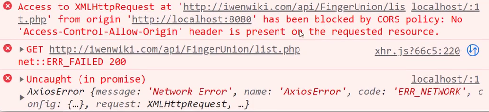
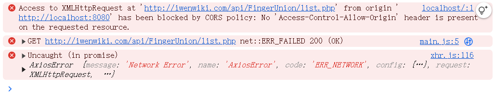

目前主流的跨域解决方案
- 后台解决：cors
- 前台解决：proxy

注意，解决完跨域配置之后要重启服务器
如果不重启会显示以下信息
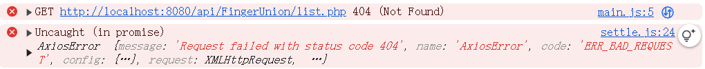

前台解决方案
在`vue.config.js`中修改，在`<url>`处改成目标url，该url就包含了所需的协议(http)、域名(iwenwiki.com)、端口(默认80，不显示)
```
const { defineConfig } = require('@vue/cli-service')
module.exports = defineConfig({
  transpileDependencies: true,
  devServer: {
    proxy: {
      '/api': {
        //target: '<url>',
        target: 'http://iwenwiki.com',
        changeOrigin: true
      }
    }
  }
})

```
然后在`HelloWorld.vue`中发送get请求
```
<template>
  <div class="hello">
    <h3>跨域解决方案</h3>
  </div>
</template>

<script>

import axios from 'axios'

export default {
  name: 'HelloWorld',
  mounted() {
    axios.get("/api/FingerUnion/list.php").then(res => {
      console.log(res.data);
    })
  }

}
</script>

<style scoped>

</style>
```

Vue引入路由配置
在Vue中，可以通过`vue-router`路由管理页面之间的关系
Vue Router是Vue.js官方的路由，它与Vue.js核心深度集成，让用Vue.js构建单页应用变得轻松

在Vue中引入路由
[Vue Router官方文档](https://router.vuejs.org/zh/introduction.html)

首先安装路由，管理员运行终端，执行代码
```
cnpm install --save vue-router
```
然后创建配置独立路由的文件
在`src`文件夹下新建`router`文件夹，在`router`文件夹下新建`index.js`文件
在`src`文件夹下新建`views`文件夹，在`views`文件夹下新建`HomeView.vue`和`AboutView.vue`文件

`index.js`代码
```
import { createRouter, createWebHashHistory } from 'vue-router'
import HomeView from '../views/HomeView.vue'
import AboutView from '../views/AboutView.vue'

//配置信息中需要页面的相关配置
const routes = [
    {
        path:"/",
        component:HomeView
    },
    {
        path:"/about",
        component:AboutView
    }
]

const router = createRouter({

    history: createWebHashHistory(),
    routes
})

export default router;
```

`HomeView.vue`代码
```
<template>
    <h3>首页</h3>
</template>
```

`AboutView.vue`代码
```
<template>
    <h3>关于页面</h3>
</template>
```

引入路由到项目
`main.js`代码
```
import { createApp } from 'vue'
import App from './App.vue'
import './registerServiceWorker'
import router from './router'

createApp(App).use(router).mount('#app')

```

在`App.vue`中指定路由显示入口`<router-view/>`
`App.vue`代码
```
<template>
  
  <!-- 路由的显示入口 -->
  <router-link to="/">首页</router-link> | 
  <router-link to="/about">关于</router-link>
  <router-view></router-view>
</template>

<script>
export default {
  name: 'App',
  
}
</script>

<style>
#app {
  font-family: Avenir, Helvetica, Arial, sans-serif;
  -webkit-font-smoothing: antialiased;
  -moz-osx-font-smoothing: grayscale;
  text-align: center;
  color: #2c3e50;
  margin-top: 60px;
}
</style>

```
小问题：点击首页和关于没有显示相应的字？
答案：在创建项目时要选中Router选项

createWebHashHistory和createWebHistory区别
- createWebHashHistory:
    - http://localhost:8080/#/
    - http://localhost:8080/#/about
    - 不需要后台配合做重定向
    - 原理：a标签锚点连接
- createWebHistory:
    - http://localhost:8080/
    - http://localhost:8080/about
    - 此种方式需要后台配合做重定向，否则会出现404问题
    - 原理：H5 pushState()

路由传递参数

页面跳转过程中是可以携带参数的
第一步：在路由配置中指定参数`key`，后面的`key`没有数量限制`路径/:key/:key...`
`component`除了首页必须从外面引入路径，其他的建议用箭头函数引入，这样可以避免每次都加载新的路径而造成的资源浪费，因为每次打开首页都会把内容全部加载好，虽然没有显示其他的`component`，但后台实际上已经加载了。使用箭头函数可以在点击的时候才加载
```
{
  path:'/路径/:key',
  name:'路径',
  component:() => import('路径')
}
```

第二步：在跳转过程中携带参数
```
<router-link to="路径/参数"></router-link>
```

第三步：在详情页面读取路由携带的参数
```
<p>{{ $route.params.name }}</p>
```

`index.js`代码
```
import { createRouter, createWebHashHistory } from 'vue-router'
import HomeView from '../views/HomeView.vue'

const routes = [
  {
    path: '/',
    name: 'home',
    component: HomeView
  },
  {
    path: '/about',
    name: 'about',
    // route level code-splitting
    // this generates a separate chunk (about.[hash].js) for this route
    // which is lazy-loaded when the route is visited.
    component: () => import('../views/AboutView.vue')
  },
  {
    path:'/news',
    name:'news',
    component: () => import('../views/NewsView.vue')
  },
  {
    path:'/newsdetails/:name',
    name:'newsdetails',
    component: () => import('../views/NewsDetailsView.vue')
  }
]

const router = createRouter({
  history: createWebHashHistory(),
  routes
})

export default router

```

`NewsView.vue`代码
```
<template>
    <h3>新闻</h3>
    <ul>
        <li><router-link to='/newsdetails/百度'>百度新闻</router-link></li>
        <li><router-link to='/newsdetails/网易'>网易新闻</router-link></li>
        <li><router-link to='/newsdetails/头条'>头条新闻</router-link></li>
    </ul>
</template>
```

`NewsDetailsView.vue`代码
```
<template>
    <h3>新闻详情</h3>
    <p>{{ $route.params.name }}</p>
</template>
```

`App.vue`代码
```
<template>
  <router-link to="/">Home</router-link> |
  <router-link to="/about">About</router-link> |
  <router-link to="/news">新闻</router-link>
  <router-view/>
</template>

<style>
#app {
  font-family: Avenir, Helvetica, Arial, sans-serif;
  -webkit-font-smoothing: antialiased;
  -moz-osx-font-smoothing: grayscale;
  text-align: center;
  color: #2c3e50;
}

nav {
  padding: 30px;
}

nav a {
  font-weight: bold;
  color: #2c3e50;
}

nav a.router-link-exact-active {
  color: #42b983;
}
</style>

```

效果


点击百度新闻
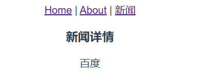

嵌套路由配置
大导航下面有小导航是很常见的应用方式

第一步：创建子路由要加载的页面
第二步：在路由配置文件中添加子路由配置
```
{
  path:'路径',
  name:'xx',
  redirect:'路径/name',
  component:() => import('路径'),
  children: [
    {
      path:'name',
      component:() => import('路径')
    },
    {
      path:'name2',
      component:() => import('路径')
      //children可以无限嵌套
      /*
        children:[
          {
            ...
            children:[

            ]
          }
        ]
      */
    }
  ]
}
```
第三步：指定子路由显示位置
`<router-view></router-view>`
第四步：添加子路由跳转链接
```
<router-link to="/about/us">关于我们</router-link>
```
第五步：重定向配置`redirect:'/news/baidu'`，如果不配置重定向，不访问指定内容是什么都不显示的，如果配置了重定向，如果什么都不访问的情况下，把重定向的内容作为默认内容显示出来

`index.js`代码
```
import { createRouter, createWebHashHistory } from 'vue-router'
import HomeView from '../views/HomeView.vue'

const routes = [
  {
    path: '/',
    name: 'home',
    component: HomeView
  },
  {
    path: '/about',
    name: 'about',
    // route level code-splitting
    // this generates a separate chunk (about.[hash].js) for this route
    // which is lazy-loaded when the route is visited.
    
    //重定向
    redirect: '/about/us',
    component: () => import('../views/AboutView.vue'),
    children: [
      {
        //二级导航的路径不加 /
        path:'us',
        component:() => import('../views/AboutSub/AboutUs.vue')
      },
      {
        path:'info',
        component:() => import('../views/AboutSub/AboutInfo.vue')
      }
    ]
  }
]

const router = createRouter({
  history: createWebHashHistory(),
  routes
})

export default router

```

`App.vue`代码
```
<template>
  <router-link to="/">Home</router-link> |
  <router-link to="/about">About</router-link>
  <router-view/>
</template>

<style>
#app {
  font-family: Avenir, Helvetica, Arial, sans-serif;
  -webkit-font-smoothing: antialiased;
  -moz-osx-font-smoothing: grayscale;
  text-align: center;
  color: #2c3e50;
}

nav {
  padding: 30px;
}

nav a {
  font-weight: bold;
  color: #2c3e50;
}

nav a.router-link-exact-active {
  color: #42b983;
}
</style>

```

`AboutView.vue`代码
```
<template>
  <div class="about">
    <router-link to="/about/us">关于我们</router-link> | 
    <router-link to="/about/info">关于信息</router-link>
    <router-view></router-view>
  </div>
</template>

```

Vue状态管理(Vuex)

Vuex是一个专为Vue.js应用程序开发的状态管理模式 + 库，它采用集中式存储管理应用的所有组件的状态，并以相应的规则保证状态以一种可预测的方式发生变化
状态管理可以为更方便的管理组件之间的数据交互，提供了一个集中式的管理方案，任何组件都可以按照指定的方式进行读取和改变数据
集中式管理方案避免了数据在组件之间的流动，而是让数据集中管理，如果某个组件宕机不会影响其他组件的数据流动

引入Vuex步骤
第一步：安装Vuex`cnpm install --save vuex`
第二步：配置Vuex文件
在`src`文件夹下新建`store`文件夹，在`store`文件夹下新建`index.js`文件
```
import { createStore } from 'vuex'

export default createStore({
    //所有数据放在这里
    state:{
        counter:0
    }
})
```
第三步：在主文件中引入Vuex
```
import { createApp } from 'vue'
import App from './App.vue'
import './registerServiceWorker'
import store from './store'

createApp(App).use(store).mount('#app')

```
第四步：在组件中读取状态
- 直接在组件中添加语句
  ```
  <p>counter = {{ $store.state.counter }}</p>
  ```
- 如果在一个组件中使用多次，vuex提供的快捷读取方式
  ```
  <template>
    <div class="hello">
      <p>counter = {{ counter }}</p>
    </div>
  </template>

  <script>

  import { mapState } from 'vuex'; 

  export default {
    name: 'HelloWorld',
    //专门来读取vuex的数据
    computed: {
      ...mapState(["counter"])
    }
  }
  </script>
  ```

Vue状态管理核心
最常用的核心概念包括`State`、`Getter`、`Mutation`、`Action`

上一节中就是`State`

Getter
对vuex中的数据进行过滤，符合条件的显示，不符合的不显示
`store`中的`index.js`代码
```
import { createStore } from 'vuex'

export default createStore({
  state: {
    counter: 10
  },
  getters: {
    getCount(state){
      return state.counter > 0 ? state.counter : '不符合要求'
    }
  }
})

```
`HomeView.vue`代码
```
<template>
  <div class="home">
    
    <h3>home</h3>
    <p>counter = {{ $store.getters.getCount }}</p>
    <p>{{ getCount }}</p>
  </div>
</template>

<script>
import { mapGetters } from 'vuex'

export default {
  name: 'HomeView',
  components: {

  },
  computed: {
    ...mapGetters(['getCount'])
  }
}
</script>


```

Mutation
更改Vuex的`store`中的状态的唯一方法是提交`mutation`，Vuex的`mutation`非常类似于事件：每个`mutation`都有一个字符串的事件类型(type)和一个回调函数(handler)，回调函数就是实际进行状态更改的地方，并且它会接受`state`作为第一个参数
`index.js`代码
```
import { createStore } from 'vuex'

export default createStore({
  state: {
    counter: 10
  },
  getters: {
    getCount(state){
      return state.counter > 0 ? state.counter : '不符合要求'
    }
  },
  mutations: {
    addCount(state, num) {
      state.counter += num
    }
  }
})

```
`HomeView.vue`代码
```
<template>
  <div class="home">
    
    <h3>home</h3>
    <p>counter = {{ $store.getters.getCount }}</p>
    <p>{{ getCount }}</p>

    <button @click="addClickHandle">增加</button>
  </div>
</template>

<script>
import { mapGetters, mapMutations } from 'vuex'

export default {
  name: 'HomeView',
  components: {

  },
  computed: {
    ...mapGetters(['getCount'])
  },
  methods: {
    ...mapMutations(['addCount']),
    addClickHandle() {
      //固定调用方式
      // this.$store.commit('addCount', 15)
    
      this.addCount(20)
    }
  }
}
</script>

```
`AboutView.vue`代码
```
<template>
  <div class="about">
    <h1>This is an about page</h1>
    <p>counter = {{ $store.getters.getCount }}</p>
  </div>
</template>

```

Action
Action类似于Mutation，有异步操作才用Action，没有异步操作用Mutation，他俩不同在于
- Action提交的是mutation，而不是直接变更状态
- Action可以包含任意异步操作

首先加入网络请求包`axios`
```
cnpm install --save axios
```
`index.js`代码
```
import { createStore } from 'vuex'
import axios from 'axios'

export default createStore({
  state: {
    counter: 10
  },
  getters: {
    getCount(state){
      return state.counter > 0 ? state.counter : '不符合要求'
    }
  },
  mutations: {
    addCount(state, num) {
      state.counter += num
    }
  },
  //为异步操作所准备
  actions:{
    asyncAddCount({ commit }) {
      axios.get("http://iwenwiki.com/api/generator/list.php").then(res => {
        commit("addCount", res.data[0])
      })
    }
  }
})

```
`HomeView.vue`代码
```
<template>
  <div class="home">
    
    <h3>home</h3>
    <p>counter = {{ $store.getters.getCount }}</p>
    <p>{{ getCount }}</p>

    <button @click="addClickHandle">增加</button>
  
    <button @click="addAsyncClickHandle">异步增加</button>
  </div>
</template>

<script>
import { mapGetters, mapMutations, mapActions } from 'vuex'

export default {
  name: 'HomeView',
  components: {

  },
  computed: {
    ...mapGetters(['getCount'])
  },
  methods: {
    ...mapMutations(['addCount']),
    ...mapActions(['asyncAddCount']),
    addClickHandle() {
      //固定调用方式
      // this.$store.commit('addCount', 15)
    
      this.addCount(20);
    },
    addAsyncClickHandle() {
      // this.$store.dispatch("asyncAddCount")

      this.asyncAddCount();
    }
  }
}
</script>

```

Vue3新特性

六大亮点
- Performance：性能比Vue2强
- Tree shaking support：可以将无用模块剪辑，仅打包需要的
- Composition API：组合API
- Fragment, Teleport, Suspense：碎片，Teleport即Protal传送门，悬念
- Better TypeScript support：更优秀的TS支持
- Custom Renderer API：暴露了自定义渲染API

ref & reactive
在2.x中通过组件data的方法来定义一些当前组件的数据
```
data() {
  return {
    message:20
  }
}
```
在3.x中通过ref或reactive创建响应式对象
基本类型数据用ref，复杂类型数据用reactive
ref代码
```
<template>
  <div class="hello">
    <p>{{ message }}</p>
  </div>
</template>

<script>
import { ref } from 'vue'

export default {
  name: 'HelloWorld',
  // 组合式API
  setup() {
    //ref
    const message = ref('我的消息')
    return {
      message
    }
  }
}
</script>

```
reactive代码
```
<template>
  <div class="hello">
    <p>{{ message }}</p>
    <ul>
      <li v-for="(item, index) in names.list" :key="index">{{ item }}</li>
    </ul>
  </div>
</template>

<script>
import { ref, reactive } from 'vue'

export default {
  name: 'HelloWorld',
  // 组合式API
  setup() {
    //ref
    const message = ref('我的消息')
    //reactive
    const names = reactive({
      list: ['iwen', 'ime', 'frank']
    })


    return {
      message,
      names
    }
  }
}
</script>

```

methods中定义的方法写在setup()中
```
<template>
  <div class="hello">
    <p>{{ message }}</p>
    <ul>
      <li v-for="(item, index) in names.list" :key="index">{{ item }}</li>
    </ul>
    <button @click="clickHandle">按钮</button>
  </div>
</template>

<script>
import { ref, reactive } from 'vue'

export default {
  name: 'HelloWorld',
  // 组合式API
  setup() {
    //ref
    const message = ref('我的消息')
    //reactive
    const names = reactive({
      list: ['iwen', 'ime', 'frank']
    })

    function clickHandle() {
      console.log('点击')
      // 通过message的value修改信息
      message.value = '我是新消息'
    }
    // 必须return
    return {
      message,
      names,
      clickHandle
    }
  }
}
</script>

```

setup()中使用props和context
在2.x中，组件的方法可以通过this获取到当前组件的实例，并执行data变量的修改、方法的调用、组件的通信等等
在3.x中，setup()在beforeCreate和created时机就已调用，无法使用和2.x一样的this，但可以通过接收setup(props, ctx)的方法，获取到props和当前组件的实例，即setup中没有this
```
<template>
  <div class="hello">
    <p>{{ message }}</p>
    <ul>
      <li v-for="(item, index) in names.list" :key="index">{{ item }}</li>
    </ul>
    <button @click="clickHandle">按钮</button>
    <p>{{ msg }}</p>
  </div>
</template>

<script>
import { ref, reactive } from 'vue'

export default {
  name: 'HelloWorld',
  props: {
    msg:String
  },
  // 组合式API
  setup(props, ctx) {
    //ref
    const message = ref('我的消息')
    //reactive
    const names = reactive({
      list: ['iwen', 'ime', 'frank']
    })

    function clickHandle() {
      console.log('点击')
      // 通过message的value修改信息
      message.value = '我是新消息'
    }

    const msg = props.msg

    // 必须return
    return {
      message,
      names,
      clickHandle,
      msg
    }
  }
}
</script>

```

在setup中使用生命周期函数
通过在生命周期钩子前加上`on`来访问组件的生命周期钩子
setup()内部调用生命周期钩子
|Options API|Hook inside setup|
|-|-|
|beforeCreate|Not needed*|
|created|Not needed*|
|beforeMount|onBeforeMount|
|mounted|onMounted|
|beforeUpdate|onBeforeUpdate|
|updated|onUpdated|
|beforeUnmount|onBeforeUnmount|
|unmounted|onUnmounted|
```
<template>
  <div class="hello">
    
  </div>
</template>

<script>
import { onMounted } from 'vue'

export default {
  name: 'HelloWorld',
  setup(props, ctx) {
    // 以前同一个生命周期函数只会出现一个，现在可以出现多个
    onMounted(() => {
      console.log('生命周期函数1:onMounted')
    })
    onMounted(() => {
      console.log('生命周期函数2:onMounted')
    })

  }
}
</script>

```

Provide / Inject
- provide()和inject()可以实现嵌套组件之间的数据传递
- 这两个函数只能在setup()函数中使用
- 父级组件中使用provide()函数向下传递数据
- 子级组件中使用inject()获取上层传递过来的数据
- 不限层级，只能由父组件向子组件传递，不能反向传递

在`App.vue`组件中添加
```
import { provide } from 'vue'

setup() {
  provide('message', '我是消息')
}
```
`HelloWorld`组件中接收
```
<template>
  <div class="hello">
    <p>{{ message }}</p>
  </div>
</template>

<script>
import { onMounted, inject } from 'vue'

export default {
  name: 'HelloWorld',
  setup() {

    const message = inject('message');
    return {
      message
    }
  }
}
</script>

```

Fragment
翻译为碎片
不再限于模板中的单个根节点，以前只允许一个外层根节点

Vue3加载Element-plus
Element-plus：基于Vue3，面向设计师和开发者的组件库
[Element ui](https://element.eleme.cn/#/zh-CN)
Element是一套为开发者、设计师和产品经理准备的基于`Vue2.0`的桌面端组件库

安装Element-Plus
```
cnpm install element-plus --save
```

完整引用
如果你对打包后的文件大小不是很在乎，那么使用完整导入会更方便
`main.js`代码
```
import { createApp } from 'vue'
import App from './App.vue'
import './registerServiceWorker'
import ElementPlus from 'element-plus'
import 'element-plus/dist/index.css'

createApp(App).use(ElementPlus).mount('#app')

```
`HelloWorld.vue`代码
```
<template>
  <div class="hello">
    <el-row>
      <el-button>默认按钮</el-button>
      <el-button type="primary">主要按钮</el-button>
      <el-button type="success">成功按钮</el-button>
      <el-button type="info">信息按钮</el-button>
      <el-button type="warning">警告按钮</el-button>
      <el-button type="danger">危险按钮</el-button>
    </el-row>
    <el-switch v-model="value1" />
    <el-switch
      v-model="value2"
      class="ml-2"
      style="--el-switch-on-color: #13ce66; --el-switch-off-color: #ff4949"
    />
  </div>
  
</template>

<script>
import { ref } from 'vue'

export default {
  name: 'HelloWorld',
  setup() {
    const value1 = ref(true)
    const value2 = ref(true)

    return {
      value1,
      value2
    }
  }  
}
</script>

```


按需引入
在真实的应用场景中并不是每个组件都会被用到，这会造成不小的资源浪费
首先安装`unplugin-vue-components`和`unplugin-auto-import`两个插件
```
cnpm install -D unplugin-vue-components unplugin-auto-import
```
然后修改`vue.config.js`配置文件
```
const { defineConfig } = require('@vue/cli-service')
const AutoImport = require('unplugin-auto-import/webpack')
const Components = require('unplugin-vue-components/webpack')
const { ElementPlusResolver } = require('unplugin-vue-components/resolvers')

module.exports = defineConfig({
  transpileDependencies: true,
  configureWebpack: {
    plugins: [
      AutoImport({
        resolvers: [ElementPlusResolver()]
      }),
      Components({
        resolvers: [ElementPlusResolver()]
      })
    ]
  }
})
```
最后可以直接在组件中使用

注意
Vue3基于Webpack在vue.config.js中配置
当`unplugin-vue-components`版本小于等于26.0，使用以下写法
```
const { defineConfig } = require("@vue/cli-service")
const AutoImport = require('unplugin-auto-import/webpack')
const Components = require('unplugin-vue-components/webpack')
const { ElementPlusResolver } = require('unplugin-vue-components/resolvers')

module.exports = defineConfig({
  transpileDependencies: true,
  configureWebpack: {
    plugins: [
      AutoImport({
        resolvers: [ElementPlusResolver()],
      }),
      Components({
        resolvers: [ElementPlusResolver()],
      }),
    ]
  }
})

```
大于26.0版本使用以下写法
```
const { defineConfig } = require("@vue/cli-service")
const AutoImport = require('unplugin-auto-import/webpack')
const Components = require('unplugin-vue-components/webpack')
const { ElementPlusResolver } = require('unplugin-vue-components/resolvers')

module.exports = defineConfig({
  transpileDependencies: true,
  configureWebpack: {
    plugins: [
      AutoImport.default({
        resolvers: [ElementPlusResolver()],
      }),
      Components.default({
        resolvers: [ElementPlusResolver()],
      }),
    ]
  }
})

```
否则启动的时候会出现
```
TypeError: AutoImport is not a function
```
小问题：成功启动，但图标不显示？F12以后显示`Uncaught TypeError: Cannot read properties of null (reading 'ce')`

Vue3加载Element-plus的字体图标

安装`icons`字体图标
```
cnpm install @element-plus/icons-vue
```
全局注册
在`src`下，创建`plugins`文件夹，在文件夹下创建`icons.js`文件
```
import * as components from '@element-plus/icons-vue'

export default {
    install: (app) => {
        for (const key in components) {
            const componentConfig = components[key];
            app.component(componentConfig.name, componentConfig);
        }
    },
};
```

引入文件
在`main.js`中引入`icons.js`文件
```
import elementIcon from './plugins/icon'

app.use(elementIcon)
```

接下来就可以直接在组件中引入使用了
```
<template>
  <div class="hello">
    <h1>{{ msg }}</h1>
    <el-icon><House />1</el-icon>
  </div>
</template>

<script>
import { ref } from 'vue'

export default {
  name: 'HelloWorld',
  props: {
    msg: String
  }
}
</script>

```


