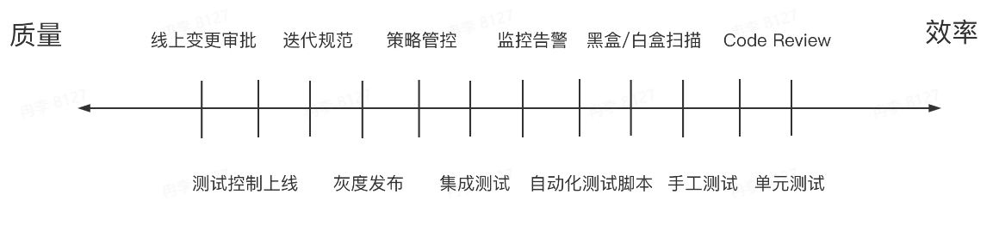

# 后端开发流程学习笔记
[PPT](https://bytedance.larkoffice.com/file/boxcnX2Kbn9stBnpy52esgfczpb)

**术语前瞻**
|分类|英文|中文|解释|
|-|-|-|-|
|研发模式|Waterfall Model|瀑布模型|瀑布模型（Waterfall Model）最早强调软件或系统开发应有完整之周期，且必须完整的经历周期之每一开发阶段，并系统化的考量分析与设计的技术、时间与资源之投入等。由于该模式强调系统开发过程需有完整的规划、分析、设计、测试及文件等管理与控制，因此能有效的确保系统质量，它已经成为软体业界大多数软件开发的最初标准|
|研发模式|The Scaled Agile Framework(SAFe)|规模化敏捷框架||
|研发模式|Scrum|Scrum|在软件工程中，Scrum是以经验过程为依据，采用迭代、增量的方法来提高产品开发的可预见性并控制风险的理论，Scrum不是一种过程，也不是一项构建产品的技术，而是一个框架，在Scrum框架中可以应用各种过程和技术，Scrum的作用是让开发实践方法的相对功效显现出来以便随时改进。Scrum是敏捷(Agile)开发的一种实践模式，敏捷开发强调拥抱需求变化，快速响应不断变化的需求，并尽可能快地提供可以工作的软件产品，敏捷最强调的是可以正常工作的软件产品，文档等不是非常的强调（并非不要文档，只是需要必要的文档），敏捷理论认为面对面的沟通交流远比文档更有效。敏捷开发的Scrum模式是以价值驱动(Value-Driven)的开发模式，即认为用户的需求并不一定需要100%实现，最重要的是将对用户最有价值的功能实现并交付.|
|流程中的概念|Scrum Master|敏捷教练|Scrum Master是Scrum教练和团队带头人，确保团队合理的运作Scrum，并帮助团队扫除实施中的障碍|
|流程中的概念|Product Owner|产品负责人|产品负责人，确定产品的方向和愿景，定义产品发布的内容、优先级及交付时间，为产品投资回报率负责|
|流程中的概念|Agile Release Train|敏捷发布火车|敏捷开发的一种发布模式|
|流程中的概念|RD|研发工程师|RD一般指Research and Development Engineer，即研发工程师|
|流程中的概念|PM|产品经理|产品经理|
|流程中的概念|PRD|产品需求文档|产品需求文档|
|流程中的概念|UED|交互设计师|用户体验设计师，交互设计师，界面设计师|
|流程中的概念|QA|测试工程师|指理解产品的功能要求，并对其进行测试，检查软件有没有缺陷（Bug），测试软件是否具有稳定性（Robustness）、安全性、易操作性等性能，写出相应的测试规范和测试用例的专门工作人员。|
|流程中的概念|Backlog|待办事项|产品订单（product backlog）是整个专案的概要文档。产品订单包括所有所需特性的粗略的描述。产品订单是关于将要生产什么样的产品。产品订单是开放的，每个人都可以编辑。产品订单包括粗略的估算，通常以天为单位。估算将帮助产品负责人衡量时程表和优先级（例如，如果"增加拼写检查"特性的估计需要花3天或3个月，将影响产品负责人对该特性的渴望）。冲刺订单（sprint backlog）是大大细化了的文档，包含团队如何实现下一个冲刺的需求的信息。任务被分解为以小时为单位，没有任务可以超过16个小时。如果一个任务超过16个小时，那么它就应该被进一步分解。冲刺订单上的任务不会被分派，而是由团队成员签名认领他们喜爱的任务。|
|流程中的概念|Grooming Meeting|Grooming会议|这个会议上面会由PO来描述下个迭代需要实现的功能，大家讨论要不要干|
|流程中的概念|Planning Meeting|Planning会议|这个会议讨论功能具体什么时候干，要估算任务的工作量|
|基础知识|CNCF|云原生计算基金会|云原生计算是软件开发中的一种方法，它利用云计算“在现代动态环境（例如公共云、私有云和混合云）中构建和运行可扩展的应用程序”。 通过声明性代码部署的容器、微服务、无服务器功能和不可变基础设施等技术是这种架构风格的常见元素。|
|基础知识|Kubernetes|K8S|生产级别的容器编排系统。Kubernetes 是一个可移植的、可扩展的开源平台，用于管理容器化的工作负载和服务，可促进声明式配置和自动化。 Kubernetes 拥有一个庞大且快速增长的生态系统。Kubernetes 的服务、支持和工具广泛可用。|
|基础知识|FAAS|函数即服务|函数即服务。仅通过编写函数（function）就能够发布为一个 API 或者服务，实现业务功能的技术体系。由于处理单元为函数粒度，往往底层也能够支持自动扩缩容地更精细化使用计算资源，开发侧支持事件驱动，可由消息或多种 Hook 触发，同时拥有快速上线、按需付费等优点。|
|基础知识|APAAS|平台即服务|是一个为应用程序服务提供开发和部署环境的云服务|
|基础知识|IDE|IDE|用于提供程序开发环境的应用程序。一般包括代码编辑器、编译器、调试器和图形用户界面等工具|
|基础知识|Git|Git|分布式的版本管理系统|
|基础知识|Merge/Rebase|合并/变基|处理代码分支的操作，将不同的分支整合成一个的两种方式|

为什么要有流程？
+ 个人开发者是不需要流程的
+ 超过一个人的团队就需要协作
+ 随着团队规模上升，会出现全新的问题

复杂项目没有流程出现的问题：
+ 需求阶段：每个人都有自己的想法，团队决策需要有一个过程
+ 开发阶段：多人/多端协作开发，每个人有自己的安排，相互配合需要有一个流程
+ 测试阶段：产物怎样交付，测试如何开展，BUG怎么修都需要流程
+ 发布阶段：怎样确保发布过程平稳丝滑，版本和流量如何控制，需要有规范
+ 运维阶段：线上问题如何应急响应，处理用户反馈和线上问题需要有流程

传统的瀑布模型：一个最直观的流程模型
+ 工作流程的直观表达
+ 定义了标准的研发阶段
+ 以流程为本，理想化模型

敏捷开发：更现代的流程模型
+ 以小团队快速迭代
+ 团队成员之间的合作更加紧密
+ 以人为本，和用户沟通

The Scaled Agile Framework(SAFe)：是一套管理框架
+ 精益产品开发
+ 敏捷软件开发
+ 系统思考
+ 由多个scrum相互配合

现代的Scrum：
+ 敏捷教练Scrum Master
+ 产品负责人Product Owner
+ 敏捷团队Scrum Team
+ 敏捷发布火车Agile Release Train

#### 需求阶段
MVP(minimum viable product，最小化可行产品)思想：
+ 站在用户的角度思考
+ 收集用户反馈，快速迭代


#### 开发阶段
云原生的发展，深刻改变了后端开发的工作


**传统开发与云原生下的开发**
+ 传统虚拟机(传统)
  + 在物理主机中虚拟出多个虚拟机，每个虚拟机拥有自己的操作系统
  + 运维人员负责维护和交付虚拟机
  + 每个虚拟机中都要安装相应的依赖环境
+ 容器化
  + 容器是在操作系统中虚拟出来的
  + 通过cgroup，namespace和Union Mount等技术实现了容器之间的相互隔离，同时容器只有很低的开销
  + 应用和其依赖作为一个整体，打包成镜像交付
+ 单体架构(传统)
  + 多个模块共同组成一个服务，服务体量较大
  + 模块之间直接调用，不需要RPC通信
  + 服务整体扩缩容量
  + 多人开发一个代码仓库，需要充分集成测试
+ 微服务架构
  + 每个功能在不同的服务中
  + 不同模块需要进行RPC通信
  + 不同模块可以独立扩缩容量
  + 每个服务的代码仓库仅由少部分人维护

开发环境逐渐云原生化
FaaS，PaaS等技术让开发逐渐从本地IDE向线上转变
从入职领到电脑搭建完一套完整的开发环境需要很久，通过WEB IDE等技术，环境未来将会开箱即用

代码规范
+ 养成良好的注释习惯，超过三个月的代码自己都会忘了当时在想什么
+ 不要有魔法数字，魔法字符串，让别人不知道常量是什么含义，如
```go
if v == 2
```
+ 重复的逻辑抽象成公共的方法，不要copy代码
+ 正确使用IDE的重构功能，防止修改错误

自测
+ 单元测试
+ 功能环境测试
+ 测试数据构造

文档
+ 大型改造需要有技术设计文档，方案评审
+ 好的接口文档能更方便的和前端进行沟通

#### 测试阶段
功能环境
+ 需要一个能模拟线上的环境进行开发和测试
+ 环境和环境之间能够隔离，不影响其他功能的开发和测试

集成环境
+ 不同人开发的功能合并在一起测试，相互之间的影响可能产生缺陷
+ 迭代发布的所有功能合并在一起测试，确保发布的所有功能之间的影响不产生缺陷

回归环境
+ 确保新的功能不对老的功能产生影响
+ 回归测试一般会借助自动化测试脚本


#### 发布阶段

发布过程中要做的事情
+ 发布负责人
  + 负责按照计划执行发布
  + 需要通知各个相关人员发布进展
  + 观察各个服务的发布状态，及时处理异常
+ 变更服务的相关RD
  + 按照上线checklist检查服务的日志，监控，响应上线过程中的告警
  + 对于自己负责的改动，在小流量或者是预览环境进行功能验证
  + 执行发布计划中的其他操作(如线上配置，数据处理等)
+ 值班同学
  + 发布过程中的监控和告警需要特别关注，如果有异常需要立刻判断是否由变更引起
  + 如果有变更引起的告警或者用户反馈，需要及时中止发布

发布模式
+ 蛮力发布：简单粗暴，直接用新版本覆盖老版本

  + 优点
    + 简单
    + 成本低
  + 缺点
    + 发布过程中服务会中断
    + 出了问题会影响全部用户
  + 适用
    + 测试环境部署
    + 小公司或者非核心的业务服务
+ 金丝雀发布：由于金丝雀对瓦斯极其敏感，因此以前矿工开矿下矿洞前，先会放一只金丝雀进去探是否有有毒气体，看金丝雀能否存活下来，金丝雀发布由此得名

  + 优点
    + 相对简单
    + 能够用少量用户验证新版本功能
  + 缺点
    + 发布过程中服务会中断
    + 发现不了随用户量增大才会暴露的问题
  + 适用
    + 测试环境部署
    + 小公司或者非核心的业务服务
+ 滚动发布：每个实例都通过金丝雀的方式逐步放大流量，对用户影响小，体验平滑

  + 优点
    + 发布过程中用户体验不会中断
    + 可以充分验证服务功能
  + 缺点
    + 流程较复杂，对发布系统有比较高的要求
    + 发布速度较慢
    + 新老版本不兼容的情况不能使用
  + 适用
    + 发布系统能力较强，可以平滑切换流量
    + 发布自动化程度高，可以自动滚动
+ 蓝绿发布：把服务分成蓝绿两组，先把蓝组流量摘掉然后升级，只用绿组提供服务，之后切换全部流量，只用蓝组提供服务，然后升级绿组服务，最终两组全部升级

  + 优点
    + 发布速度快
    + 流程相对简单
  + 缺点
    + 需要有一半机器承担所有流量的能力
    + 出问题会影响全部用户
  + 适用
    + 服务器资源丰富
    + 新老版本不能兼容的情况，需要一次性升级到新版
+ 红黑发布：和蓝绿发布类似，但是发布时会动态扩容出一组新的服务，而不需要常备两组服务

  + 优点
    + 发布速度快
    + 流程相对简单
  + 缺点
    + 对机器数量仍然有要求，需要能扩容一倍
    + 出问题会影响全部用户
  + 适用
    + 服务器资源丰富
    + 新老版本不能兼容的情况，需要一次性升级到新版

没有强大发布系统和服务器资源不足的公司一般使用蛮力发布或金丝雀发布
有强大的发布工具和服务器资源充足的公司一般使用滚动发布和蓝绿发布

#### 运维阶段
事故
+ 用户量增加引起流量洪峰
+ 数据库表的数据量增长导致查询速度变慢
+ 内存/进程泄漏导致服务资源不足
+ 光缆被挖断

公司在发展过程中，逐渐形成了十分强大的超大规模微服务体系。为了实现对这些复杂微服务的监控，我们往往会在微服务中添加埋点采集Metrics、Logging、分布式Trace等多种数据

#### 流程优化思路

DevOps解决方案：让流程形成闭环
+ 代码管理
+ 自动化测试
+ 持续集成
+ 持续交付

效率竖井
+ 流程中实际产生价值的部分很短
+ 大量的时间用在等待和传递上
+ 人和人之间的沟通很慢


全流程自动化--[价值流模型](https://en.wikipedia.org/wiki/Value-stream_mapping)
+ 通过效能平台串联各个阶段
  + 需求发起研发流程的自动化
  + 写代码，测试环境部署的自动化
  + 自动化测试触发和报告分析
  + 发布过程可观测融入流程
+ 减少无价值的等待
  + 分析整个流程的耗时，计算真正产生价值的时间
  + 不断优化流程，让有价值的流程时间占比上升
