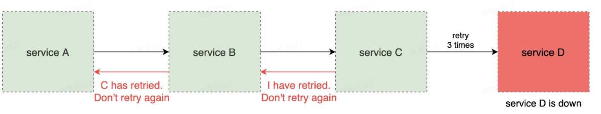

# 微服务架构原理与服务治理学习笔记
[PPT](https://bytedance.larkoffice.com/file/boxcncJ3GtCLGEp1MI8U583PhGd)
[A Design Analysis of Cloud-based Microservices Architecture at Netflix](https://medium.com/swlh/a-design-analysis-of-cloud-based-microservices-architecture-at-netflix-98836b2da45f)
[字节跳动微服务架构演进](https://www.infoq.cn/article/asgjevrm8islszo7ixzh)
[微服务架构的一知半解](https://juejin.cn/post/6960282794081812511)

#### 微服务架构介绍
为什么系统架构需要演进？
+ 互联网的爆炸性发展
+ 硬件设施的快速发展
+ 需求复杂性的多样化
+ 开发人员的急剧增加
+ 计算机理论及技术的发展

单体架构 -> 垂直应用架构 -> 分布式架构 -> SOA架构 -> 微服务架构

`单体架构`
把所有逻辑放在一个项目内
all in one process

优势
+ 性能最高
+ 冗余小

劣势
+ debug困难
+ 模块互相影响
+ 模块分工、开发流程

`垂直应用架构`
按照业务线垂直划分

优势
+ 业务独立开发维护

劣势
+ 不同业务存在冗余
+ 每个业务还是单体

`分布式架构`
抽出业务无关的公共模块

优势
+ 业务无关的独立服务

劣势
+ 服务模块bug可导致全站瘫痪
+ 调用关系复杂
+ 不同服务冗余

`SOA架构`
Service Oriented Architecture
面向服务

优势
+ 服务注册

劣势
+ 整个系统设计是中心化的
+ 需要从上至下设计
+ 重构困难

`微服务架构`
彻底的服务化

优势
+ 开发效率
+ 业务独立设计
+ 自下而上
+ 故障隔离

劣势
+ 治理、运维难度
+ 观测挑战
+ 安全性
+ 分布式系统

微服务架构概览


微服务架构核心要素
+ 服务治理
  + 服务注册
  + 服务发现
  + 负载均衡
  + 扩缩容
  + 流量治理
  + 稳定性治理
  + ...
+ 可观测性
  + 日志采集
  + 日志分析
  + 监控打点
  + 监控大盘
  + 异常报警
  + 链路追踪
  + ...
+ 安全
  + 身份验证
  + 认证授权
  + 访问令牌
  + 审计
  + 传输加密
  + 黑产攻击
  + ...

#### 微服务架构原理及特征
基本概念

+ 服务(service)：一组具有相同逻辑的运行实体
+ 实例(instance)：一个服务中，每个运行实体即为一个实例
+ 实例与进程的关系：实例与进程之间没有必然对应关系，可以一个实例对应一个或多个进程(反之不常见)
+ 集群(cluster)：通常指服务内部的逻辑划分，包含多个实例
+ 常见的实例承载形式：进程、VM、k8s pod...
+ 有状态/无状态服务：服务的实例是否存储了可持久化的数据(例如磁盘数据)

如果把HDFS看作一组微服务
NameNode和DataNode是两种服务，NameNode是单实例服务


服务间通信

+ 对于单体服务，不同模块通信只是简单的函数调用
+ 对于微服务，服务间通信意味着网络传输

在代码层面，如何指定调用一个目标服务的地址(ip:port)？
这种代码具有问题，不可能直接指定一个固定的ip地址，因为ip地址是动态分配的
```go
client := grpc.NewClient("10.23.45.67:8080")
```
服务的地址是会变的


还可以考虑使用域名来调用一个目标服务的地址

存在的问题
+ 本地DNS存在缓存，导致延时
+ 负载均衡问题
+ 不支持服务实例的探活检查
+ 域名无法配置端口

服务注册即发现
解决思路：新增一个统一的服务注册中心，用于存储服务名到服务实例的映射


服务实例上线及下线过程
管理员想下线服务B的第三个服务实例

首先去服务注册中心把第三个服务实例的注册删掉

过个几秒以后，第三个实例的流量就被分配到其他实例

重新添加一个服务实例缓解流量压力

先添加服务实例，然后进行健康检查

健康检查之后，在服务注册中心添加第三个服务实例


流量特征

+ 统一网关入口
+ 内网通信多数采用RPC
+ 网状调用链路

#### 核心服务治理功能
服务发布(deployment)，即指让一个服务升级运行新的代码的过程

服务发布的难点
+ 服务不可用

+ 服务抖动

+ 服务回滚


蓝绿部署


+ 简单，稳定
+ 但需要两倍资源

灰度发布(金丝雀发布)
为了节省发布时机器资源，这种发布需要更强的机器性能支撑，因为要不断地去切换流量


流量治理
在微服务架构下，我们可以基于地区、集群、实例、请求等维度，对端到端流量的路由路径进行精确控制


负载均衡
负载均衡(Load Balance)负责分配请求在每个下游实例上的分布

常见LB策略
+ Round Robin
+ Random
+ Ring Hash
+ Least Request
+ ...

稳定性治理
线上服务总会出问题，这与程序的正确性无关
+ 网络攻击
+ 流量突增
+ 机房断电
+ 光纤被挖
+ 机器故障
+ 网络故障
+ 机房空调故障
+ ...

微服务架构中典型的稳定治理功能
+ 限流

+ 熔断

+ 过载保护

+ 降级：保证重要的服务可以使用，没那么重要的就拒绝


#### 服务治理实践
本地函数调用
```go
func LocalFunc(x int) int {
    res := calculate(x * 2)
    return res
}
```
可能发生的异常
+ 参数非法
+ OOM(Out Of Memory)
+ NPE(Null Pointer Exception)
+ 边界case
+ 系统崩溃
+ 死循环
+ 程序异常退出

远程函数调用
```go
func RemoteFunc(ctx context.Context, x int) (int, error) {
    ctx2, defer_func := context.WithTimeout(ctx, time.Second)
    defer defer_func()

    res, err := grpc_client.Calculate(ctx2, x * 2)
    return res, err
}
```
可能发生的异常
+ 网络抖动
+ 下游负载高导致超时
+ 下游机器宕机
+ 本地机器负载高，调度超时
+ 下游熔断、限流
+ ...

重试可以避免偶发的错误，提高SLA(Service-Level Agreement)
```go
func RemoteFunc(ctx context.Context, x int) (int, error) {
    ctx2, defer_func := context.WithTimeout(ctx, time.Second)
    defer defer_func()

    res, err := grpc_client.Calculate(ctx2, x * 2)
    return res, err
}

func RemoteFuncRetry(ctx context.Context, x int) (res int, err error) {
    for i := 0; i < 3; i++ {
        if res, err := RemoteFunc(ctx, x); err == nil {
            return
        }
    }
    return
}
```
重试的意义
+ 降低错误率
  + 假设单次请求的错误概率为1%，那么连续两次错误概率则为0.01%
+ 降低长尾延时
  + 对于偶尔耗时较长的请求，重试请求有机会提前返回
+ 容忍暂时性错误
  + 某些时候系统会有暂时性错误(例如网络抖动)，重试可以尽量规避
+ 避开下游故障实例
  + 一个服务中可能会有少量实例故障(例如机器故障)，重试其他实例可以成功

重试的难点
+ 幂等性：多次请求可能会造成数据不一致
+ 重试风暴：随着调用深度增加，重试次数会指数级上涨
+ 超时设置：假设一个调用正常是1s的超时时间，如果允许一次重试，那么第一次请求经过多少时间时才开始重试？

重试风暴


`重试策略`
限制重试比例
设置一个重试比例阈值(例如1%)，重试次数占所有请求比例不超过该阈值


防止链路重试
链路层面的防重试风暴的核心是限制每层都发生重试，理想情况下只有最下一层发生重试
可以返回特殊的status表明请求失败，但别重试


Hedged requests
对于可能超时(或延时高)的请求，重新向另一个下游实例发送一个相同的请求，并等待先到达的响应


`效果验证`
实际验证经过上述重试策略后，在链路上发生的重试放大效应

