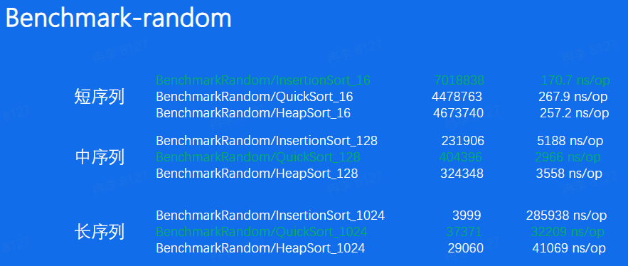
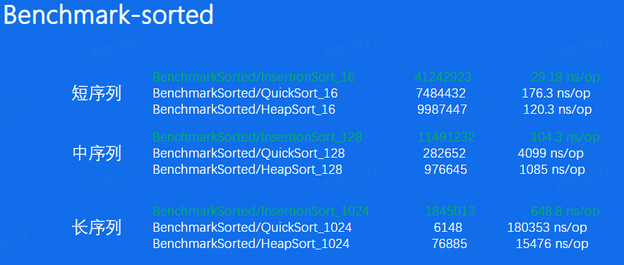
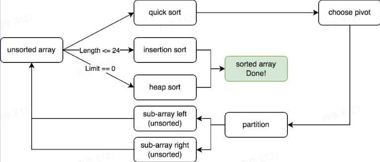
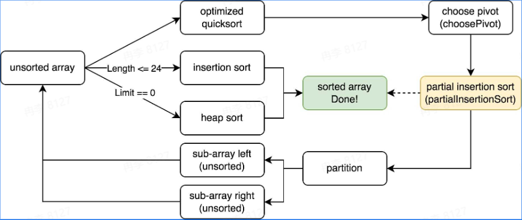
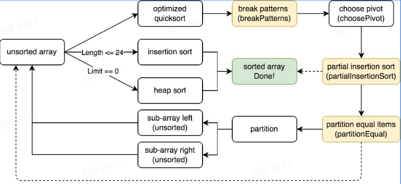

# Go排序算法学习笔记
[PPT](https://bytedance.larkoffice.com/file/boxcnp3phccElgOhup1xV8V315c)

问题引入：某个时间段内，直播间礼物数TOP10房间获得奖励，需要在每个房间展示排行榜
解决方案
+ 礼物数量存储在Redis-zset中，使用skiplist使得元素整体有序
+ 使用Redis集群，避免单机压力过大，使用主从算法、分片算法
+ 保证集群原信息的稳定，使用一致性算法
+ 后端使用缓存算法(LRU)降低Redis压力，展示房间排行榜

**经典排序算法**
Insertion Sort插入排序
将元素不断插入已经排序好的array中
+ 起始只有一个元素，即整体有序
+ 后续元素插入有序序列中，即不断交换，直到找到第一个比其小的元素

Quick Sort快速排序
分治思想，不断分割序列直到序列整体有序
+ 选定一个pivot(轴点)
+ 使用pivot分割序列，分成元素比pivot大和元素比pivot小的两个序列

Heap Sort堆排序
利用堆的性质形成的排序算法
+ 构造一个大根堆
+ 将根节点(最大元素)交换到最后一个位置，调整整个堆，如此反复

||Best|Avg|Worst|
|-|-|-|-|
|插入排序|$O(n)$|$O(n^{2})$|$O(n^{2})$|
|快速排序|$O(nlogn)$|$O(nlogn)$|$O(n^{2})$|
|堆排序|$O(nlogn)$|$O(nlogn)$|$O(nlogn)$|

根据序列元素排列情况划分，利用benchmark检测不同划分下各排序算法的速度
+ 完全随机的情况(random)
+ 有序/逆序的情况(sorted/reverse)
+ 元素重复度较高的情况(mod 8)

在此基础上，还要根据序列长度划分(16/128/1024)

+ 插入排序在短序列中速度最快
+ 快速排序在其他情况中速度最快
+ 堆排序速度与最快算法差距不大

+ 插入排序在序列已经有序的情况下最快

结论
+ 所有短序列和元素有序情况下，插入排序性能最好
+ 在大部分情况下，快速排序有较好的综合性能
+ 几乎在任何情况下，堆排序的表现都比较稳定

**pdqsort**

pdqsort(pattern-defeating-quicksort)：是一种不稳定的混合排序算法，它的不同版本被应用在C++ BOOST、Rust以及Go1.19中，它对常见的序列类型做了特殊优化，使得在不同条件下都拥有不错的性能

`pdqsort version1`
结合三种排序算法的优点
+ 对于短序列(小于一定长度)我们使用插入排序
+ 其他情况，使用快速排序来保证整体性能
+ 当快速排序表现不佳时，使用堆排序来保证最坏情况下时间复杂度仍然为$O(nlogn)$

短序列的具体长度是多少？
+ 12~32，在不同语言和场景中会有不同，在泛型版本根据测试选定24

如何得知快速排序表现不佳，以及何时切换到堆排序？
+ 当最终pivot的位置离序列两端很接近时(距离小于$\frac{length}{8}$)判定其表现不佳，当这种情况的次数达到limit(即bits.Len(length))时，切换到堆排序

+ 对于短序列($\leq 24$)我们使用插入排序
+ 其他情况使用快速排序(选择首个元素作为pivot)来保证整体性能
+ 当快速排序表现不佳时(limit==0)，使用堆排序来保证最坏情况下时间复杂度为$O(nlogn)$

进一步优化思路
+ 尽量使得快速排序的pivot为序列的中位数->改进choose pivot
+ Partition速度更快->改进Partition，但是此优化在Go的表现不好

`pdqsort version2`
思考关于pivot的选择
+ 使用首个元素作为pivot(最简单方案)
  + 实现简单，但是往往效果不好，例如在sorted情况下性能很差
+ 遍历数组，寻找真正的中位数
  + 遍历比对代价高，性能不好

通过`寻找近似中位数`来平衡寻找pivot所需要的开销和pivot带来的性能优化

根据序列长度的不同来决定选择策略
+ 短序列($\leq 8$)选择固定元素
+ 中序列($\leq 50$)采样三个元素，median of three
+ 长序列($\gt 50$)采样九个元素，median of medians

pivot的采样方式使得我们有探知序列当前状态的能力
采样的元素都是逆序排列->序列**可能**已经逆序->翻转整个序列
采样的元素都是顺序排列->序列**可能**已经有序->使用插入排序
插入排序实际使用partialInsertionSort，即有限制次数的插入排序

version1到version2优化总结
+ 升级pivot选择策略(近似中位数)
+ 发现序列可能逆序，则反转序列->应对reverse场景
+ 发现序列可能有序，使用有限插入排序->应对sorted场景

未优化场景
+ 短序列情况
  + 使用插入排序(v1)
+ 极端情况
  + 使用堆排序保证算法的可行性(v1)
+ 完全随机的情况
  + 更好的pivot选择策略(v2)
+ 有序/逆序的情况
  + 根据序列状态翻转或者插入排序(v2)
+ 元素重复度较高的情况(mod 8)->?

`pdqsort final version`
如何优化重复元素很多的情况？
+ 如果两次partition生成的pivot相同，即partition进行了无效分割，此时认为pivot的值为重复元素

优化-重复元素较多的情况(partitionEqual)
+ 当检测到此时的pivot和上次相同时(发生在leftSubArray)，使用partitionEqual将重复元素排列在一起，减少重复元素对于pivot选择的干扰

优化-当pivot选择策略表现不佳时，随机交换元素
+ 避免一些极端情况使得快速排序总是表现不佳，以及一些黑客攻击情况

||Best|Avg|Worst|
|-|-|-|-|
|插入排序|$O(n)$|$O(n^{2})$|$O(n^{2})$|
|快速排序|$O(nlogn)$|$O(nlogn)$|$O(n^{2})$|
|堆排序|$O(nlogn)$|$O(nlogn)$|$O(nlogn)$|
|pdqsort|$O(n)$|$O(nlogn)$|$O(nlogn)$|

高性能的排序算法如何设计？
+ 根据不同情况选择不同策略，取长补短

生产环境中使用的排序算法和课本上的排序算法有什么区别？
+ 理论算法注重理论性能，例如时间、空间复杂度等。生产环境中的算法需要面对不同的实践场景，更加注重实践性能

Go语言($\leq 1.18$)的排序算法是快速排序吗？
+ 实际一直是混合排序算法，主体是快速排序，Go$\leq 1.18$时的算法也是基于快速排序，和pdqsort的区别在于fallback时机、pivot选择策略、是否有针对不同partition优化等

[Proposal](https://github.com/golang/go/issues/50154)
[Paper](https://arxiv.org/pdf/2106.05123)
[Code](https://github.com/golang/go/blob/master/src/sort/zsortinterface.go)
[公众号文章](https://mp.weixin.qq.com/s/5HqfRGqPyAhFt0krPgMHOQ?poc_token=HAFXj2ej1Ej_Ypi9jq9sJWlQYoP-VBWkEAGVz9Ia)
