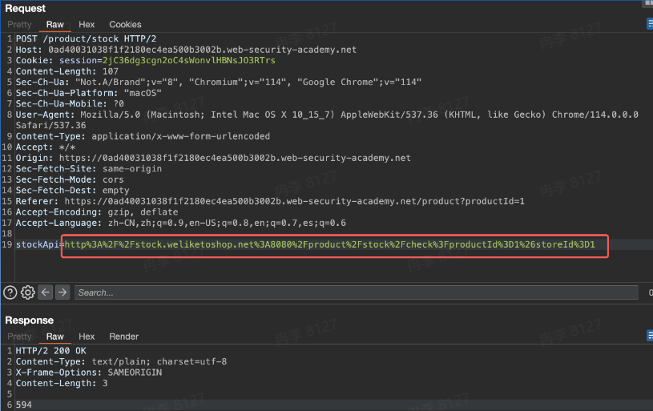
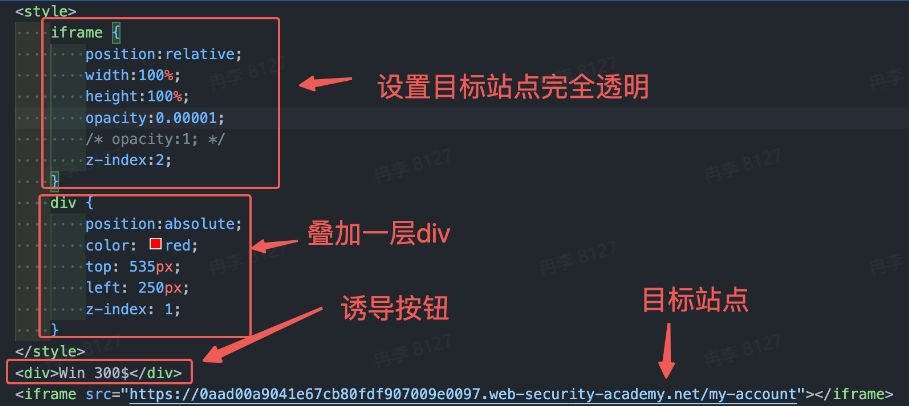

# 网站常见安全漏洞学习笔记
[PPT](https://bytedance.larkoffice.com/file/LU06bKDAkoRekaxxUm4cPqRGnOe)

一个网站的基本构成


前端：JavaScript/vue/react
网关：nginx
后端：Go/Java/Node
前后端交互：HTTP/WebSocket

网站漏洞
+ 服务端漏洞
  + SQL
  + RCE/命令注入
  + SSRF
  + 文件上传
  + ...
+ 客户端漏洞
  + XSS
  + CSRF
  + 点击劫持
  + ...

**服务端漏洞**
`第三方组件漏洞`
防护方式：针对java可以选择使用dependency-check-maven检查项目依赖的组件是否存在安全漏洞

`SQL注入`
SQL语句静态模板和动态数据部分没有严格区分，如果在数据项中加入了某些SQL语句关键字(如SELECT、DROP等)，这些SQL语句就很可能在数据库写入或者读取数据时得到执行

+ [Java]错误使用语言框架，或者语言框架本身存在安全问题，使用Mybatis-plus的危险函数，如inSql，支持直接sql拼接，存在sql注入风险
+ [Java]Mybatis使用\$构建SQL模板


+ Golang常见错误写法
  + 业务场景经常遇到根据用户定义的字段进行排序的功能，如果直接将用户输入字段作为维度带到Order则会产生sql注入，假设GORM语句为：db.Order(param).Find(&products)
  + 正常情况下用户输入维度字段即可实现自定义排序
  ```
  param:code
  SQL语句:SELECT * FROM 'products' WHERE 'products'.'deleted_at' IS NULL ORDER BY code 
  ```
  + 攻击者可以输入SQL语句，改变原始SQL语义
  ```
  param:if(1, sleep(10), 'code')
  SQL语句:SELECT * FROM 'products' WHERE 'products'.'deleted_at' IS NULL ORDER BY if(1, sleep(10), 'code')
  ```

防护方式
+ 尽量不要基于DB的Raw方法拼接构造SQL语句，而应该使用预编译、ORM框架
+ 使用ORM框架时，应该注意框架中的特性，可能存在不安全的写法导致SQL注入问题
+ 在复杂场景下必须使用拼接SQL，需要对外部输入进行转义

`命令执行`
代码中遇到需要调用某个命令才能完成功能的时候，会涉及到命令拼接，如果命令拼接没有做好安全过滤，那么将会导致命令注入风险，服务器权限将会被控制


防护方式
+ 对动态的值尽可能设置白名单进行验证
+ 如果某些位置无法白名单，需要尝试对数据类型进行校验
+ 特殊字符黑名单的过滤，或者转义

`越权漏洞`
资源访问或操作时主体权限没有进行校验就会造成越权问题，细分为：未授权、水平越权和垂直越权


`水平越权`
黑灰产场景：订单查询功能提供订单id即可查询订单详情，这里攻击者可以遍历orderId获取其他用户的订单信息

防护方式：涉及资源id尽量不要使用短id(遍历难度较小)，同时最重要的一定要做好资源属主校验

`垂直越权`
普通用户访问：前端直接拦截，提示无权限
管理员用户访问：判定是管理员，可以直接访问
黑灰产场景：攻击者可以通过开通另外的测试管理员账户抓包获取接口，或者通过逆向前端代码方式获取实际接口，然后绕过前端直接尝试访问后端接口，获取数据详情

防护方式：如果是简单场景，可以将接口在路由级别进行分组，对不同的API分组引入Middleware进行权限拦截，Middleware获取当前用户角色以确定是否可以访问此接口

`SSRF`
SSRF又称为服务端请求伪造攻击，指攻击者利用后端服务器为跳板，让后端服务向非预期网络地址(主要指内网地址)发出恶意请求，获取敏感信息或执行恶意操作


服务端流程：服务端请求stockAPI，获取结果返回
攻击者：将stockAPI参数改为内网地址，访问内网资源


防护方式：对url的host进行白名单过滤，获取对host解析的ip进行判定，是否是内网地址

`文件上传漏洞`
找到公开的上传点(如视频创作/文章创作/客服反馈等)，上传恶意文件(恶意视频、图片)，获取图片url，然后直接分享url至外部恶意网站或QQ/微信群

防护方式
+ 限制文件类型：如果系统只需要图片类型，可以从服务端解析文件格式，限制只能传入特定的文件格式
+ 站库分离：应用部署的位置和上传的文件分离，一般可以使用TOS、OSS等进行文件存储
+ 防止图床：对图片访问链接进行限制，包括时间限制、访问身份限制等

**客户端漏洞**

`开放重定向`
开放重定向：某些需要重定向到其他站点的功能，往往在参数中携带需要重定向的URL，但实际程序逻辑没有控制好重定向的范围，导致攻击者可以构造恶意链接，诱导用户重定向到恶意站点
危害：钓鱼攻击
修复方案：对重定向严格进行白名单控制并正确校验匹配白名单


`XSS`
跨站脚本攻击(XSS)：本质是一种Script代码注入，攻击者往目标Web页面里插入恶意Script代码，当用户访问页面时(有客户端时需要交互)，嵌入其中的Web里面的Script代码会被执行，从而达到恶意攻击用户的目的
场景：反射型，存储型，Dom型
危害：通常的危害包括窃取用户敏感信息，以用户身份执行敏感操作

前端代码使用Vue，会从请求path中读取username，同时使用v-html指令将username渲染到Dom中

攻击过程
+ 构造恶意链接，将username设置为恶意payload
+ 攻击者通过网站反馈入口，向管理员/运营人员发送恶意链接
+ 攻击者的服务器成功收到管理员/运营人员的session cookie
+ 浏览器替换cookie为管理员的，获取管理员权限

防护方法
+ 输入过滤：对输入的特殊字符进行拦截，禁止前端提交特殊字符
+ 输出过滤：
  + 当字符输出到Dom时，对危险字符进行html encode，避免XSS
  + 使用vue/react等框架时，避免使用危险指令，而应该使用安全指令，v-html/v-text
+ 富文本场景：比如文章发布场景，本身是需要提供富文本功能，这时候需要严格限制tag和attribute，可以在代码层面做白名单或者黑名单
```
<tag attribute1='value1' attribute2='value2'>
```
+ CSP：用于缓解XSS，理念是对当前站点允许加载什么源的资源、发送什么请求能进行限制
```
Content-Security-Policy:default-src 'self'; img-src *; media-src example.org example.net; script-src userscripts.example.com
```

`CSRF`
跨站请求伪造(CSRF)：允许攻击者诱导用户访问恶意链接，执行用户非预期执行的操作
危害：用户执行敏感操作，如关注其他用户，或者更改账号的安全邮箱等

漏洞利用步骤
+ 将更改Email的请求生成CSRF表单，并构造钓鱼链接
+ 发送链接给其他用户
+ 用户点击链接后成功执行email更改操作

防护方式
+ CSRF tokens：首次访问时给客户端传递一个token，客户端每次访问时必须带上此token才能访问
+ SameSite cookies：Strick->Lax(Default)->None.核心是禁止某些场景发送第三方cookie
+ Referer-based validation：校验Referer来源是否是合法站点

思考大厂微服务场景，CSRF防护应该怎么做

`点击劫持`
点击劫持(clickjacking)是一种在网页中将恶意代码等隐藏在看似无害或者存在诱导的内容(如按钮)之下，并诱使用户点击的手段，用户点击后往往会执行一些非预期操作
漏洞场景：考虑如下删除账号功能，如果目标站点CSRF防护做得很到位，无法直接构造CSRF钓鱼页面，这时候可以考虑在钓鱼页面iframe原始页面，并且覆盖一层诱导性文字
原始页面

钓鱼页面


漏洞利用步骤
+ 参考如下代码构造钓鱼页面链接

+ 发送链接给其他用户
+ 用户访问链接，点击**Win 300\$**时，实际是点击**Delete Account**

防护方式
防护的核心是不让非预期的网站iframe我的站点
+ X-Frame-Options：DENY/SAMEORIGIN
+ CSP：frame-ancestors指令，用于设置允许frame的source列表
```
Content-Security-Policy:frame-ancestors <space separated list of sources>;
Content-Security-Policy:frame-ancestors 'self' https://example.org https://example.com https://store.example.com
```

`CORS跨域配置错误`
CORS：全称是跨域资源共享(Cross-origin resource sharing)，用以解决页面应用跨域访问的需求
CORS错误配置：CORS本身不存在漏洞，而是由于开发者在配置CORS过程中，错误配置跨域访问Allow List，导致非预期的站点可以进行跨域访问，最终可能导致信息泄露

常见几种错误配置，以需要跨域访问example.com所有子域名为例
+ 前缀/后缀/包含/正则匹配：可用example.com.attack.com、attackexample.com、attackaexample.com域名绕过
+ 反射：在Access-Control-Origin中反射请求的Origin值，理论上可以用任意域名绕过
+ 信任null：攻击者可以从任意域下通过iframe sandbox构造Origin为null的跨域请求
+ https信任http：http传输存在被劫持篡改的可能，攻击者可能通过劫持通信流量注入恶意脚本方式窃取敏感信息

利用思路
+ 构造钓鱼页面URL

+ 在钓鱼页面后台监控访问日志，发起受害者成功点击了钓鱼页面，并且将accountDetail信息回传


防护方式：核心是正确设置跨域名单
+ 代码层：Middleware统一处理
+ 网关层：Nginx反代统一拦截处理

`WebSocket`
区别于http，只是不同的交互协议，本质上http服务端的漏洞，在WebSocket上也可能存在
WSS和WS：WSS(WebSockets over SSL/TLS)，提供加密信道，杜绝一些中间人攻击
数据校验：SQL/XSS/RCE等漏洞仍可能存在
CSWSH：Cross-Site WebSocket Hijacking，即在使用cookie作为认证方式的时候，如果WebSocket服务端没有校验好请求来源(origin)，将导致WebSocket会话劫持

黑产设置钓鱼页面，用户一旦访问后，用户WebSocket会话可能会被监听


CSWSH防护手段
+ Cookie鉴权：限制请求的origin
+ ticket/token鉴权：http服务提供接口，用于获取临时的身份凭证，并传递到WebSocket的初始化流程中

**注意事项**
+ **网站运营者**：网站运营者应当采取技术措施和其他必要措施，确保其收集的个人信息安全，防止信息泄露、损毁、丢失。在发生或者可能发生个人信息泄露、损毁、丢失的情况时，应当立即采取补救措施，按照规定及时告知用户并向有关主管部门报告
+ **组织/个人**：任何个人和组织不得窃取或者以其他非法方式获取个人信息，不得非法出售或者非法向他人提供个人信息
