# 零拷贝及应用学习笔记
[PPT](https://bytedance.larkoffice.com/file/AgBobXohLofiVjx8HGdcoEaVnVb)

**传统文件传输过程**

`数据分享过程`
用户视角
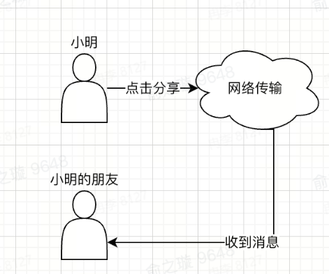
操作系统视角
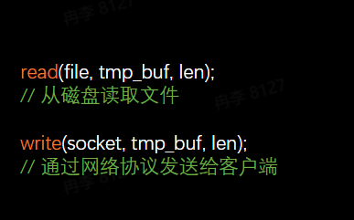

`Linux传统文件传输过程`
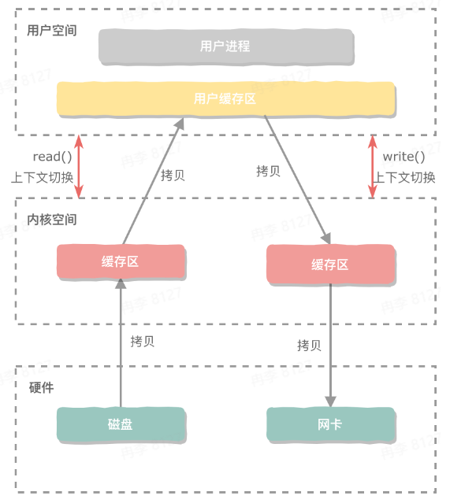
+ 发生了4次用户态与内核态的上下文切换
+ 发生了4次数据拷贝

第一次拷贝是为了把磁盘上的数据拷贝到OS的内核缓存区，第二次拷贝把内核缓存区的数据拷贝到用户缓存区中，此时应用程序就可以访问和操作这些数据。操作完毕后，用户缓存区的数据就可以再次拷贝到内核的socket缓存区中，最后把内核socket缓存区中的数据拷贝到网卡中，经过这四步拷贝，才算是完成了从磁盘读取文件并发送到网卡的一个操作
`上下文切换`
+ 用户态 vs 内核态，read和write都属于系统调用，需要先从用户态切换到内核态，调用完毕后再从内核态切换到用户态
+ 用户空间和内核空间权限不同

为什么需要区分用户空间和内核空间？
+ 隔离操作系统程序和应用程序

在CPU上下文切换的过程中，首先会保存CPU寄存器里原来的用户态的指令位，为了执行内核态代码，CPU寄存器需要更新为内核态指令的新位置，然后跳转到内核态运行内核任务，最后当系统调用结束后，CPU寄存器需要恢复原来保存的用户态，然后切换回用户空间，继续之前运行的进程

`CPU拷贝`
内核空间为什么不能直接使用用户空间的数据呢？
+ 内核不能信任任何用户空间的指针，需要把用户空间的数据先拷贝到内核空间，然后内核进行数据检查，检查完毕后再使用数据
+ 稳定性 vs 效率

拷贝方式：I/O轮询
I/O通常是指数据在存储器或者其他周边设备之间的输入和输出，如通过磁盘读取数据就是一次I/O操作
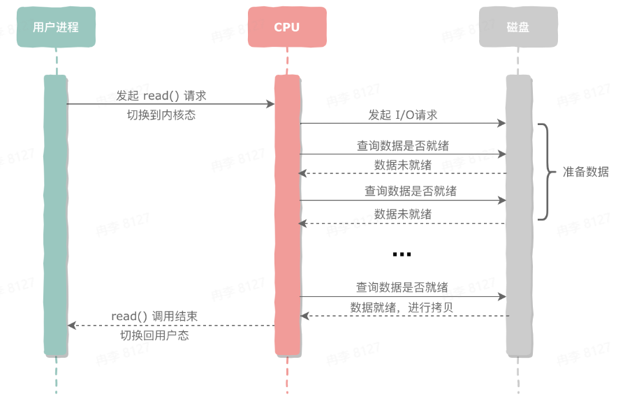
优点
+ 实现简单

缺点
+ 占用CPU全部资源，效率低，CPU大部分时间都在询问数据是否就绪上

拷贝方式：I/O中断
中断是为了解决外设在完成工作后，通知CPU的一种机制，如磁盘完成数据准备后通知CPU发起I/O中断信号
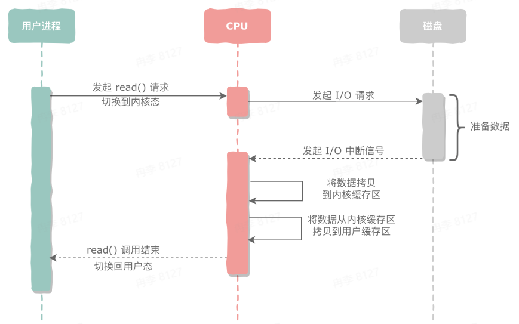
优点
+ 对比I/O轮询的方式，一定程度上释放了CPU资源

缺点
+ 在大数据量传输的情况下，CPU会反复中断

拷贝方式：DMA传输
在计算机科学领域的任何问题都可以通过增加一个间接的中间层来解决
DMA：Direct Memory Access直接内存访问
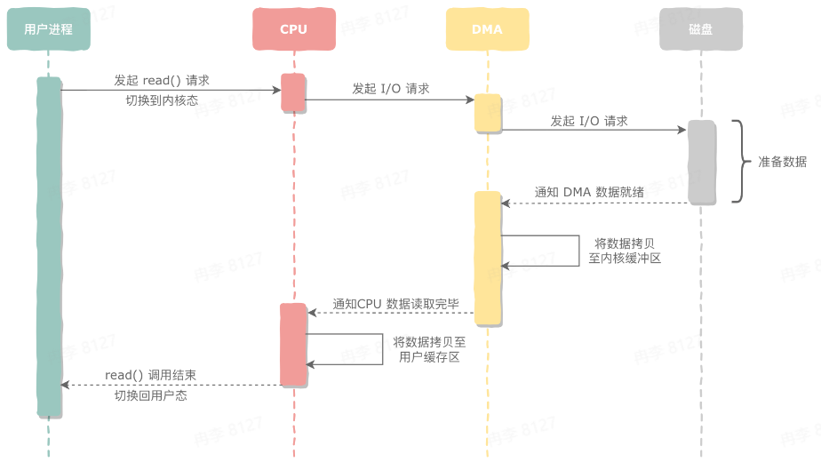
优点
+ 彻底减少了一次CPU拷贝

缺点
+ 依赖设备硬件支持

**零拷贝实现方式**
定义
零拷贝**并不是**0次拷贝数据，而是
+ 减少用户空间和内核空间之间的CPU拷贝次数
+ 减少上下文切换次数

方案1：mmap + write
mmap：memory map，本质上是一种进程虚拟内存映射的方法，可以将一个文件或者一段物理内存或者其他对象，映射到进程的虚拟内存地址空间，因此进程就可以使用指针的方式来读取这一段内存
该拷贝并不会把数据拷贝到真实的用户缓存区内，不占用物理内存，适合大文件传输，而小文件会造成很多碎片，造成空间浪费
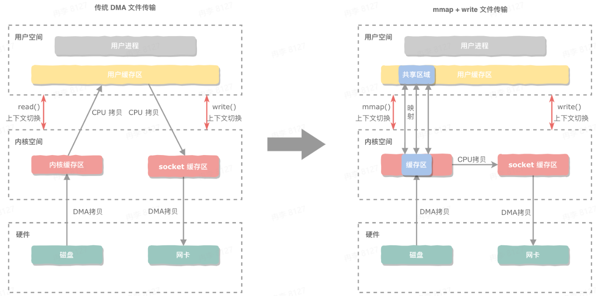

方案2：sendfile
如果只希望将文件原封不动转发到服务器，就不需要把内核空间的数据拷贝到用户空间
通过调用sendfile接口，直接把数据从内核缓存区拷贝到socket缓存区
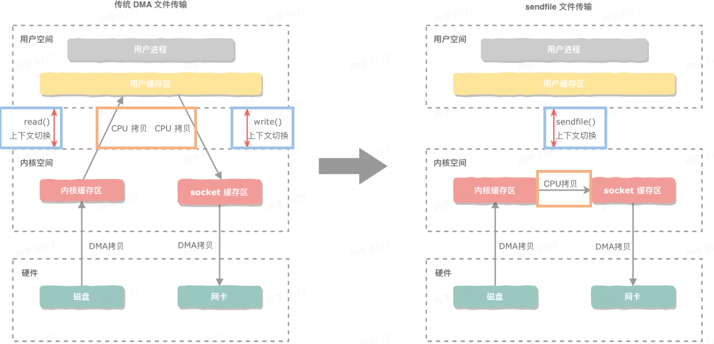

方案2的升级：sendfile + gather DMA
Linux2.4以后，只需要把数据的位置和长度等信息描述符传递到socket缓存区中去，再由DMA引擎可以直接从内核缓存区把文件拷贝到网卡中
整个文件传输过程中都不需要CPU来搬运数据
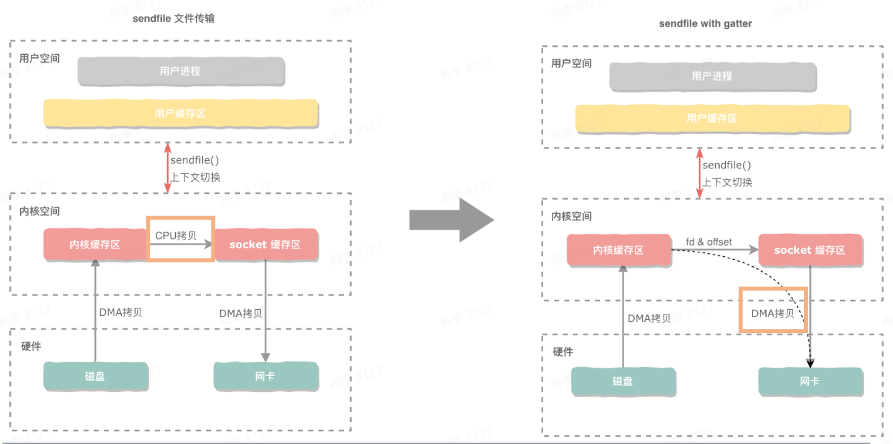

方案3：splice
在硬件设备不支持sendfile + gather DMA的情况下，Linux在2.6.17推出一个新的系统调用splice，它可以通过管道直接把数据在内核空间中传输
将写端绑定到内存缓存区，把读端绑定到socket缓存区
和sendfile不同的是，splice允许任何两个文件之间互相连接，不仅仅是文件描述符之间进行传输
在Linux2.6.23版本以后sendfile机制已经没有了，但API和相应功能还在，是通过splice来实现的
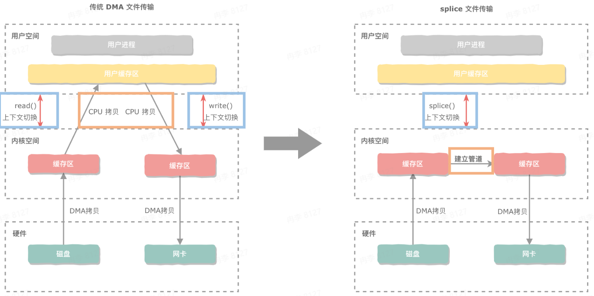

splice和sendfile缺点是用户是无法拿到这个数据的，既不支持访问也不支持修改
要根据不同的应用场景选择文件传输策略

|拷贝方式|上下文切换(次)|CPU拷贝(次)|DMA拷贝(次)|用户进程是否可以修改数据|
|-|-|-|-|-|
|read + write|4|4|0|是|
|read + write + DMA|4|2|2|是|
|mmap + write|4|1|2|是|
|sendfile|2|1|2|否|
|sendfile + gather DMA|2|0|2|否|
|splice|2|0|2|否|

`Go语言中的使用`
mmap + write使用
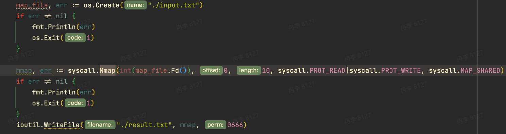
首先调用mmap的系统调用，传入一个input文件的文件描述符，并且告知内存要映射的这部分磁盘文件的长度大小，还需要告诉内核这部分映射到内存的文件是可读的或者可写的对应的一个标识，最后一个参数是这部分内容告诉内核该内容是共享的
通过mmap的返回拿到这部分的内存地址，拿到地址以后通过writefile办法写入到新的文件中去

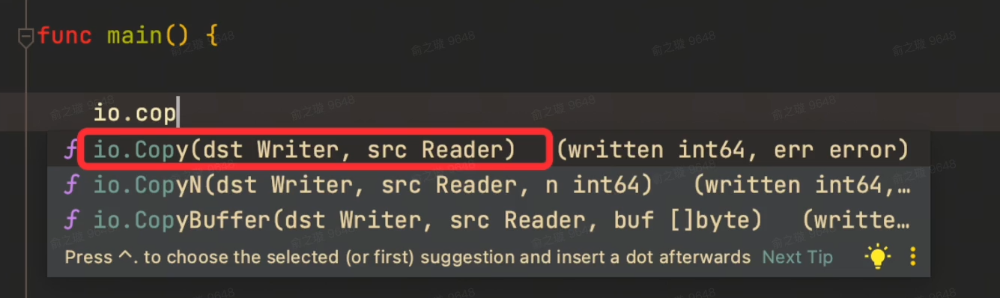
io.Copy支持在reader和writer之间实现一个文件的拷贝传输

io.Copy内部实现
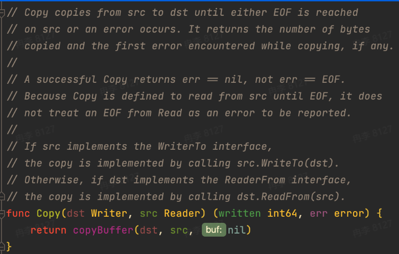
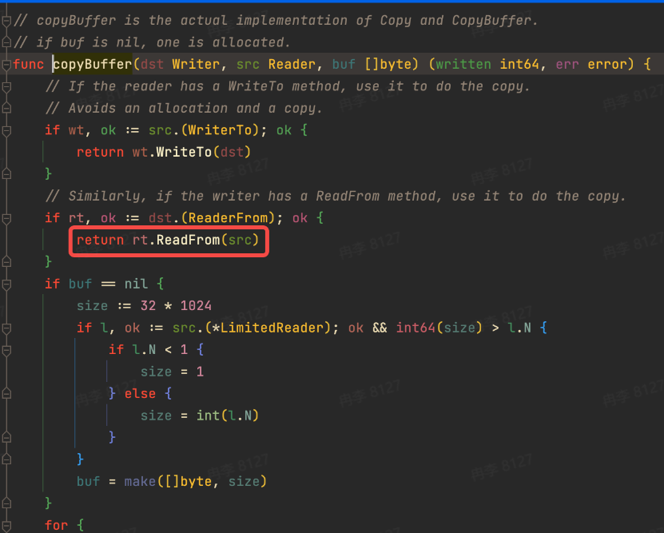

io.Copy调用了copyBuffer的方法，copyBuffer中主要看ReaderFrom
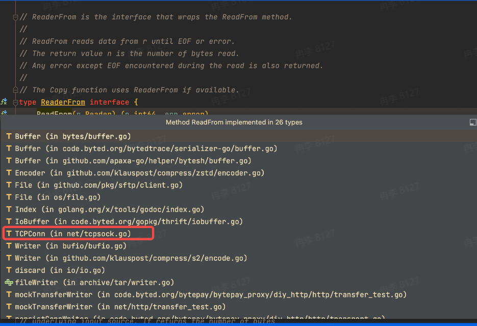

在TCP connection包中的ReadFrom方法又调用了一个ReadFrom方法，该ReadFrom方法才是真正的一个关乎系统级的一个调用
优先调用splice方法进行文件read操作，如果系统版本不支持，就调用sendFile方法，如果都不支持才会降级到最原始的genericReadFrom接口
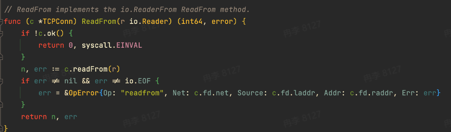
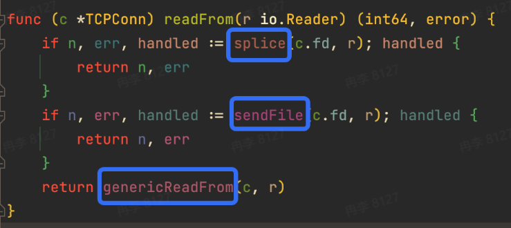

`零拷贝的应用`
**Kafka发送消息的过程**

producer生产到broker的过程就是把网络数据持久化到磁盘的过程，consumer从broker进行消费，就是将磁盘文件通过网络传递给consumer进行消费

磁盘性能
+ 磁盘读写性能 vs 内存读写性能

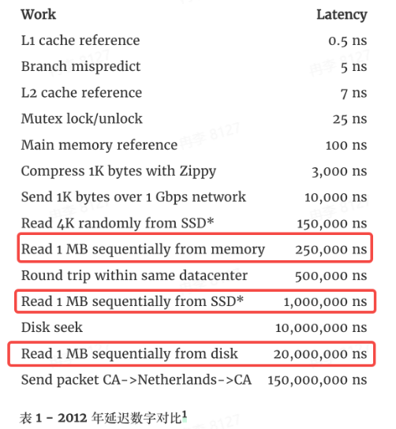
磁盘读写性能比内存读写性能差很多
影响磁盘读写性能的一个关键因素就是磁盘完成一次IO请求所花费的时间，完成一次IO请求由三部分组成，寻道时间、旋转延迟和数据传输三部分，这三部分都是物理操作，相较于内存操作耗时量大
连续读写性能高于随机读写性能，连续读写降低了寻道时间和旋转延迟
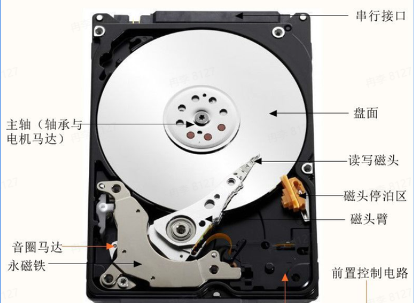

Kafka性能优点1：顺序读写
+ producer每次会追加写入到partition
+ consumer每次消费的时候，根据offset进行顺序读取
+ 批量刷盘，减少磁盘IO次数，将数据批量写入

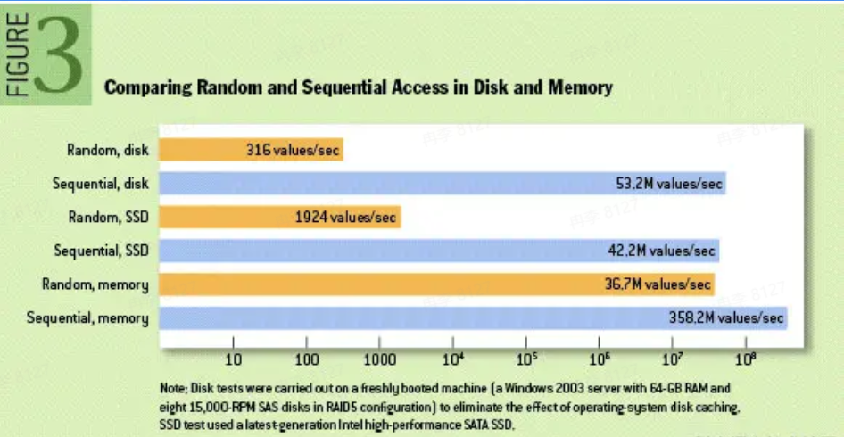

Kafka性能优点2：页缓存技术
+ 利用linux的page cache技术
+ 异步落盘，减少磁盘I/O次数
+ 通过Replication机制去解决数据丢失的问题

Kafka性能优点3：零拷贝之mmap
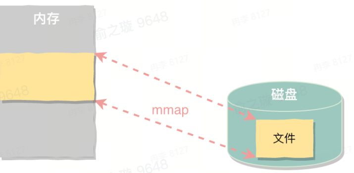
首先Kafka建立一个稀疏索引，稀疏索引是指在主键有序的基础上给一少部分原始数据建立索引，从而实现在查询时先确认大致范围，然后再根据算法进行精确查找
通过索引文件解决了高效读取问题，通过mmap来读写建立好的稀疏索引的文件以减少一次CPU拷贝

Kafka性能优点4：零拷贝之sendfile
+ consumer不需要对数据进行修改，可以采用零拷贝方式
+ 对比传统read() + write()：节省了2次CPU拷贝、2次上下文切换

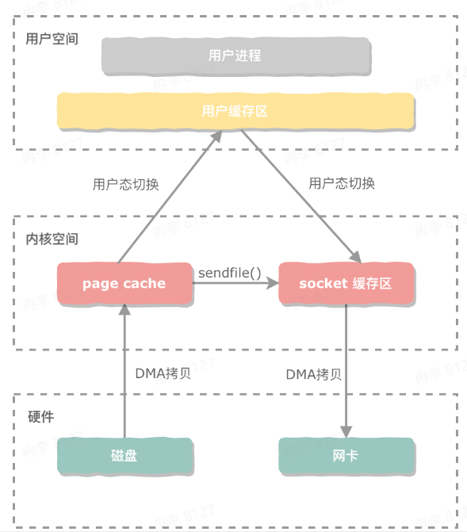

**RocketMQ发送消息的过程**

broker在现实中会对应一台服务器，每个broker可以存储多个topic信息，每个topic信息可以分片存储在不同的broker中，message queue是一个用于存储消息的物理地址，每个topic中的消息地址存储在多个message queue中
consumer group由多个consumer实例构成

RocketMQ优化：mmap
RocketMQ会把收到的消息通过顺序写入的方式记录到commit log中，然后再建立对应的consumer queue，可以将consumer queue理解为消息的索引，consumer会通过consumer queue去获取真实的消息
在RocketMQ中通过读取commit log和consumer queue都使用了mmap的技术
RocketMQ主要通过MappedByteBuffer对文件进行读写操作，它利用了NIO中的FileChannel模型，可以将磁盘上的物理文件直接映射到一个用户态的内存地址中
因为使用内存映射机制，RocketMQ的文件存储都使用定长结构来存储，方便可以一次性将整个文件映射到内存，但没有真正把数据加载到内存中
+ 通过mmap + write()实现，满足小数据需求
+ 通过文件预热的方式提前加载几页来解决缺页问题

Kafka比较适用一些日志类消息传输，尤其是海量数据的场景下，它能支持的单机吞吐量很高，但在可靠性以及一些功能支持上不如RocketMQ，RocketMQ更适合用于一些业务上的应用，要根据使用场景选择不同的消息中间件

Rocket vs Kafka
|消息中间件|RocketMQ|Kafka|
|-|-|-|
|单机吞吐量|10w|100w|
|零拷贝技术|mmap|mmap + sendfile|
|定时/延时消息|支持|不支持|
|消息顺序性|严格有序|不保证一定有序|

mmap：1[0]次CPU拷贝 + 4次上下文切换
sendfile：1[0]次CPU拷贝 + 2次上下文切换

`总结`
从传统方式到零拷贝
+ 传统文件传输过程：需要CPU全程参与数据搬运，效率低
+ 引入DMA技术：通过DMA控制器完成磁盘到内核缓存区的数据拷贝工作
+ 零拷贝定义：减少用户态和内核态之间的上下文切换次数 \& 减少CPU拷贝次数

零拷贝实现方式
+ mmap
+ sendfile
+ splice

Go语言实现
+ TCPConn.ReadFrom()

应用场景
+ Kafka
+ RocketMQ
