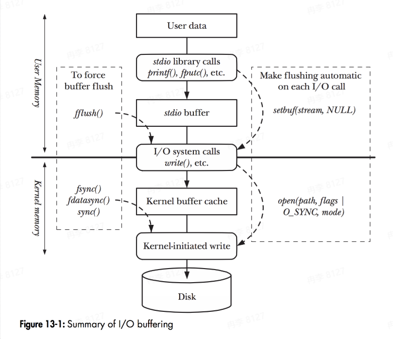
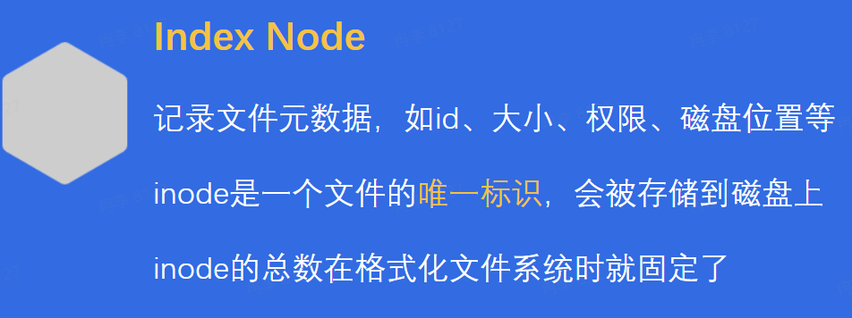
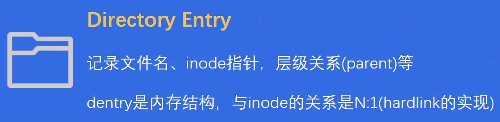
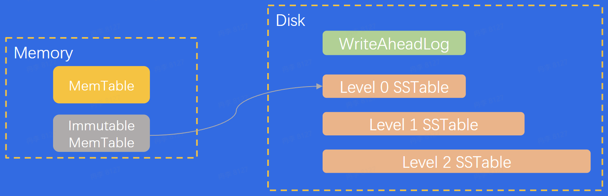
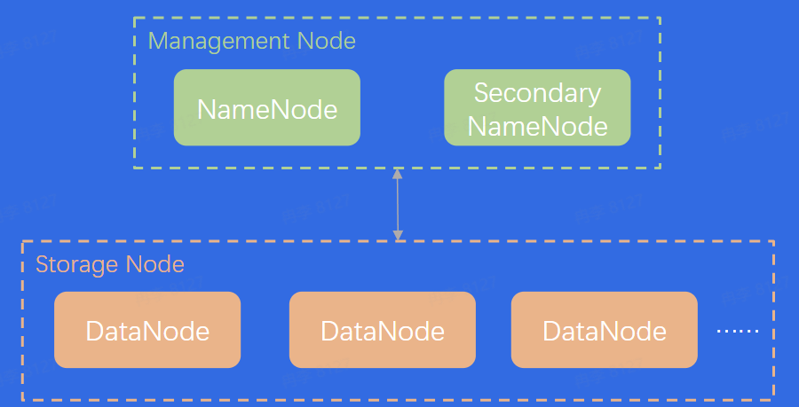
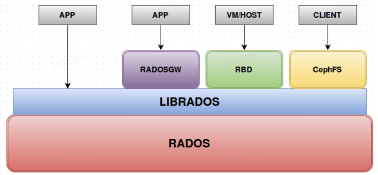
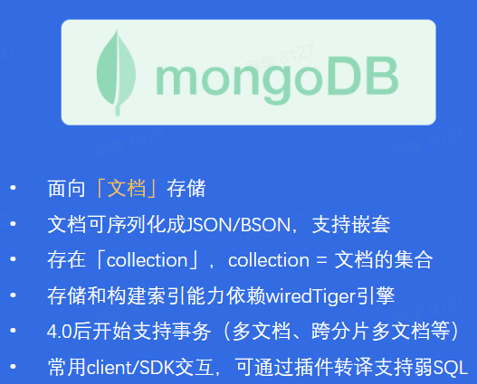
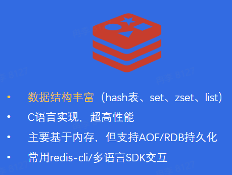
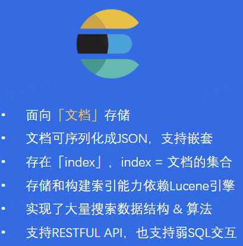
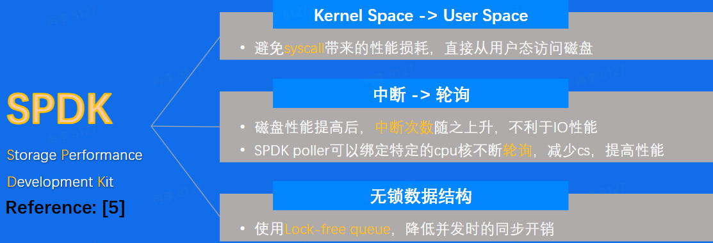

# 数据库学习笔记
[PPT](https://bytedance.larkoffice.com/file/boxcn7QgwoNh57Tjg6HmxKMhMHf)
[The Google File System](https://static.googleusercontent.com/media/research.google.com/zh-CN//archive/gfs-sosp2003.pdf)

### 存储系统 & 数据库

#### 存储系统
存储系统：一个提供了读写、控制类接口，能够安全有效地把数据持久化的软件

系统特点
+ 作为后端软件的底座，性能敏感
+ 存储系统软件架构，容易受硬件影响
+ 存储系统代码既"简单"又"复杂"

数据从应用到存储介质

+ `缓存`很重要，贯穿整个存储体系
+ `拷贝`很昂贵，应该尽量减少
+ 硬件设备五花八门，需要有抽象统一的接入层

单机存储系统怎么做到高性能/高性价比/高可靠性？
+ RAID技术(Redundant Array of Inexpensive Disks)

RAID背景
+ 单块大容量磁盘的价格 $\gt$ 多块小容量磁盘
+ 多块磁盘的并发写入性能 $\gt$ 单块磁盘的写入性能
+ 单块磁盘的容错能力有限，不够安全

+ RAID 0
  + 多块磁盘简单组合
  + 数据条带化存储，提高磁盘带宽
  + 没有额外的容错设计
+ RAID 1
  + 一块磁盘对应一块额外镜像盘
  + 真实空间利用率仅$50\%$
  + 容错能力强
+ RAID 0 + 1
  + 结合了RAID 0和RAID 1
  + 真实空间利用率仅$50\%$
  + 容错能力强，写入带宽好

#### 数据库
特点
+ 关系型数据库是存储系统，但是在存储之外，又发展出其他能力
  + 结构化数据友好
  + 支持事务(ACID)
  + 支持复杂查询语言
+ 非关系型数据库也是存储系统，但是一般不要求严格的结构化
  + 半结构化数据友好
  + 可能支持事务(ACID)
  + 可能支持复杂查询语言

数据库 vs 经典存储
+ 结构化数据管理
  + 数据库：写入关系型数据库，以表形式管理
  + 经典存储：写入文件，自行定义管理结构
+ 数据库支持事务
  + 事务具有
    + A(Atomicity):事务内的操作要么全做，要么不做
    + C(Consistency):事务执行前后，数据状态是一致的
    + I(Isolation):可以隔离多个并发事务，避免影响
    + D(Durability):事务一旦提交成功，数据保证持久化
+ 复杂查询能力
  + 数据库查询灵活简洁

### 主流产品

#### 单机存储
单机存储：单个计算机节点上的存储软件系统，一般不涉及网络交互
+ 本地文件系统
  + 文件系统的管理单元：文件
  + 文件系统接口：文件系统繁多，如Ext2/3/4，sysfs，rootfs等，但都遵循VFS的统一抽象接口
  + Linux文件系统的两大数据结构：Index Node & Directory Entry
  
  
+ key-value存储
  + 常见使用方式：put(k, v) & get(k)
  + 常见数据结构：LSM-Tree，某种程度上牺牲读性能，追求写入性能
  + 拳头产品：RocksDB
  

#### 分布式存储
分布式存储：在单机存储基础上实现了分布式协议，涉及大量网络交互

+ 分布式文件系统(HDFS, Hadoop Distributed File System)
  + 背景：专用的高级硬件很贵，同时数据存量很大，要求超高吞吐
  + 核心特点
    + 支持海量数据存储
    + 高容错性
    + 弱POSIX语义
    + 使用普通x86服务器，性价比高
  
+ 分布式对象存储(Ceph)
  + 开源分布式系统里的`万金油`
  + 核心特点
    + 一套系统支持对象接口、块接口、文件接口，但是一切皆对象
    + 数据写入采用主备复制模型
    + 数据分布模型采用CRUSH算法(HASH + 权重 + 随机抽签)
  

#### 单机数据库
单机数据库：单个计算机节点上的数据库系统，事务在单机内执行，也可能通过网络交互实现分布式事务

+ 关系型数据库：Oracle、MySQL、PostgreSQL
  + 通用组件
    + Query Engine：负责解析query，生成查询计划
    + Txn Manager：负责事务并发管理
    + Lock Manager：负责锁相关的策略
    + Storage Engine：负责组织内存/磁盘数据结构
    + Replication：负责主备同步
  + 关键内存数据结构：B Tree、B+ Tree、LRU List等
  + 关键磁盘数据结构：WriteAHeadLog(Redolog)、Page
+ 非关系型数据库：MongoDB、Redis、Elasticsearch
  
  
  

关系型数据库一般直接使用SQL交互，非关系型数据库交互方式各不相同
非关系型数据库的数据结构千奇百怪，没有关系约束后，schema相对灵活
不管是否关系型数据库，大家都在尝试支持SQL(子集)和"事务"

#### 分布式数据库
容量问题
+ 单点容量有限，受硬件限制
+ 存储节点池化，动态扩缩容

弹性问题
+ 动态扩缩容，为不同数据提供合适服务器

性价比问题
+ 使用共享存储池，解决disk不够大而CPU利用率低的问题

更多需要做的
+ 单写 vs 多写
+ 从磁盘弹性到内存弹性
+ 分布式事务优化

### 新技术演进

+ 架构变更：Bypass OS kernel
+ AI增强：智能存储格式转换
+ 新硬件革命：存储介质变更、计算单元变更、网络硬件变更

#### SPDK

#### AI & Storage
在存储领域，AI可以通过决策，将行存和列存两种存储数据的方式合并成更加方便有效的行列混存方式存储不同类型数据

#### 高性能硬件
**RDMA网络**
+ 传统的网络协议栈，需要基于多层网络协议处理数据包，存在用户态&内核态的切换，足够通用但性能不是最佳
+ RDMA是kernel bypass的流派，不经过传统的网络协议栈，可以把用户态虚拟内存映射给网卡，减少拷贝开销，减少CPU开销

**Persistent Memory**
在NVMe SSD和Main Memory间有一种全新的存储产品：Persistent Memory
+ IO时延介于SSD和Memory之间，约百纳秒量级
+ 可以用作易失性内存(memory mode)，也可以用作持久化介质(app-direct)

**可编程交换机**
P4 Switch，配有编译器、计算单元、DRAM，可以在交换机层对网络包做计算逻辑。在数据库场景下，可以实现缓存一致性协议等

**CPU/GPU/DPU**
+ CPU：从multi-core走向many-core
+ GPU：强大的算力 & 越来越大的显存空间
+ DPU：异构计算，减轻CPU的workload

