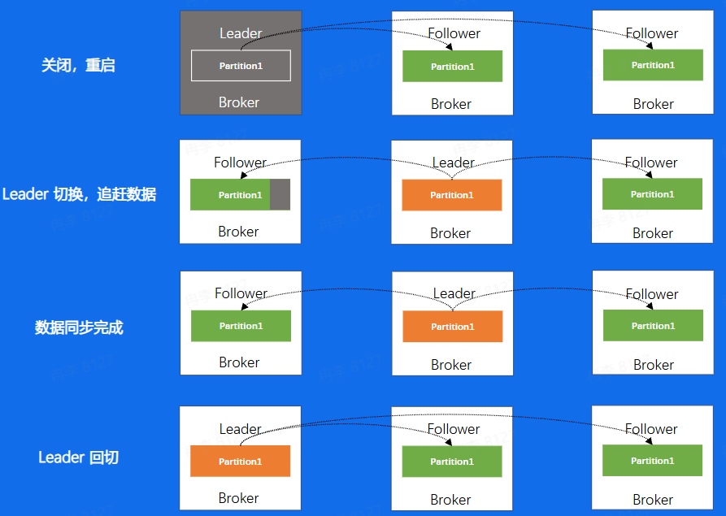
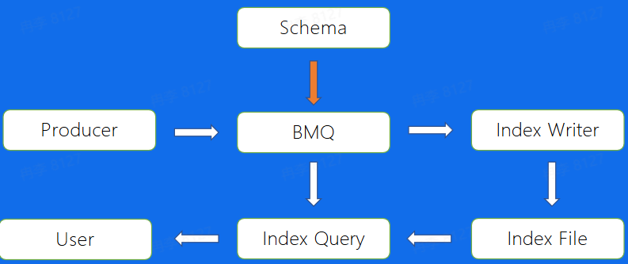
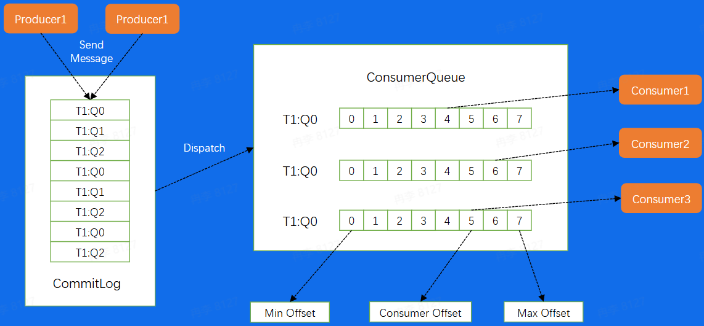
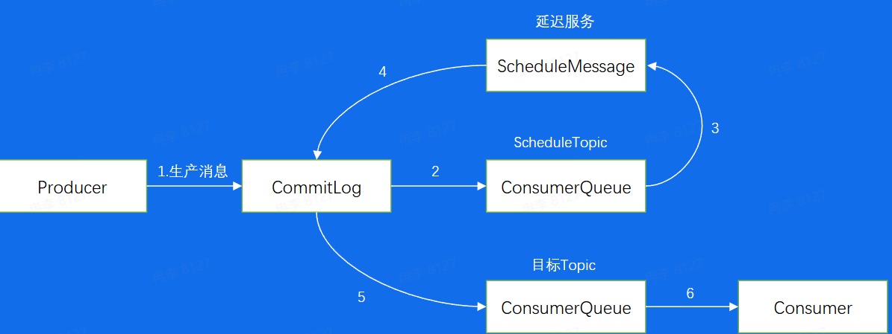
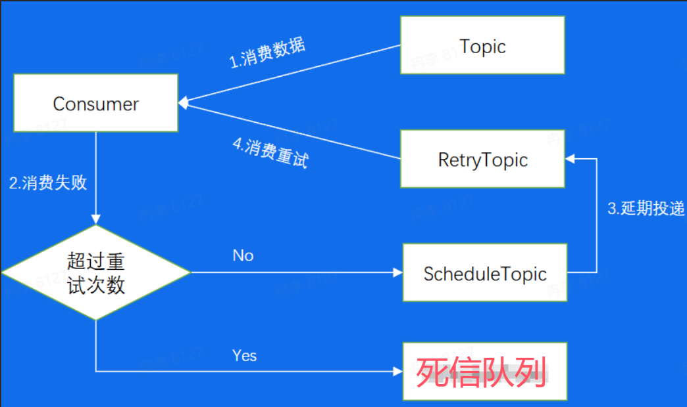

# 消息队列学习笔记
[PPT](https://bytedance.larkoffice.com/file/boxcnokp2zoxYUepDyhlObUFyJH)

**案例一**
系统崩溃

解决方案：解耦

**案例二**
服务能力有限

解决方案：削峰

**案例三**
链路耗时长尾

解决方案：异步

**案例四**
本地日志故障

解决方案：日志处理

#### 消息队列
消息队列(MQ)，指保存消息的一个容器，本质是一个队列。但这个队列需要支持高吞吐、高并发、高可用

发展历程

业界消息队列对比
+ Kafka：分布式的、分区的、多副本的日志提交服务，在高吞吐场景下发挥较为出色
+ RocketMQ：低延迟、强一致、高性能、高可靠、万亿级容量和灵活的可扩展性，在一些实时场景中运用较广
+ Pulsar：是下一代云原生分布式消息流平台，集消息、存储、轻量化函数式计算为一体、采用存算分离的架构设计
+ BMQ：和Pulsar架构类似，存算分离，初期定位是承接高吞吐的离线业务场景，逐步替换掉对应的Kafka集群

**Kafka**
使用场景
离线记录日志信息，记录程序执行中的状态，记录用户行为

使用步骤
+ 创建一个Kafka集群
+ 在这个集群中创建一个Topic，并设置好分片数量
+ 引入对应语言的SDK，配置好集群和Topic等参数，初始化为一个生产者，调用Send方法，将你的数据发送出去
+ 引入对应语言的SDK，配置好集群和Topic等参数，初始化为一个消费者，调用Poll方法，接收数据

基本概念

+ Topic：Kafka中的逻辑队列，每一个不同的业务场景就是一个不同的Topic，对于这个业务来说，所有数据都存储在这个Topic中
+ Cluster：Kafka的物理集群，每个集群中可以建立多个不同的Topic
+ Producer：生产者，消息的生产端，负责将业务消息发送到Topic中
+ Consumer：消费者，消息的消费端，负责消费Topic中的消息
+ ConsumerGroup：消费者组，不同组的Consumer消费进度互不干涉，通常topic会有很多分片，不同分片直接消息是可以并发来处理的，这样提高单个topic的吞吐
+ Partition：Topic的一个分区

Offset：消息在partition内的相对位置信息，可以理解为唯一ID，在partition内部严格递增。对于每一个partition来说，每一条消息都有一个唯一的Offset

Replica(副本)：每个分片有多个Replica，Leader Replica将会从ISR中选出。分片的副本分布在不同的机器上，可以用来容灾，Leader对外服务，Follower异步去拉取Leader中的数据进行一个同步，如果Leader挂掉，可以将Follower提升为Leader在堆外进行服务
ISR(In-Sync Replicas)：意思是同步的副本，对于Follower来说，始终和Leader是有一定差距的，但当这个差距比较小时，我们就可以将这个Follower副本加入到ISR中，不在ISR中的副本是不允许提升为Leader的

数据复制
下图是Kafka中副本的分布图。途中Broker代表每一个Kafka的节点，所有的Broker节点组成一个集群。
整个集群包含了4个Broker机器节点，集群有两个Topic，分别是Topic1和Topic2，Topic1有两个分片，Topic2有一个分片，每个分片都是三个副本的状态
中间有一个Broker同时扮演者Controller的角色，Controller是整个集群的大脑，负责对副本和Broker进行分配

Kafka架构
ZooKeeper：负责存储集群元信息，包括分区匹配信息等

**如果消息量很大，网络带宽不够用如何解决？**
Producer批量发送

Producer数据压缩

Broker消息文件结构
数据路径：/Topic/Partition/Segment/(log | index | timeindex | ...)

Broker磁盘结构
移动磁头找到对应磁道，磁盘转动找到对应扇区，最后写入
寻道成本比较高，因此顺序写入可以减少寻道所带来的时间成本
采用顺序写的方式进行写入，以提高写入效率

Consumer通过发送FetchRequest请求消息数据，Broker会将指定Offset处的消息，按照时间窗口和消息大小窗口发送给Consumer

目标：寻找offset=28

+ Broker偏移量索引文件：二分找到小于目标offset的最大文件/最大索引位置，再遍历找到目标offset

+ Broker时间戳索引文件：二分找到小于目标时间戳最大的索引位置，再通过寻找offset的方式找到最终数据

传统数据拷贝
存在多次CPU拷贝，开销较大

零拷贝
Consumer从Broker中读取数据，通过sendfile的方式，将磁盘读到OS内核缓冲区后，直接转到socket buffer进行网络传输
Producer生产的数据持久化到Broker，采用mmap文件映射，实现顺序的快速写入

如何解决Partition在Consumer Group中分配问题？

+ Low level：通过手动进行分配，哪一个Consumer消费哪一个Partition完全由业务来决定。
这种分配的好处是启动比较快，对于每一个Consumer来说，启动的时候就已经知道自己应该去消费哪个消费方式，如下图中Consumer Group1中的Consumer1去消费Partition1、Partition2和Partition3...这些Consumer在启动时就知道分配方案。
缺点是如果Consumer挂掉，那么分配给它的分片就停止消费了，或者如果要加入一个Consumer就需要停掉整个集群，重新修改配置再上线

+ High level：Kafka提供的自动分配方式。在Broker集群中，对于不同的Consumer Group来说，都会选取一台Broker当作Coordinator，而Coordinator的作用就是帮助Consumer Group进行分片的分配，也叫做分片的rebalance。使用这种方式，如果Consumer Group发生宕机，或者有新的Consumer加入，整个partition和Consumer都会重新进行分配来达到一个稳定的消费状态

Consumer Rebalance
首先consumer随机去找协调者是谁，向broker发送FindCoordinatorRequest

找到协调者以后，告诉协调者要加入组织

选择一个Consumer Leader

告诉协调者分配方案

Consumer们定时给协调者发送心跳，如果一段时间有Consumer没有发送，就说明那个Consumer宕机了

可以帮助Kafka提高吞吐或者稳定性的功能
+ Producer：批量发送、数据压缩
+ Broker：顺序写、消息索引、零拷贝
+ Consumer：Rebalance

对于Kafka来说，每一个Broker上都有不同Topic分区的不同副本，每一个副本会将其数据存储到该Kafka节点上，对于不同的节点之间，通过副本直接的数据复制来保证数据的最终一致性与集群的高可用

Kafka重启操作
如果对一个机器进行重启，我们会关闭一个Broker，此时如果该Broker上存在副本的Leader，那么该副本将发生Leader切换，切换到其他节点并且在ISR中的Follower副本
而此时因为数据在不断地写入，对于刚刚关闭重启的Broker来说，和新的Leader之间一定存在数据的滞后，此时这个Broker会追赶数据，重新加入到ISR中
当数据追赶完成，我们需要切回Leader，这一步叫做prefer leader，目的是为了避免在一个集群长期运行后，所有的Leader都分布在少数节点上，导致数据的不均衡
对于一个Broker重启，需要进行数据复制，时间成本较大

Kafka替换、扩容、缩容
替换：本质上来说就是一个需要追更多数据的重启操作，因为正常重启只需要追一小部分，而替换需要复制整个Leader的数据，时间会更长
扩容：当分片分到新机器上后，也是相当于要从0开始复制一些新的副本
缩容：缩容节点上的分片也会分片到集群中剩余节点上面，分配过去的副本也会从0开始复制数据
以上三个操作均有数据复制所带来的时间成本问题

Kafka负载不均衡
同一个Topic有四个分片和两个副本，对分片1来说数据量明显比其他的要大，当机器IO达到瓶颈的时候，可能就需要把第一台Broker上面的Partition3迁移到其他负载小的Broker上

但数据复制又会引起Broker1的IO升高，问题就变成了，为了解决IO升高，而又带来了更高的IO

Kafka问题总结
+ 运维成本高
+ 对于负载不均衡的场景，解决方案复杂
+ 没有自己的缓存，完全依赖Page Cache
+ Controller、Coordinator和Broker在同一进程中，大量IO会造成其性能下降

**BMQ**
BMQ兼容Kafka协议，存算分离，云原生消息队列，初期定位是承接高吞吐的离线业务场景，逐步替换掉Kafka集群，字节自研

BMQ架构

运维操作对比
BMQ真正的数据已经移到下层分布式文件存储，所以运维操作不需要额外关心数据复制带来的时间成本
|具体操作|Kafka|BMQ|
|-|-|-|
|重启|需要数据复制，分钟级重启|重启后直接对外服务，秒级完成|
|替换|需要数据复制，分钟级替换，甚至天级别|替换后直接对外服务，秒级完成|
|扩容|需要数据复制，分钟级扩容，甚至天级别|替换后直接对外服务，秒级完成|
|缩容|需要数据复制，分钟级缩容，甚至天级别|替换后直接对外服务，秒级完成|

HDFS写文件流程
首先客户端写入前会选择一定数量的DataNode，这个数量是副本数，然后将一个文件写入到三个节点上，切换到下一个segment后，又会重新选择三个节点写入，这样对于单个副本的所有segment来说，会随机的分配到分布式文件系统的集群中

BMQ文件结构
在BMQ集群中，对于单副本来说是随机分配到不同节点上面的，不会产生Kafka负载不均问题
相当于把一个大的副本分成多个小副本，然后随机分配到不同节点上，这样既保证了数据完整，也避免了把很大的一块全部存入到一个Broker里

Broker Partition状态机
保证对于任意分片在同一时刻只能在一个Broker上存活，也能够保证一个分片的正常运行。
首先，Controller做好分片的分配后，如果在该Broker分配到了Broker，首先会start这个分片，然后进入recover状态，这个状态主要有两个目的，第一个目的是获取分片写入权利，也就是说对于HDFS来说，只会允许一个分片进行写入，只有拿到这个权利的分片才能写入。第二个目的是如果上次分片是异常中断的，没有进行save checkpoint，这里会重新进行一次save checkpoint，然后就进入了正常的写流程状态，创建文件、写入数据，到一定大小以后又开始新建新的文件进行写入

Broker 写文件流程
数据校验：CRC，校验参数是否合法
校验完成后会把数据放入Buffer中，通过一个异步的Write Thread线程将数据最终写入到底层的存储系统中
注意：对于业务的写入来说，可以配置返回方式，可以在写完缓存之后直接返回，也可以数据真正写入存储系统后再返回，前者损失了数据的可靠性，带来了吞吐性能的优势，因为只写入内存是比较快的，但如果下一次flush前宕机，数据就有可能丢了
后者因为数据已经写入存储系统，也就不需要担心数据丢失，但吞吐会小一些

Broker 写文件Failover
如果DataNode节点挂了或者其他原因导致写文件失败，不能一直等待节点恢复，可以把节点换掉，重新找正常的节点创建新文件进行写入，这样保证了写入的可用性

Proxy(代理)
首先Consumer发送一个Fetch Request，然后会有一个Wait流程
一个Topic，如果一直没有数据写入，那么此时consumer就会一直发送Fetch Request，如果consumer数量过多，BMQ的服务端是承受不了的，因此设置一个等待机制，如果没有fetch到指定大小的数据，那么proxy会等待一定的时间，再返回给用户侧，这样就降低了fetch请求的IO次数，经过wait流程后，会到cache里找是否存在想要的数据，如果有直接返回，如果没有再去存储系统中找。首先Open文件，然后通过index找到数据所在的具体位置，从这个位置开始读取数据

多机房部署
对于一个高可用服务，除了要防止单机故障所带来的影响，也要防止机房故障带来的影响，比如机房断电、机房之间网络故障

BMQ高级特性

泳道消息
开发流程

+ BOE：Bytedance Offline Environment，是一套完全独立的线下机房环境
+ PPE：Product Preview Environment，即产品预览环境

BOE测试
多个人同时测试需要等待上一个人测试完成

每多一个测试人员，都需要重新搭建一个配置相同的Topic，造成人力和资源的浪费

PPE验证
对于PPE消费者来说，资源没有生产环境多，所以无法承受生产环境的流量

解决主干泳道流量隔离问题以及泳道资源重复创建问题
泳道生产者给Topic的消息是带有标识的，不同泳道的Consumer只会消耗自己泳道标识的消息

Databus
直接使用原生SDK产生的问题
+ 客户端配置较为复杂
+ 不支持动态配置，更改配置需要停掉服务
+ 对于latency不是很敏感的业务，batch效果不佳
正常SDK Java代码

Databus代码

使用Databus好处
+ 简化消息队列客户端复杂度
+ 解耦业务与Topic
+ 缓解集群压力，提高吞吐

Mirror
使用Mirror通过最终一致的方式解决跨Region读写问题
本地写入以后异步地发送到不同地区的机房

Index
如果希望通过写入LogId、UserId或者其他的业务字段进行消息的查询该如何做？
通过offset或时间戳来查询

直接在BMQ中将数据结构化，配置索引DDL，异步构建索引后，通过Index Query服务读出数据

Parquet
Apache Parquet是Hadoop生态圈中一种`新型列式存储格式`，它可以兼容Hadoop生态圈中大多数计算框架(Hadoop、Spark等)，被多种查询引擎支持(Hive、Impala、Drill等)
行式存储方便对于每一行进行查询，但不方便对于某一列进行查询，列式存储相反

直接在BMQ中将数据结构化，通过Parquet Engine，可以使用不同的方式构建Parquet格式文件

**RocketMQ**
使用场景
基于低延时场景，针对电商业务线，其业务涉及广泛，如注册、订单、库存、物流等，同时也会涉及许多业务峰值时刻，如秒杀活动、周年庆、定期特惠等

基本概念 Kafka vs RocketMQ
|名称|Kafka|RocketMQ|
|-|-|-|
|逻辑队列|Topic|Topic|
|消息体|Message|Message|
|标签|无|Tag|
|分区|Partition|ConsumerQueue|
|生产者|Producer|Producer|
|生产者集群|无|Producer Group|
|消费者|Consumer|Consumer|
|消费者集群|Consumer Group|Consumer Group|
|集群控制器|Controller|Nameserver|

Producer、Consumer和Broker三个部分和Kafka一样，Kafka中的Partition在这里叫ConsumerQueue

RocketMQ架构
数据流通过Producer发送给Broker集群，再由Consumer进行消费
Broker节点有Master和Slave的概念
NameServer为集群提供轻量级服务发现和路由

存储模型
对于一个Broker来说所有的消息都会append到一个CommitLog上，然后按照不同的Queue，重新Dispatch到不同的Consumer中，这样Consumer就可以按照Queue来进行拉取消费，需要注意的是这里的ConsumerQueue所存储的并不是真实的数据，真实的数据只存在CommitLog中，这里存的仅仅是这个Queue所有消息在CommitLog上的位置，相当于是这个Queue的一个密集索引

RocketMQ高级特性
+ 事务场景

+ 事务消息

+ 延迟发送

延迟消息
生产者把消息发送给CommitLog，该消息具有ScheduleTopic，因此目标ConsumerQueue是不接收这个CommitLog的，接收的ConsumerQueue把消息转发给ScheduleMessage开始延迟服务，然后ScheduleMessage在到时间以后发送给CommitLog，经过这样两个步骤，目标ConsumerQueue才会去接受该消息

+ 处理失败

+ 消费重试和死信队列

