# 企业级网络接入学习笔记
[PPT](https://bytedance.larkoffice.com/file/boxcnRSW4SPpe1e6r5DQfKEpLDd)
[学习Github仓库](https://github.com/chanyean/youth_training_camp)

**术语前瞻**
|名词|解释|
|-|-|
|权威DNS|保存了相应域名的权威信息。权威DNS即通俗上“这个域名我说了算”的服务器|
|LocalDNS|缓存+递归查询，运营商（集团网）部署的本地DNS服务器，直接接受网内客户端请求|
|根DNS服务器|全球有13台，LocalDNS未命中缓存查询的起点服务器，[具体公网地址](https://www.iana.org/domains/root/servers)|
|DNS Update|DNS主服务器master接受外部的变更指令|
|DNS Notify|DNS主服务器master接受变更命令后，会自增自身的serial号，同时将变更的serial号告知从服务器slave|
|DNS IXFR|DNS从服务器slave以增量的形式向master要求获取本次变更的内容|
|DNS AXFR|DNS从服务器slave以全量的形式向master要求获取当前的全量数据|
|对称加密|使用相同的秘钥来加密传输内容，一端加密后，对端收到数据会用相同的秘钥来解密|
|非对称加密|如果用公钥对数据进行加密，只有用对应的私钥才能解密；如果用私钥对数据进行加密，那么只有用对应的公钥才能解密|
|静态加速|针对视频、图片等不变的内容，将其缓存在靠近用户的边缘节点，缓存预热后用户直接从边缘获取，从而加速访问速度|
|动态加速DCDN|针对API类返回值不同的请求，通过特殊的网络优化方式（路由优化、传输优化）等技术加速其达到源站的速度|
|VIP|虚拟IP，一般作为四层反向代理的入口，client看起来一直在与VIP交互|
|RS|Real Server，VIP后实际承受client请求的服务，可能是物理机/虚拟机/容器POD|
|DPDK|Data Plane Development Kit，主要用户4层负载均衡，用于转发的网络加速领域比较多；以极大提高网卡报文的处理性能和吞吐量，提高数据平面应用程序的工作效率|
|DPDK|Data Plane Development Kit，一种从数据面去加速网络报文处理的工具，可以极大提高数据处理性能和吞吐量，提高数据平面应用程序的工作效率|
|SSL/TLS|(Secure Sockets Layer 安全套接字协议),及其继任者传输层安全（Transport Layer Security，TLS）是为网络通信提供安全及数据完整性的一种安全协议|

经典问题：浏览器输入网站域名www.toutiao.com到网页加载出来都经历了哪些过程？

+ 大体分为四个过程
  + DNS解析
  + TCP建立连接
  + TLS握手
  + HTTP请求发送

Host管理
维护一个主机表，记录Host->ip映射
随着业务规模和员工数量增长，面临的问题
+ 流量和负载：用户规模指数级增长，文件大小越来越大，统一分发引起较大的网络流量和cpu负载
+ 名称冲突：无法保证主机名称的唯一性，同名主机添加导致服务故障
+ 时效性：分发靠人工上传，时效性太差

域名系统
使用域名系统替换hosts文件

域名空间
+ 域名空间被组织成树形结构
+ 域名空间通过划分zone的方式进行分层授权管理
+ 全球公共域名空间仅对应一棵树
+ 根域名服务器：查询起点
+ 域名组成格式：[a-z，A-Z，0-9，-]以划分label

顶级域gTLD：general Top-level Domains：gov政府，edu教育，com商业，mil军事，org非盈利组织
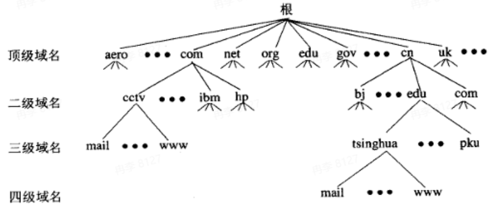

域名备案：防止在网上从事非法的网站经营活动，打击不良互联网信息的传播，一般在云厂商处即可进行实名认证并备案
修改配置：
+ 清空/etc/hosts
+ 配置/etc/resolv.conf中nameservers为公共DNS
+ 迁移原配置，通过控制台添加解析记录即可

如何开放外部用户访问？
+ 租赁一个外网ip，专用于外部用户访问门户网站，将www.example.com解析到外网ip100.1.2.3，将该ip绑定到一台物理机上，并发布公网route，用于外部用户访问

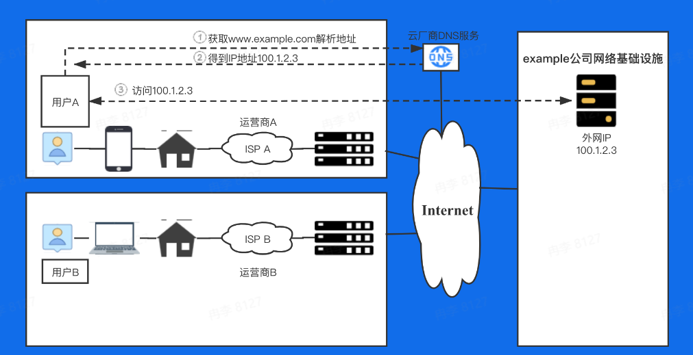

**自建DNS服务器**
问题背景
+ 内网域名的解析也得出公网去获取，效率低下
+ 外部用户看到内网ip地址，容易被黑客攻击
+ 云厂商权威DNS容易出故障，影响用户体验
+ 持续扩大公司品牌技术影响力，使用自己的DNS系统

从公有云托管->构建自己的DNS系统

DNS查询过程
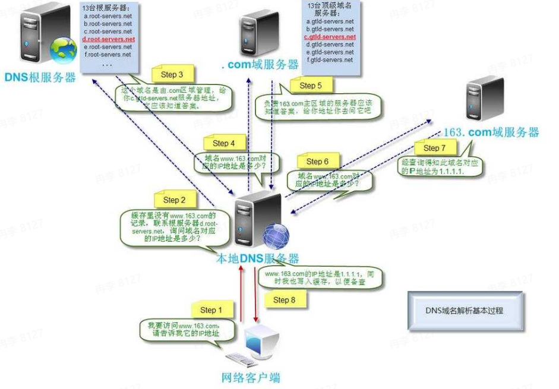

DNS记录类型
+ A/AAAA：IP指向记录，用于指向IP，前者为IPv4记录，后者为IPv6记录
+ CNAME：别名记录，配置值为别名或主机名，客户端根据别名继续解析以提取IP地址
+ TXT：文本记录，购买证书时需要
+ MX：邮件交换记录，用于指向邮件交换服务器
+ NS：解析服务器记录，用于指向哪台服务器对于该域名解析
+ SOA记录：起始授权机构记录，每个zone有且仅有唯一的一条SOA记录，SOA是描述zone属性以及主要权威服务器的记录

站在企业角度思考，需要哪种DNS服务器？
+ 权威DNS、LocalDNS(可选)

常见开源DNS：bind、nsd、knot、cordns
bind DNS服务器
+ DNS Query
+ DNS Response
+ DNS Update
+ DNS Notify
+ DNS XFR

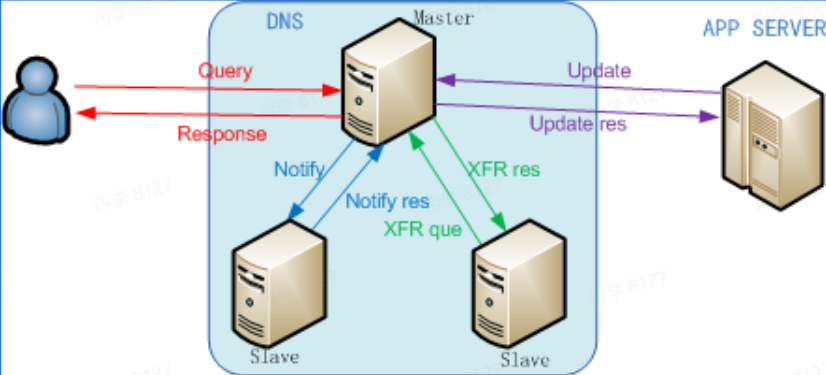

权威DNS系统架构
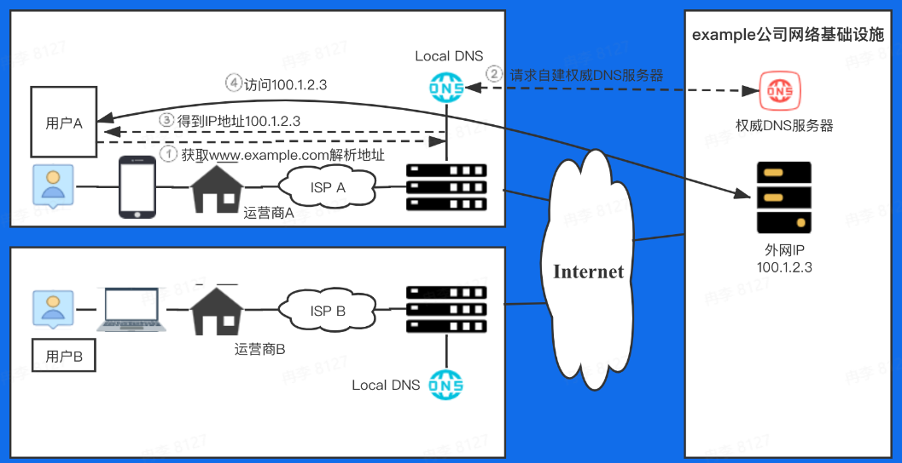

SSL通信过程
+ client random
+ server random
+ primaster secret
+ 加密算法协商，最后得到对称密钥session key
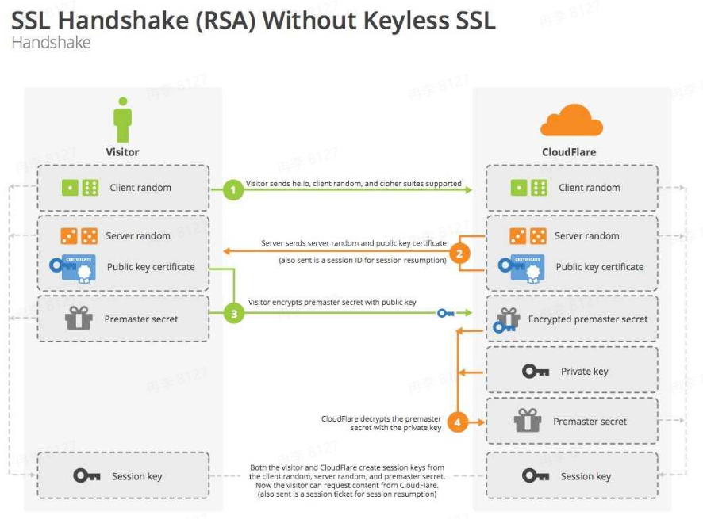

Server端发送的是带签名的证书链
Client收到仍会验证
+ 是否是可信机构颁布
+ 域名是否与实际访问一致
+ 检查数字签名是否一致
+ 检查证书的有效期
+ 检查证书的撤回状态

外网用户访问站点可能出现哪些问题？
+ 源站容量低，可承载的并发请求数低，容易被打垮
+ 报文经过的网络设备越多，出问题的概率越大，丢包、劫持、mtu问题
+ 自主选路网络链路长，时延高

解决方案
+ 源站容量问题：增加后端机器扩容；静态内容使用静态加速缓存
+ 网站传输问题：动态加速DCDN
+ 全站加速：静态加速+动态加速

**静态加速CDN**

针对静态文件传输的网络优化方式
+ 增加缓存

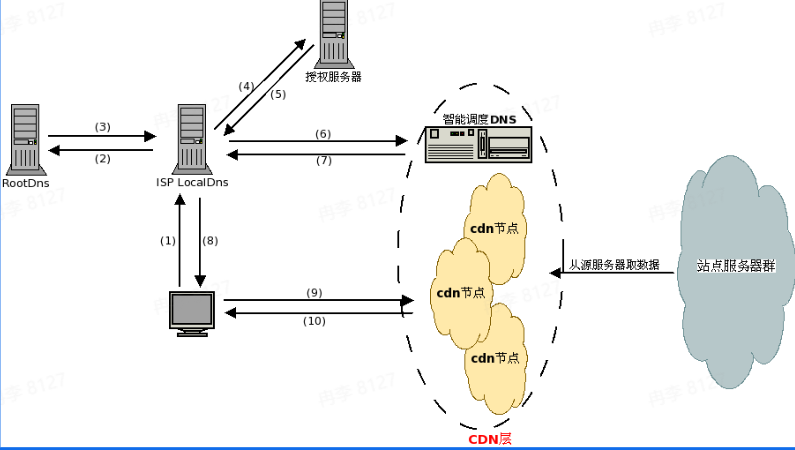

优势
+ 解决服务器端的“第一公里问题”
+ 缓解甚至消除了不同运营商之间互联的瓶颈造成的影响
+ 减轻了各省的出口带宽压力
+ 优化了网上热点内容的分布

**动态加速DCDN**
针对POST等非静态请求等不能在用户边缘缓存的业务，基于智能选路技术，从众多回源线路中择优选择一条线路进行传输

DCDN原理
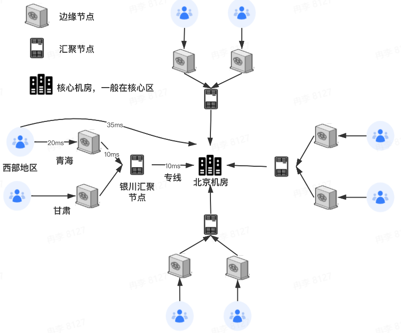

越往中心，容量越少，算力越大，越往边缘，容量越大，算力越小
RTT示例
+ 用户到核心：35ms
+ 用户到边缘：20ms
+ 边缘到汇聚：10ms
+ 汇聚到核心：10ms

常规请求耗时计算
+ Via DCDN：100ms
  + 20(TCP)+20*2(TLS)+20+10+10(routine)
+ Direct：140ms
  + 35(TCP)+35*2(TLS)+35(routine)

区分下列场景使用的加速类型
+ 用户首次登录抖音，注册用户名手机号等用户信息
  + 动态加速DCDN
+ 抖音用户点开某个特定的短视频加载后观看
  + 静态加速CDN
+ 用户打开头条官网进行网页浏览
  + 静态加速CDN(后续的静态内容下载)+动态加速DCDN(第一条请求)

使用全站加速
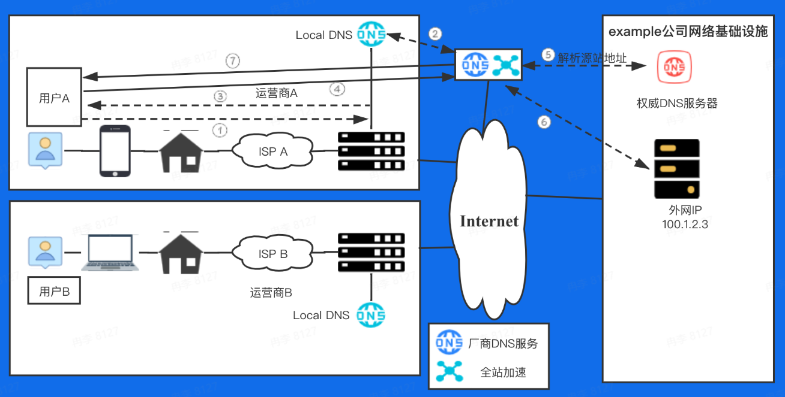

在运营商处租用的100.1.2.3公网IP，如何在企业内部使用最合理
+ 直接找一个物理机，ifconfig将网卡配上这个IP，起server监听即可
+ 应用多，起多个server监听不同的端口即可
+ 租多个公网IP(数量有限)

**4层负载均衡**
基于IP+端口，利用某种算法将报文转发后给某个后端服务器，实现负载均衡地落到后端服务器上
三个主要功能
+ 解耦vip和rs
+ NAT
+ 防攻击：syn proxy

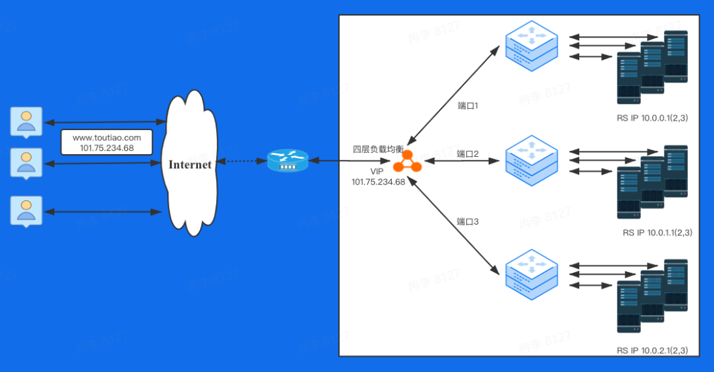

常见的调度算法原理
+ RR轮询：Round Robin，将所有的请求平均分配给每个真实服务器RS
+ 加权RR轮询：给每个后端服务器一个权值比例，将请求按照比例分配
+ 最小连接：把新的连接请求分配到当前连接数最小的服务器
+ 五元组hash：根据sip、sport、proto、dip、dport对静态分配的服务器做散列取模
  + 缺点：当后端某个服务器故障后，所有连接都重新计算，影响整个hash环
+ 一致性hash：只影响故障服务器上的连接session，其余服务器上的连接不受影响

常见实现方式FULLNAT
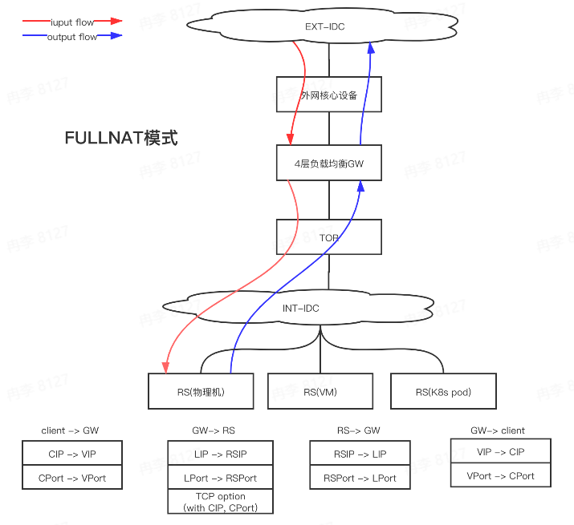

RS怎么知道真实的CIP？
+ 通过TCP option字段传递，然后通过特殊的内核模块反解。TCP option字段可以进行任意编辑

4层负载均衡特点
+ 大部分都是通过dpdk技术实现，技术成熟，大厂都在用
+ 纯用户态协议栈，kernel bypass，消除协议栈瓶颈
+ 无缓存，零拷贝，大页内存(减少cache miss率)
+ 仅针对4层数据包转发，小包转发可达到限速，可承受高cps

使用4层负载均衡网络架构
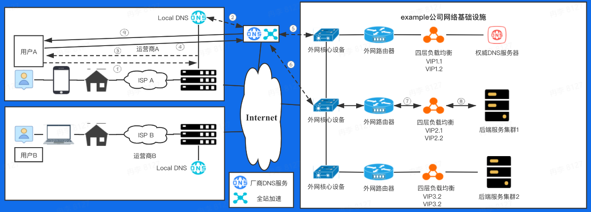

**7层负载均衡**
4层负载对100.1.2.3只能bind一个80端口，而有多个外部站点需要使用该如何解决？/有一些7层相关的配置需求该怎么做？
+ SSL卸载：业务侧是http服务，用户需要用https访问
+ 请求重定向：浏览器访问toutiao.com自动跳转www.toutiao.com
+ 路由添加匹配策略：完全匹配、前缀匹配、正则匹配
+ Header编辑
+ 跨域支持：对请求第三方页面的支持
+ 协议支持：websocket、grpc、quic

**Nginx**
最灵活的高性能WEB SERVER，应用最广的8层反向代理

Nginx
+ 模块化设计，较好的扩展性和可靠性
+ 基于master/worker架构设计
+ 支持热部署：可在线升级
+ 不停机更新配置文件、更换日志文件、更新服务器二进制
+ 较低的内存消耗：1万个keep-alive连接模式下的非活动连接仅小号2.5M内存
+ 事件驱动：异步非阻塞模型、支持aio、mmap(内存映射)等

Nginx反向代理示意图
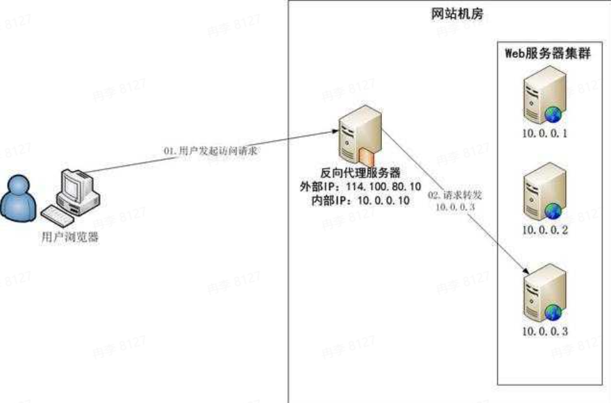

代理服务器功能
+ Keep-alive
+ 访问日志
+ url rewrite重写
+ 路径别名
+ 基于ip的用户的访问控制
+ 限速及并发连接数控制
+ ...

Nginx内部架构
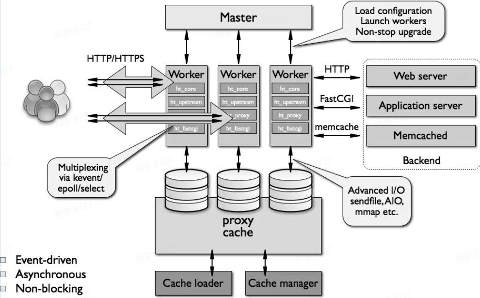

**事件驱动模型**

最常见捕获鼠标点击的方式：创建一个线程，该线程不断地对鼠标点击进行捕获
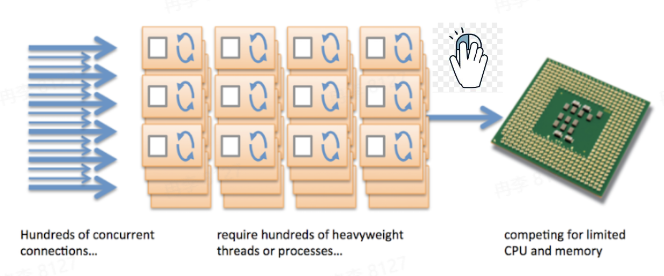
缺点
+ 浪费CPU资源
+ 如果监听阻塞，不仅要捕获鼠标点击，还要扫描键盘是否按下
+ 如果要扫描的设备比较多，响应时间就比较长

事件驱动模型是将每一种动作归纳成一个独立的事件，事件之间不会相互影响
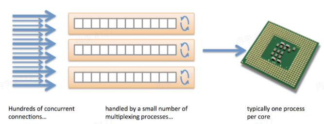

把事件驱动模型映射成网络模型
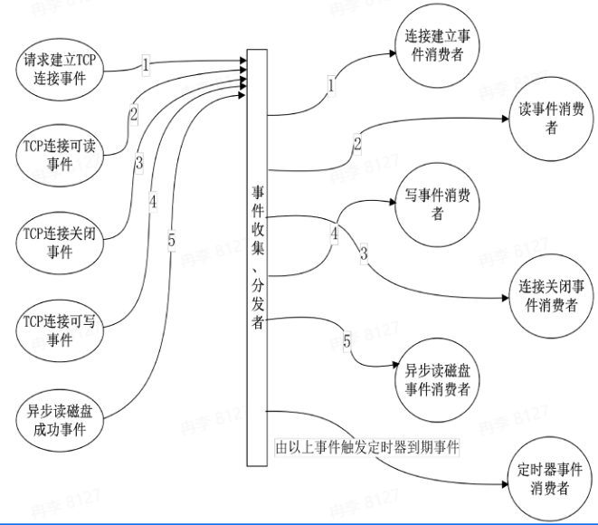

**异步非阻塞**
传统服务器：一个进程/线程处理一个连接/请求(阻塞模型，依赖OS实现并发)
Nginx：一个进程/线程处理多个连接/请求(异步非阻塞模型，减少OS进程切换)
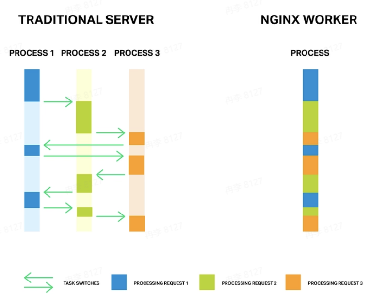

Nginx简单调优
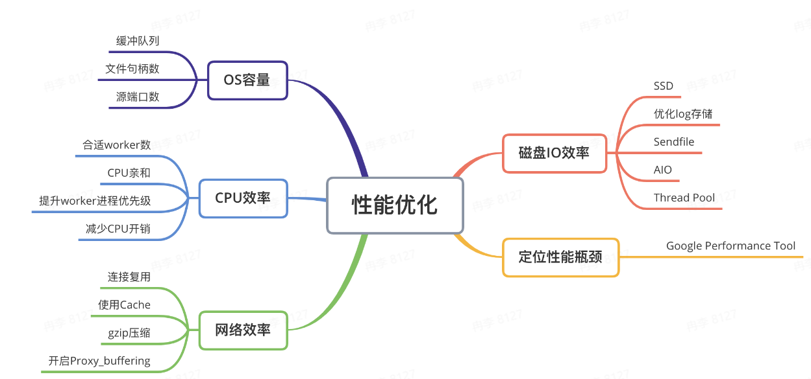

优化内核网络参数
```
fs.filemax=999999
net.ipv4.tcp_tw_reuse=1
net.ipv4.tcp_keepalive_time=600
net.ipv4.tcp_fin_timeout=30
net.ipv4.tcp_max_tw_buckets=5000
net.ipv4.ip_local_port_range=1024 61000
net.ipv4.tcp_max_syn.backlog=1024
net.ipv4.tcp_syncookies=1
```

提升CPU使用效率
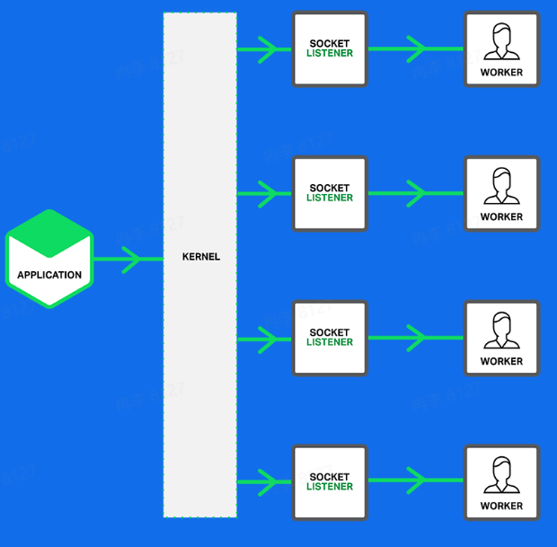
+ 合适的worker进程数
  + worker进程数=CPU核数
+ CPU亲和
  + 每个worker进程绑定一个CPU核，提升缓存命中率
+ 减少CPU开销
+ multi_accept允许worker同时接受新连接
+ accept_mutex解决惊群问题
+ reuseport监听同端口，内核负载均衡

提升网络效率
+ 连接复用
  + 减少upstream建连
+ 使用Cache
  + 超时时间对业务的影响
+ gzip压缩
  + 会增加cpu开销，需平衡使用
+ 开启proxy_buffering
  + 谨慎设置proxy_buffering大小，磁盘io读写

使用7层负载均衡架构
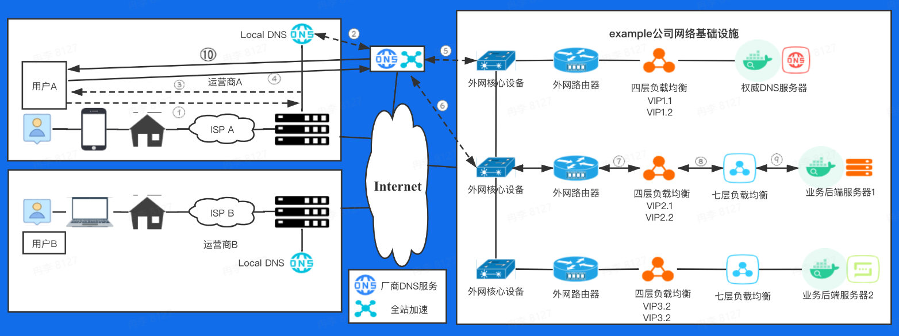

4层负载均衡实验
开源的解决方案：LVS+keepalived
LVS：linux virtual server，linux虚拟服务器，根据目标地址和目标端口实现用户请求转发，本身不产生流量，只做用户请求转发。[LVS](http://linuxvirtualserver.org/)
Keepalived：LVS集群高可用，解决某个节点故障问题
Nginx stream模块可进行4层协议TCP/UDP报文进行转发、代理

服务开发前期，如何低成本的让别人访问自己的服务器？
+ Ngrok：Expose your localhost to the web
+ 使用条件：使用github账号授权登录即可使用。[参考链接](https://dashboard.ngrok.com/get-started/setup)

EXAMPLES：
```
ngrok http 80 # secure public URL for port 80 web server
ngrok http -subdomain=baz 8080 # port 8080 available at baz.ngrok.io
ngrok http foo.dev:80 # tunnel to host:port instead of localhost
ngrok http https://localhost # expose a local https server
ngrok tcp 22 # tunnel arbitrary TCP traffic to port 22
ngrok tls -hostname=foo.com 443 # TLS traffic for foo.com to port 443
ngrok start foo bar baz # start tunnels from the configuration file
```

将本地服务开放外网访问命令
```
./ngrok http example.com:8082
```
