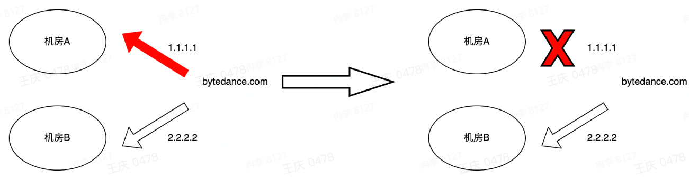

# 网络交互与架构学习笔记
[PPT](https://bytedance.larkoffice.com/file/boxcnPKYSwOfA9SFz3sUIzKqbpe)

#### 环境准备
+ Linux系统安装tcpdump软件
+ 安装wireshark

#### 路由
路由不一定是对称的，即从终端A->终端B的路径和从终端B->终端A不一定是对称的
路由主要工作在网络层，但运输层等也有工作，如动态路由BGP/OSPF等
路由是修改MAC地址，找到包含目标IP的发包口

#### ARP协议
逻辑同网段才能发送ARP，跨网段无法发送ARP
ARP请求广播，ARP应答单播
免费ARP：在某局域网内，新增一台设备，因为路由/交换机内没有缓存，当第一次访问时通信非常慢，那么这台设备主动发送免费ARP，告知局域网内的其他设备它的MAC地址。IPv6也有类似免费ARP功能(GARP)，当服务器新增一个IP地址后，会发送一次免费ARP，其中包含IP地址和IPv6地址，防止该网络内出现IP冲突
ARP代理：发送ARP时，被中间设备劫持，然后中间设备进行相应，可以运行SDN等高级功能(如部分VPN也采用ARP代理)
ARP本质上是查找下一跳的MAC，不是请求目标地址

#### IP协议
+ 唯一标识，互联网通用

为什么不用MAC地址唯一标识？
+ MAC协议是互联网的二层协议，但二层具有很多协议，而IP协议为了统一二层协议进行二次封装

IPv4不够用怎么解决？
+ 启用IPv6
+ 如果不兼容IPv6，那么使用NAT等技术

#### NAT
NAT是将多个局域网IP地址映射成一个全网唯一的外网IP地址，节省了互联网IPv4的消耗
NAT修改的是IP+端口，以解决多个内网客户端同时访问一个外网地址，NAT通过维护一张表，把不同连接分布到不同端口上

#### 数据包发送

在真实情况下，中间圈出来的箭头包含很复杂的中间过程

#### 先请求DNS
+ 客户端发www.xxx.com的解析请求
+ 递归解释器去问"."(根域名服务器)，这个".com"去哪里解析
+ 递归解释器去问".com"(顶级域名服务器)，"xxx.com"去哪里解析
+ "xxx.com"(权威域名服务器)告诉递归解释器目标地址在哪

**DNS的传输层协议`UDP`**

**TCP三次握手**
[参考资料](https://www.jianshu.com/p/15754b4e9458)
#### TCP传输
+ sequence number：表示的是发送方这边，这个packet的数据部分的第一位应该在整个data stream中所在的位置
+ acknowledge number：表示的是接收方的下一次sequence number是多少，注意，SYN/FIN的传输虽然没有data，但是会让下一次传输的packet seq加一，但是ACK的传输不会让下一次的packet seq加一

[TCP状态机](https://blog.csdn.net/achenwenping/article/details/80627599)
#### HTTP/HTTP1.1
HTTP相较于TCP只是多了一层规矩，HTTP依然是TCP，只是这个规矩让用户更清晰/更简洁

HTTP1.1优化
+ **长连接**
+ 部分传输
+ HOST
+ 缓存
+ ...

HTTPS=HTTP+SSL/TLS

#### 网络提速

**协议优化**

HTTP2.0最重要的功能：多路复用
缺点：对头阻塞(TCP传输丢了一个包)

QUIC/HTTP3.0
+ TCP or UDP？使用UDP
+ Kernel(内核态) or Userspace(用户态)？Userspace
+ 0RTT
+ 弱网优势：解决了弱网环境下的对头阻塞

**路径优化**

+ 同运营商访问：移动访问移动网内服务器，电信访问电信网内服务器
+ 静态资源(图片视频等)路径优化(CDN)：不会随着API请求的改变而改变的资源是静态资源
+ 动态API(播放/评论接口)路径优化(DSA)：随着时间改变，接口的数据会改变称为动态API

#### 网络稳定

容灾大多是通过网络手段去控制的
+ 故障发生
+ 故障感知
+ 自动切换
+ 服务恢复

**容灾案例**
`外网容灾`

当机房之间的专线挂掉以后，通过外网进行微服务交互，但这样网络速度会变慢

`调度容灾`

GTM系统功能：探测、故障感知。自动化去计算机房B的容量能否去承载机房A的容量，然后进行容灾

`云控容灾`

云控容灾：嵌入SDK，主动降级/容灾，场景具有局限性，如需要被授权、web页面无法访问等

`降级容灾`

BUG导致全crash->前置兜底逻辑/cache文件
提前部署前置cache文件，当LB挂掉以后，加载前置兜底cache文件

**故障排查**
+ 故障明确：沟通是前提
  + 什么业务？什么接口故障？
  + 故障体现在哪里？
  + 访问其他目标是否正常？
  + 是否是修改导致的异常？
+ 故障止损
  + 先止损再排查
    + 用户体验第一
    + 对公司收入的影响是按照分钟甚至秒来计算
  + 如何止损
    + 组件没有容灾，但是系统有没有？
    + 做一次降级，把问题地方进行版本回退或者直接禁用
+ 分段排查
  + 客户端排查
    + 客户端访问其他服务没问题吗？
    + 其他客户端访问目标服务没问题吗？
  + 服务端排查
    + 服务端监控/指标都正常吗？
    + 手动访问一下正常吗？
    + 分组件排查
  + 中间链路排查
    + 服务端跟客户端确保都没问题
    + 中间网络设备有没有问题？(交换机/路由器/网关LB)
    + 旁路的DNS有没有问题？

**网络故障排查常用命令**
+ dig查询DNS问题
+ ping/telnet/nmap查询三层/四层连通性
+ Traceroute排查中间链路
+ iptables
+ tcpdump

`案例一`

客户端异常->服务端自测正常->网关转发异常->健康检查异常

`案例二`

个别用户报故障，生产环境下大多是客户端的问题

`案例三`

电信报障某APP无法使用->检测后端服务正常，电信流量突降->电信客户端ping不通目标服务->电缆被挖断

`案例四`

某APP故障->后端服务器反馈服务正常->网络转发设备异常->抓包肉眼debug->快速发包默认路由对称，发包时的源MAC在回包时变成目的MAC，发包时的目的MAC在回包时变成源MAC。但真实情况是路由不对称导致丢包

故障预防
+ 监控报警
+ 故障演练/预案
+ 故障降级/止损
